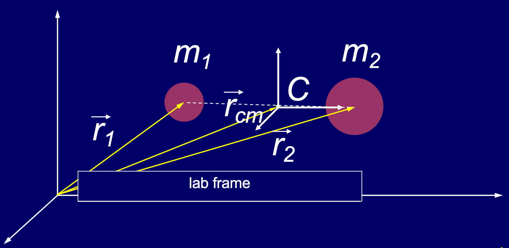

# Chapter 6 Momentum

## 基本概念
**动量 (Linear Momentum)**

The momentum $\vec p$ of a body is defined as:

$$ \vec p = m \vec v \\
\vec p = p_x\vec i +p_y \vec j + p_z\vec k\\
=mv_x\vec i+mv_y\vec j+mv_z\vec k
$$

**Another form of Newton's second law**

$$ \sum \vec F = m\vec a = m \frac{d\vec v}{dt}=\frac{d\vec p}{dt}$$

**冲量 (Impulse)**

$$\vec j = \int_{t_1}^{t_2}\vec F dt$$

**Impuse and momentum**

$$\vec p_f - \vec p_i =\int^{p_f}_{p_i}d\vec p = \int_{t_1}^{t_2}\sum \vec Fdt = \vec J\\
\vec j = \Delta \vec p$$

**动量守恒定律 (Conservation of momentum)**

1. 系统所受合外力为0时，总动量不变
2. 动量守恒时矢量守恒，可以分解为x, y, z三个方向的分量式，各个方向独立守恒

---

## 一维碰撞 (Collision in 1-D)

**弹性碰撞 (Elastic Collision)**

- 动量守恒+机械能守恒
$$\begin{align} m_1v_{1i}+m_2v_{2i}&=m_1v_{1f}+m_2v_{2f}\\
\frac{1}{2}m_1v_{1i}^2+\frac{1}{2}m_2v_{2i}^2&=\frac{1}{2}m_1v_{1f}^2+\frac{1}{2}m_2v_{2f}^2\\
\end{align}$$

**非弹性碰撞 (Inelastic Collision)**

- 动量守恒+机械能损失

**完全非弹性碰撞 (Comletely Inelastic Collision)**

- 动量守恒+机械能损失较大（两者碰撞后粘连共速）
$$m_1v_{1i}+m_2v_{2i}=(m_1+m_2)v_{f}$$

**质心 (The center of mass)**

对于上述这个二元系统，我们可以计算关于质心的位置、速度、加速度

位置：
$$\begin{align}
\vec r_{cm}&=\frac{m_1\vec r_1+m_2 \vec r_2}{m_1+m_2}\\
x_{cm}&=\frac{m_1 x_1+m_2 x_2}{m_1+m_2}\\
y_{cm}&=\frac{m_1 y_1+m_2 y_2}{m_1+m_2}\\
z_{cm}&=\frac{m_1 z_1+m_2 z_2}{m_1+m_2}\\
\end{align}$$

速度和加速度：

$$\begin{align}
\vec v_{cm}&=\frac{m_1\vec v_1+m_2 \vec v_2}{m_1+m_2}\\
\vec a_{cm}&=\frac{m_1\vec a_1+m_2 \vec a_2}{m_1+m_2}\\
\end{align}$$

**参考系的选择**

- **实验室参考系 (lab frame)：** 地面/静止的惯性参考系，为常规观测参考系
- **质心参考系(cm frame)：** 以系统质心为原点的惯性参考系，特点是系统的总动量为 0，是分析碰撞的简便参考系

对于质心参考系来说，核心的计算优势是总动量恒为0，因为：
- 根据质心速度的计算公式$\vec v_{cm}=\frac{m_1\vec v_{1i}+m_2 \vec v_{2i}}{m_1+m_2}$
- 变换两个质子的速度：
$v_{1i}'=v_{1i}-v_{cm}$
$v_{2i}'=v_{2i}-v_{cm}$
- 总动量：$\vec v_{cm}'=\frac{m_1\vec v_{1i}'+m_2 \vec v_{2i}'}{m_1+m_2}=0$
- 分析碰撞的过程（弹性碰撞）：对于整个二元系统，只有内力的相互作用而没有外力的相互作用，所以质心的速度始终为0，因此为了保证这一点，在质心系中，两个质子的速度发生反转，即
$v_{1f}'=-v_{1i}'$
$v_{2f}'=-v_{2i}'$
- 再通过质心系的速度求解实验室参考系下的速度
$v_{1f}=v_{1f}'+v_{cm}$
$v_{2f}=v_{2f}'+v_{cm}$

