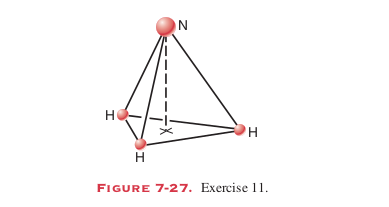
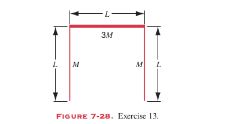
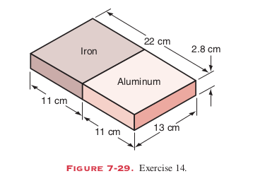
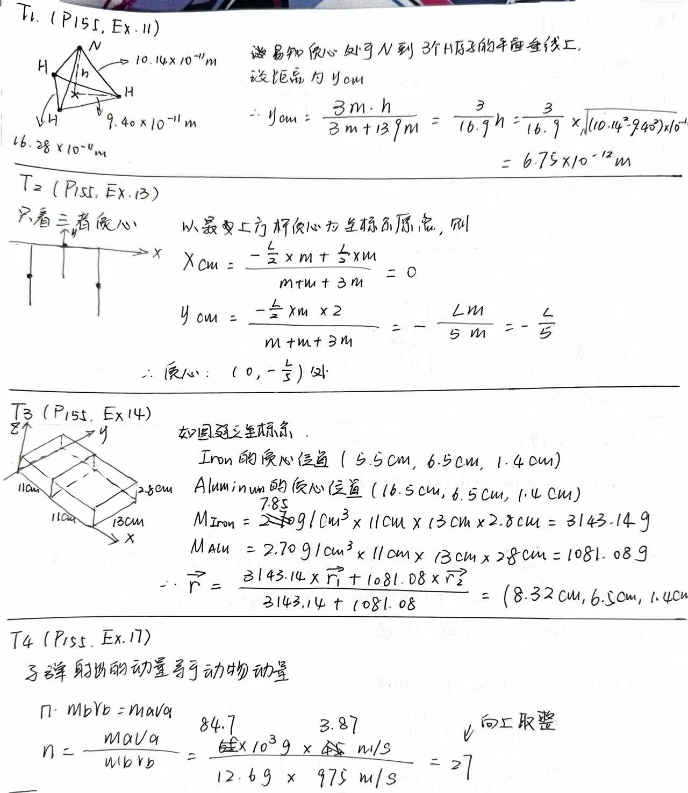
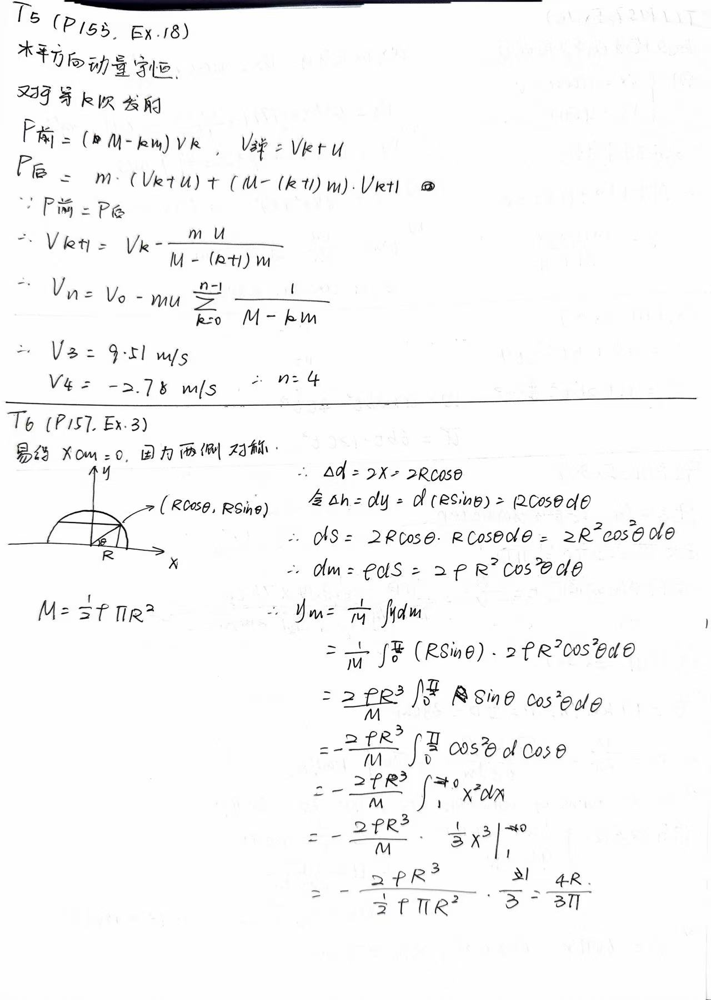
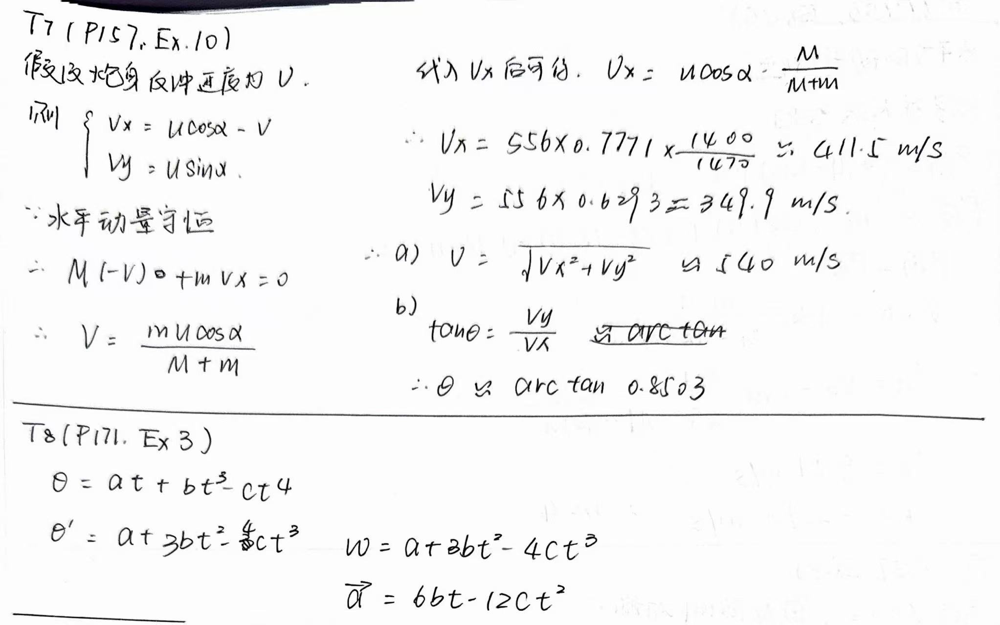
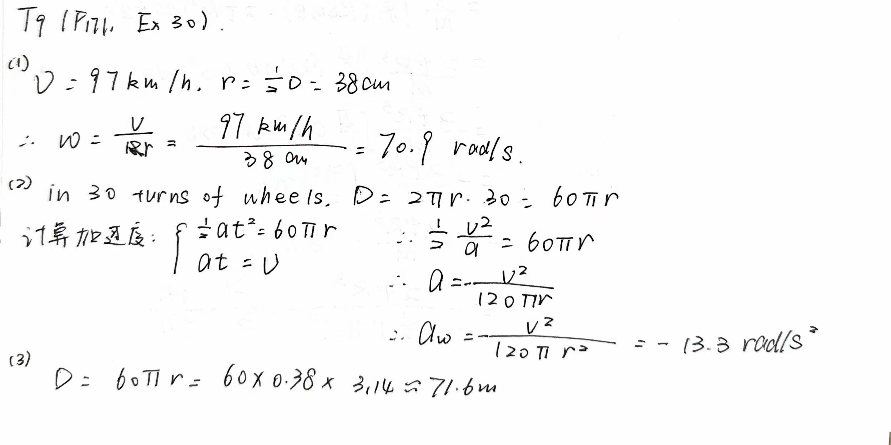

# Homework of Chapter 7 & 8

## T1 (P155, Ex.11)

In the ammonia (NH3) molecule, the three hydrogen (H) atoms form an equilateral triangle, the distance between centers of the atoms being $16.28*10^{-11} m$, so that the center of the triangle is $9.40*10^{-11} m$ from each hydrogen atom. The nitrrogen (N) atom is at the apex of a pyramid, the three hydrogen constituting the base (see Fig. 7-27). The nitrogen/hydrogen distance is $10.14*10^{-11} m$ and the nitrogen/hydrogen atomic mass ratio is 13.9. Locate the center of mass relative to the nitrogen atom.

## T2 (P155, Ex.13)

Three thin rods each of length L are arranged in a inverted U, as shown in Fig. 7-28. The two rods on the arms of the U each have mass M; the third rod has mass 3M. Where is the center of mass of the assembly?

## T3 (P155, Ex.14)

Fig. 7-29 shows a composite slab with dimensions $22.0 cm*13.0 cm*2.80 cm$. Half of the slab is made of aluminum (density = $2.70 g/cm^3$) and half of iron (density=$7.85 g/cm^3$), as shwon. Where is the center of mass of the slab?

## T4 (P155, Ex.17)

Each minute, a special game warden's machine gun fires 220, 12.6-g rubber bullets with a muzzle velocity of 975 m/s. How many bullets must be fired at an 84.7-kg animal charging toward the warden at 3.87 m/s in order to stop animal in its tracks? (Assume that the bullets travel horizontally and drop to the ground after striking the target).

## T5 (P155, Ex.18)

A railway flat car is rushing along a level frictionless track at a speed of 45m/s. Mounted on the car and aimed forward is a cannon that fires 65-kg cannon balls with a muzzle speed of 625 m/s. The total mass of the car, the cannon, and the large supply of cannon balls on the car is 3500kg. How many cannon balls must be fired to bring the car as close to rest as possible?

## T6 (P157, Ex.3)

Find the center of mass of a homogeneous semicircular plate. Let R be the raius of the circle.

## T7 (P157, Ex.10)

A 1400-kg cannon, which fires a 70.0-kg shell with a muzzle speed of 556 m/s, is set at an elevation angle of 39.0° above the horizontal. The cannon is mounted on frictionless rails, so that it recoils freely
(a) What is the speed of the shell with respect the earth
(b) At what angle with the ground is the shell projected? (Hint: The horizontal component of the momentum of the system remains unchanged as the gun is fired.)

## T8 (P171, Ex.3)

The angle turned through by the flywheel of a generator during a time interval t is given by $\theta=at+bt^3-ct^4$ where a, b, and c are constants. What is the expression for its
(a) angular velocity 
(b) angular acceleration

## T9 (P171, Ex.30)

An automobile traveling at 97 km/h has wheels of diameter 76 cm
(a) Find the angular speed  of the wheels about the axle
(b) The car is brought to a stop unifortmly in 30 turns of the wheels. Calculate the angular acceleration.
(c) How far does the car advance during this braking period?

## T10 (P171, Ex.32)

An object moves in the xy plane such that $x = R \cos \omega t$ and $y=R\sin \omega t$. Here x and y are the coordinates of the object, t is the time, and R and x are constants. 
(a) Eliminate t between these equations to find the equation of the curve in which the object moves. What is this curve? What is the meaning of the constant $\omega$?
(b) Differentiate the equations for x and y with respect to the time to find the x and y components of the velocity of the body, $v_x$ and $v_y$. Combine these to find the magnitude and direction of $v$.
(c) Diffenrentiate $v_x$ and $v_y$ with respect to the time to obtain the magnitude and direction of the resultant acceleration.

## T11 (P173, T6)

An astronaunt is being tested in a centrifuge. The centrifuge has a radius of 10.4 m and in starting, rotates according to $\phi = (0.326\ rad/s^2)t^2$. When $t=5.60\ s$, what are the astronaut's 
(a) angular velocity
(b) tangential speed
(c) tangential acceleration
(d) radial acceleration

## T12 (P173, T7)

Earth's orbit about the Sun is almost a circle
(a) What is the angular speed of Earth (regarded as a particle) about the Sun?
(b) What is its linear speed in its orbit?
(c) What is the acceleration of the Earth with respect to the Sun?