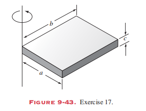
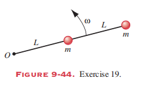
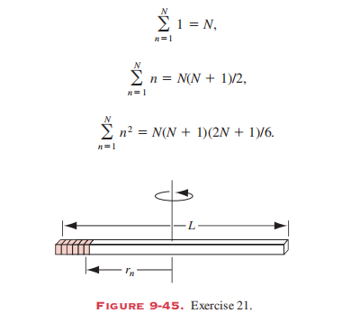
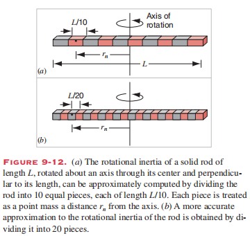

# HomeWork of Chapter 9

## T1 (P200 Ex.13)

Two thin rods of negligible mass are rigidly attached at their ends to form a 90° angle. The rods rotate in the xy plane with the joined ends forming the pivot at the origin. A particle of mass 75 g is attached to one rod a distance of 42 cm from the origin, and a particle of mass 30g is attached to the other rod a distance of 65 cm from the origin.
(a) What is the rotational inertia of the assembly
(b) How would the rotational inertia change if the particles were both attached to one rod at the given distances from the origin?

## T2 (P200 Ex.14)

Consider the assembly of Exercise 13 when the first rod lies along the positive x axis and the second rod along the positive y axis. A force $\vec{F}=(3.6N)\hat i+(2.5N)\hat j$ acts on the both particles. Find the resulting angular acceleration.

## T3 (P200 Ex.17)

Fig. 9-43 shows a uniform block of mass, M and edge lengths a, b, and c. Calculate its rotational inertia about an axis through one corner and perpendicular to the large face of the block.

## T4 (P200 Ex.19)

Two particles, each with mass m, are fastened to each other and to a rotation axis by two rods, each with length L and mass M, as shown in Fig. 9-44. The combination rotates around the rotation axis with angular velocity $\omega$. Obtain an algebraic expression for the rotational inertia of the combination about this axis.

## T5 (P200 Ex.21)

Fig. 9-45 shows the solid rod considered in Section 9-3 (see also Fig. 9-12) divided into an arbitrary number N of pieces.
(a) What is the mass $m_n$ of each piece?
(b) Show that the distance of each piece from the axis of rotation can be written as $r_n=(n-1)L/N+(\frac{1}{2})(L/N)=(n-\frac{1}{2})L/N$.
(c) Use Eq. 9-13 to evaluate the rotational inertia of this rod, and show that it reduces to Eq. 9-14 You may need the following sums:

## T6 (P200 Ex.33)

## T7 (P200 Ex.38)

## T8 (P200 Ex.41)

## T9 (P200 Ex.42)

## T10 (P200 Ex.43)

## T11 (P206 Ex.21)

## T12 (P206 Ex.22)

## T13 (P206 Ex.24)