# Chapter 9 Rotational Dynamics

## 力矩 (Torque)

力矩是使物体发生转动的的原因，对应平动运动中的力F
- 力矩矢量表达形式：$\vec \tau = \vec r \times \vec F$
- 力矩标量表达形式：$\tau = r F \sin \theta$，其中 $\theta$ 是 $\vec r$ 和 $\vec F$ 之间的夹角
- $r\sin \theta$ 是力臂，表示力的作用线与转轴之间的距离

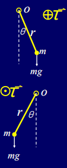

从上方图片中我们可以看到关于力矩方向的确定，根据右手定则：如果 $\vec r$ 和 $\vec F$ 的旋转方向是逆时针的，那么 $\vec \tau$ 的方向是垂直于平面向上的；如果是顺时针的，那么 $\vec \tau$ 的方向是垂直于平面向下的。

---
## 转动惯量 (Rotational Inertia)

转动惯量是物体转动惯性的大小，对应平动里的质量m，描述物体抵抗角加速度的能力
- 单个质点：$I=mr^2$
- 质点系：$I=\sum m_ir_i^2$
- 连续刚体：$I=\int r^2dm$

从上面的公式中可以看出，转动惯量取决于质量分布和转轴的位置
- 质量距离转轴越远，转动惯量越大
- 同一刚体，转轴不同I也不同

> 根据上述的概念以及在平动里面提到的 F=ma，我们不难推出转动惯量和力矩之间的关系 $ \vec \tau = I \vec \alpha $ (其中 $\vec \alpha$ 是角加速度)。

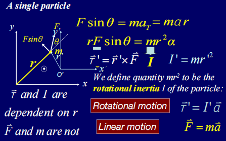

接下来我们来分析上面这一页PPT的具体内容
- 有一个外力 $F$ 作用在当前物体上，物体的质量为 $m$ 以及其位置矢量为 $\vec r$
- 则垂直与位置矢量的分量为 $F\sin\theta$
- 根据力矩的定义，我们可以得出 $\tau = r F \sin \theta$，其中 $r$ 是位置矢量的模长
- 则根据上面我们推出的的转动惯量和力矩之间的关系，我们可以得到结果 $\vec r F\sin\theta = mr^2\vec \alpha$

---
## 刚体的转动惯量

- 连续体：$I=\int r^2dm$
- 复习一下质量元
  - 线密度 $dm = \lambda dl$
  - 面密度 $dm = \sigma dA$
  - 体密度 $dm = \rho dV$

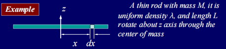

对于上面这个例子，偶们来分析其转动惯量

- $I=\int r^2dm$
- $I=\int r^2 \lambda dl$
- $I=\int_{-L/2}^{L/2} x^2 {M\over L} dx$
- $I={1\over 12}ML^2$

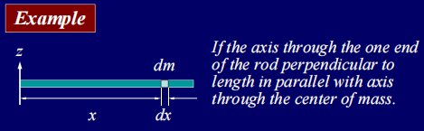

继续分析这个新的例子

- $I=\int r^2dm$
- $I=\int r^2\lambda dl$
- $I=\int_0^L x^2 {M\over L}dx%$
- $I={1\over 3}x^3{M\over L}|_0^L$
- $I={1\over 3}{ML^2}$

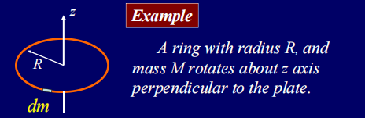

继续分析这个新的例子

- $I=\int r^2dm$
- $I=\int r^2\lambda dl$
- $I=\int_0^{2\pi} R^2 {M\over 2\pi R} Rd\theta$
- $I={MR^2\over 2\pi} \int_o^{2\pi} d\theta$
- $I=MR^2$

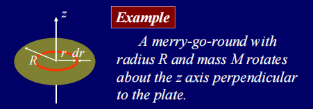

继续分析这个新的例子

- 对于每一个半径为 $r$, 宽度为 $dr$ 的环来说，其 $I=r^2{2\pi rdr\over \pi R^2}M={2r^3M \over R^2}dr$
- 所以根据上述将0-R大小的环全部积分 $I=\int_0^R {2r^3M \over R^2}dr={1\over 2}MR^2$

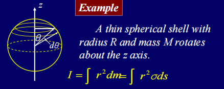

继续分析这个新的例子

- 对于这样一个圆壳，我们需要在外侧取圆环求解，对于一个角度为 $\theta$ 的圆环 $I=\int r^2 dm = \int R^2\sin^2\theta \sigma ds$
- 现在来求解上面的 $ds=2\pi R\sin\theta d\theta$
- 所以对于这样一个圆环 $I=\int R^2\sin^2\theta {M\over 4\pi R^2} 2\pi R\sin\theta d\theta=\int {\sin^3\theta MR\over 2}d\theta$
- 根据范围进行积分 $I=\int_0^\pi {\sin^3\theta MR\over 2}d\theta={2\over 3}MR^2$

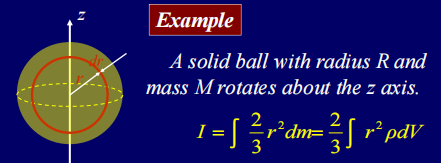

继续分析这个新的例子

- 对于一个半径为r的球壳，其 $I={2\over 3}\int r^2dm={2\over 3}\int r^2\rho dV$
- $dV=4\pi r^2 dr$
- 所以 $I={2\over 3}\int_0^R r^2 4\pi r^2 {M\over {4\over 3}\pi R^3}dr={2\over 3}\int_0^R {3r^4M\over R^3}dr={2\over 5}MR^2$

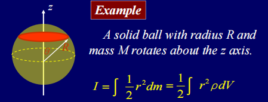

相同的方法横向切片视为多个圆盘的叠加也可以完成计算，这里就不赘述了

---
## 本节总结

| 物体/模型 | 取法或微元 | 转动惯量积分表达 | 结果 |
| --- | --- | --- | --- |
| 细杆，转轴过中点且垂直杆 | $dm=\lambda dl$，$x\in[-L/2,L/2]$ | $I=\int_{-L/2}^{L/2} x^2 {M\over L}dx$ | $I={1\over 12}ML^2$ |
| 细杆，转轴过一端且垂直杆 | $dm=\lambda dl$，$x\in[0,L]$ | $I=\int_0^L x^2 {M\over L}dx$ | $I={1\over 3}ML^2$ |
| 细圆环 | $dm=\lambda dl$，$r=R$ | $I=\int_0^{2\pi} R^2 {M\over 2\pi R}R d\theta$ | $I=MR^2$ |
| 圆盘 | 取半径为 $r$、宽度为 $dr$ 的微元圆环 | $dI= r^2 {2\pi r dr\over \pi R^2}M$，$I=\int_0^R {2r^3M\over R^2}dr$ | $I={1\over 2}MR^2$ |
| 圆壳 | 取角度为 $\theta$ 的环带，$r=R\sin\theta$ | $I=\int_0^\pi R^2\sin^2\theta {M\over 4\pi R^2}2\pi R\sin\theta d\theta$ | $I={2\over 3}MR^2$ |
| 实心球 | 视为薄球壳叠加，$dV=4\pi r^2dr$ | $I={2\over 3}\int_0^R r^2 4\pi r^2 {M\over {4\over 3}\pi R^3}dr$ | $I={2\over 5}MR^2$ |

这些例子的核心思路都是先选取合适的质量元，再把 $r^2dm$ 写成单变量积分，最后按几何范围积分即可。

---
## 牛顿定律在转动方面的应用

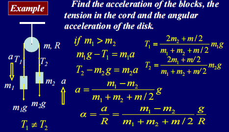

对于上面这个例子我们进行如下分析

首先题目中给出了必要的信息：重量为 $m$，半径为 $R$ 的定滑轮，以及一左一右两个质量为 $m_1$, $m_2$. 我们假设 $m_1>m_2$ 来对题目进行分析
- $m_1-T_1=m_1a$
- $T_2-m_2=m_2a$

根据上面两个式子我们可以得到
- $T_1={2m_2+m/2\over m_1+m_2+m/2}m_1g$
- $T_2={2m_1+m/2\over m_1+m_2+m/2}m_2g$

根据上述式子重新带入原有式子可以得到

$a={m_1-m_2\over m_1+m_2+m/2}g$
则定滑轮的角加速度为 $\vec \alpha = {a/over R}= {m_1-m_2\over m_1+m_2+m/2}{g\over R}$

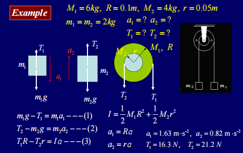

有了上面的计算基础之后，我们继续分析这个稍微复杂一些的例子

- $m_1g-T_1=m_1a_1$
- $T_2-m_2g=m_2a_2$
- $T_1R-T_2r=Ia$

根据两个滑轮的大小和半径，我们可以先求得他们的转动惯量大小

- $I={1\over 2}M_1R^2+{1\over 2}M_1=1r^2=0.035\ kg\cdot m^2$

然后我们要推断角加速度和加速度的直接关联

- $a_1=R\alpha=0.1\alpha$
- $a_2=R\alpha=0.05\alpha$

将上述两个式子带入到最开始的式子中我们可以得到

- $T_1=2g-0.2\alpha$
- $T_2=2g+0.1\alpha$

将上述两个式子带入到转动惯量的等式之中

$(2g-0.2\alpha)\cdot 0.1- (2g+0.1\alpha)\cdot 0.05 =0.035\alpha$
$\alpha = 16.33\ rad/s^2$ 

再根据其值求解其他所有的结果

---
## 平行轴定理

任意轴的转动惯量I，等于绕过质心、切与该轴平行的轴的转动惯量 $I_{cm}$ 加上 $Md^2$，其中 $M$ 是物体的总质量，$d$ 是两轴之间的距离
- $I=I_{cm}+Md^2$

这个顶力的作用是：只要你知道了刚体绕质心轴的转动惯量，就能直接算出任何平行轴的转动惯量，不需要重新积分

---
## 垂直轴定理

薄板绕垂直于版面的轴的转动惯量，等于它绕板面内两条互相垂直的轴的转动惯量之和。
- $I_z=I_x+I_y$
- $I_z$ 是绕垂直于板面的轴的转动惯量
- $I_x$ 和 $I_y$ 是绕板面内两条互相垂直的轴的转动惯量

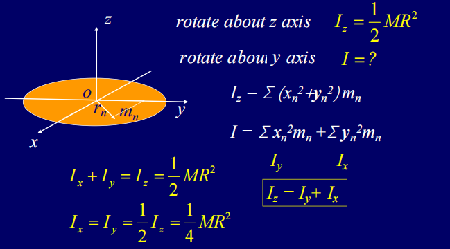

分析上图的例子，首先我们知道绕Z轴的转动惯量 $I_z=\frac{1}{2}MR^2 $，其中 $r$ 是质点到Z轴的距离
- 取圆盘上任意一个质量元 $dm$，其位置矢量为 $\vec r$，则 $r^2=x^2+y^2$，所以 $I_z=\int r^2 dm = \int (x^2+y^2) dm$
- 根据转动惯量的定义：$I_z=\sum m_nr_n^2=\sum m_n(x_n^2+y_n^2)$，其中 $r_n$ 是质点 $n$ 到Z轴的距离
- 将上述的求和拆开来得到 $I_z=\sum m_nx_n^2+\sum m_ny_n^2$，其中 $\sum m_nx_n^2$ 是绕X轴的转动惯量 $I_x$，$\sum m_ny_n^2$ 是绕Y轴的转动惯量 $I_y$
- 由于 $I_z=I_x+I_y$，所以我们得到了垂直轴定理的结论

## 总结平动和转动的核心方程

1. 单个质点
   - 平动：$F=m\vec a$，力$F$ 产生加速度，质量$m$ 是惯性
   - 转动：$\tau=I\vec \alpha$，力矩$\tau$ 产生角加速度，转动惯量$I$ 是转动惯性
2. 多质点/刚体
   - 平动：$\sum F=M\vec a$，总力产生加速度，总质量$M$ 是惯性
   - 转动：$\sum \tau=I\vec \alpha$，总力矩产生角加速度，转动惯量$I$ 是转动惯性

## 重力对刚体的力矩

**重力对质心的力矩为0，计算重力力矩的时候，可以等效为重力作用在质心上。**

重力是惯性力的一种，我们可以把重力的结论推广到惯性力上面：
- 在一个加速度为 $\vec a$ 的非惯性参考系中，惯性力的大小为 $F_{inertial}=-m\vec a$，作用在质心上
- 惯性力对质心的力矩为0，计算惯性力矩的时候，可以等效为惯性力作用在质心上

## 转动和平动综合计算

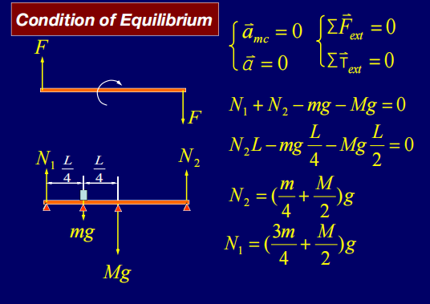

对于上面这情况，一根质量为M的均匀杆上面放置了一个质量为m的物体，两端支撑，求支撑力 $N_1$ 和 $N_2$

1. 力的平衡：$N_1+N_2=Mg+mg$
2. 力矩的平衡：$N_2L-mg\cdot {L\over 4}-Mg\cdot {L\over 2}=0$
   
解得
- $N_1={3\over 4}mg+{1\over 2}Mg$
- $N_2={1\over 4}mg+{1\over 2}Mg$

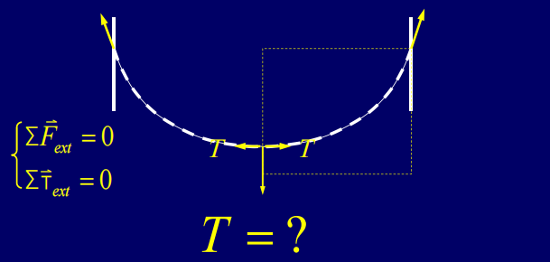

对于这样一个问题：一根柔软、均匀、不可伸长且两端固定、中间自然下垂的悬链线，我们需要求解最低点的水平差张力

我们取最低点右侧的一小段绳子，做下受力分析
- 最低点的水平张力T: 向左，水平
- 右端张力$T_1$: 向右，水平
- 重力$mg$: 向下，竖直

进行受力分析
- 水平方向：$T_1\cos\theta=T$
- 竖直方向：$T_1\sin\theta=mg$

解得 $T={mg\over \tan\theta}$

---
## 下面继续根据一些例题来完成对于各种平动转动的求解

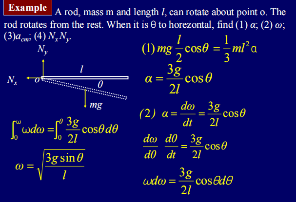

题目：一根质量为m，长度为l的均匀细杆，一端固定在O点，从水平静止开始下摆，求杆与水平方向夹角为 $\theta$ 时
1. 角加速度 $\alpha$
2. 角速度 $\omega$
3. 质心加速度 $a_{cm}$
4. 支点O的约束力 $N_x$ 和 $N_y$

1. 角加速度 $\alpha$ 的求解
- 杆绕一段的转动惯量是 $I={1\over 3}ml^2$
- 重力对转轴的力矩是 $\tau={1\over 2}mgl\cos\theta$
- 根据转动动力学方程 $\tau=I\alpha$，我们可以得到 $\alpha={3g\over 2l}\cos\theta$

2. 角速度 $\omega$ 的求解
- 角加速度和角速度的关系： $\alpha={d\omega\over dt}={d\omega\over d\theta}{d\theta\over dt}=\omega{d\omega\over d\theta}$
- 将 $\alpha$ 的表达式带入上面的关系式中，我们可以得到 $\omega{d\omega\over d\theta}={3g\over 2l}\cos\theta$
- 积分两边得到 $\int_0^\omega \omega d\omega = \int_0^\theta {3g\over 2l}\cos\theta d\theta$，解得 $\omega=\sqrt{3g\sin\theta\over l}$

3. 质心加速度 $a_{cm}$ 的求解
- 质心在杆的中点，距离转轴的距离为 $\frac{l}{2}$
- 所以切向加速度 $a_{t}=\frac{l}{2}\alpha=\frac{3g}{4}\cos\theta$
- 法向加速度 $a_{n}=\frac{l}{2}\omega^2=\frac{3g}{2}\sin\theta$

4. 支点O的约束力 $N_x$ 和 $N_y$ 的求解
- 垂直于杆的方向：$N_x\sin\theta-N_y\cos\theta+mg\cos\theta=ma_{t}$
- 平行于杆的方向：$N_x\cos\theta+N_y\sin\theta-mg\sin\theta=ma_{n}$

联立解得
- $N_x=\frac{9}{4}mg \sin\theta\cos\theta$
- $N_y=mg(1+\frac{3}{2}\sin^2\theta-\frac{3}{4}\cos^2\theta)$

5. 考虑特殊情况 $\theta=0$ 和 $\theta=\frac{\pi}{2}$ 的情况
- 当 $\theta=0$ 时，杆处于水平位置，$\alpha=\frac{3g}{2l}$，$\omega=0$，$a_{cm}=\frac{3g}{4}$，$N_x=0$，$N_y=\frac{1}{4}mg$
- 当 $\theta=\frac{\pi}{2}$ 时，杆处于竖直位置，$\alpha=0$，$\omega=\sqrt{\frac{3g}{l}}$，$a_{cm}=\frac{3g}{2}$，$N_x=0$，$N_y=\frac{5}{2}mg$

## 平面平行运动

刚体的运动满足两个条件：
- 转动轴始终通过质心：刚体绕质心转动
- 转动轴方向在空间中保持不变：转动轴方向不随刚体运动改变

这种运动被称为平面平行运动，它的本质是：质心的平动和绕质心的转动

比如：一个质量为M，半径为R的均匀圆盘，被一根绳子悬挂，从静止开始下落，求质心加速度 $a$ ,角加速度 $\alpha$ 和绳子张力 $T$

- 平动：$Mg-T=Ma$
- 转动：$TR=I\alpha$，其中 $I={1\over 2}MR^2$，$\alpha={a\over R}$
- 运动学关系，圆盘边缘相对于质心的线加速度等于质心加速度：$a=\alpha R$

根据上述可以解得
- $a={2\over 3}g$
- $\alpha={2\over 3}{g\over R}$
- $T={1\over 3}Mg$

---
## 纯滚动的定义与条件

**定义：**刚体在接触面上滚动时，接触点相对于接触面的瞬时速度为0，没有相对滑动

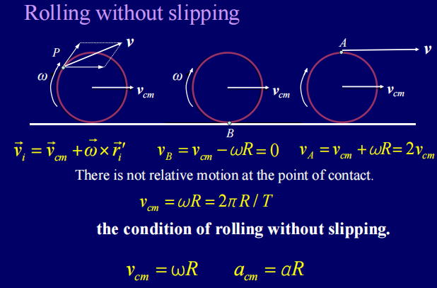

**条件：**
- 刚体上任意一点的速度，是质心速度和绕之心速度的矢量和：$\vec v = \vec v_{cm} + \vec \omega \times \vec r$
- 接触点B：质心速度向右，转动速度想做，所以 $\vec v_B = \vec v_{cm} + \vec \omega \times \vec r_B = 0$，所以 $v_{cm}=\omega R$
- 接触点A：质心速度向右，转动速度想做，所以 $\vec v_A = \vec v_{cm} + \vec \omega \times \vec r_A = 2\vec v_{cm}$，所以 $v_A=2\omega R$
- 加速度条件：$a_{cm}=\alpha R$，其中 $a_{cm}$ 是质心加速度，$\alpha$ 是角加速度（根据第一个式子求导）

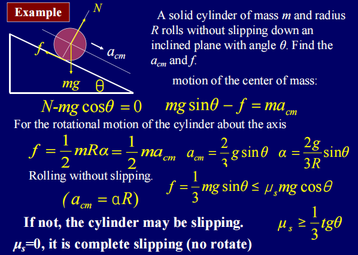

对于上面这个例子：质量为m,半径为R的均匀圆盘，从倾斜角为 $\theta$ 的斜面上纯滚动下滑，求质心加速度 $a_{cm}$和静摩擦力

1. 受力分析
- 重力 $mg$: 竖直向下，分解为沿斜面向下的分量 $mg\sin\theta$ 和垂直斜面向下的分量 $mg\cos\theta$
- 支持力 $N$: 垂直斜面向上的力，大小为 $N=mg\cos\theta$
- 静摩擦力 $f$: 沿斜面向上的力，大小为 $f$，满足 $f \leq \mu N$

2. 动力学方程
- 平动：$mg\sin\theta - f = ma_{cm}$
- 转动：$fR = I\alpha$，其中 $I={1\over 2}mR^2$，$\alpha={a_{cm}\over R}$，所以可得到 $f = {1\over 2}ma_{cm}$

根据上述我们可以得到结果
- $a_{cm}={2\over 3}g\sin\theta$
- $f={1\over 3}mg\sin\theta$

由于不滑动的条件由静摩擦力提供，所以我们需要确保 $f \leq \mu N$，即 ${1\over 3}mg\sin\theta \leq \mu mg\cos\theta$，解得 $\tan\theta \leq 3\mu$，所以当 $\theta$ 满足这个条件时，圆盘才能保持纯滚动状态。

---
## 纯滚动的瞬心 (Instantaneous Axis)

瞬心的定义：纯滚动时，接触点B的瞬时速度为0，所以可以将其看作刚体的瞬时转动轴。此时，刚体上所有点的运动都可以看成是绕着瞬心B的纯转动

瞬心法的应用：
- 绕瞬心的角速度 $\omega$ 与绕质心的角速度相同
- 绕瞬心的角加速度 $\alpha$ 与绕质心的角加速度相同
- 刚体上任意一点的速度，都可以用绕瞬心的转动来计算：$\vec v = \vec \omega \times \vec r$，其中 $\vec r$ 是该点到瞬心的距离矢量

接下来使用瞬心法求解上述相同问题

- 绕瞬心的转动惯量：$I_B=I_{cm}+mR^2={3\over 2}mR^2$
- 力矩：$\tau=mgR\sin\theta$
- 转动定律求解：$mgR\sin\theta = I_B \alpha= {3\over 2}mR^2 \alpha$
- 解得 $\alpha={2\over 3}{g\sin\theta\over R}$，所以 $a_{cm}=\alpha R={2\over 3}g\sin\theta$

**结论**
- 从上面的分析过程我们不难看出，角速度和角加速度与转轴的选择没有任何关系
- 但是力矩以及转动惯量与转轴的选择相关

---
## 外力作用下的纯滚动

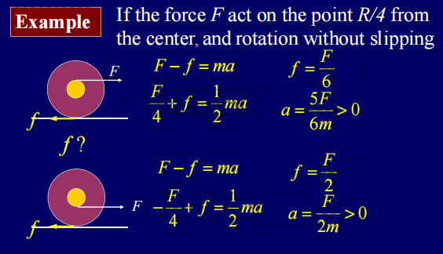

情况1：拉力作用在质心上方 $R/4$ 的位置

- 平动方程：$T-f=ma_{cm}$
- 转动方程：$TR/4+fR=I\alpha$，即为 $TR/4+fR={1\over 2}mR^2 \alpha$，所以 $T/4+f={1\over 2}ma_{cm}$

解得
- $f=\frac{F}{6}$
- $a=\frac{5F}{6m}$

情况2：拉力作用在质心下方 $R/4$ 的位置

- 平动方程：$T-f=ma_{cm}$
- 转动方程：$-TR/4+fR=I\alpha$，即为 $-TR/4+fR={1\over 2}mR^2 \alpha$，所以 $-T/4+f={1\over 2}ma_{cm}$

解得
- $f=\frac{F}{2}$
- $a=\frac{F}{2m}$

最重要的还是把题目做明白了