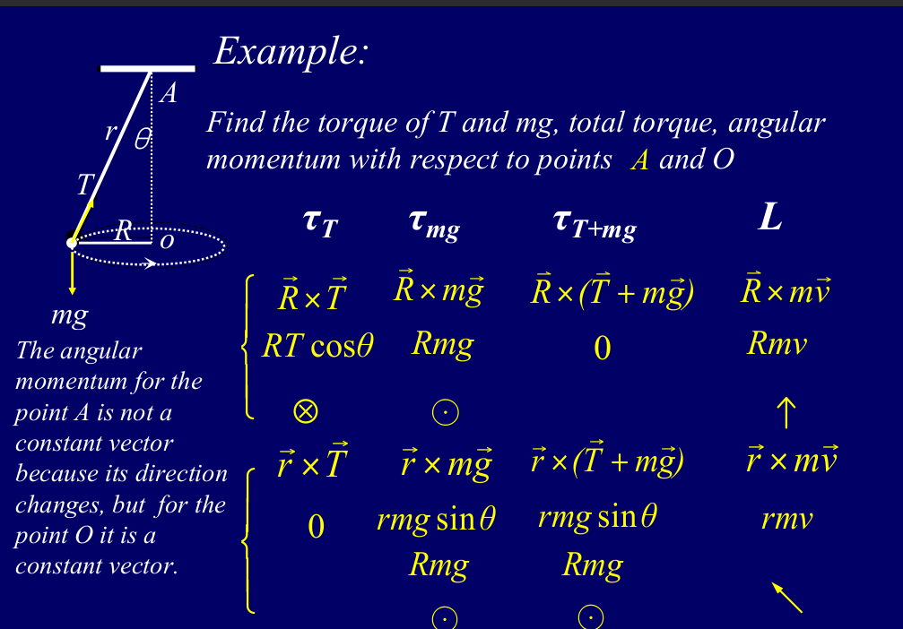
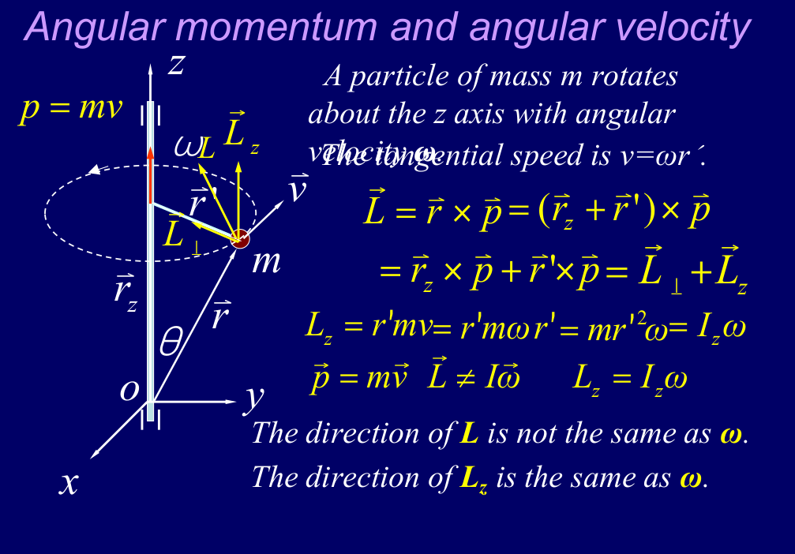
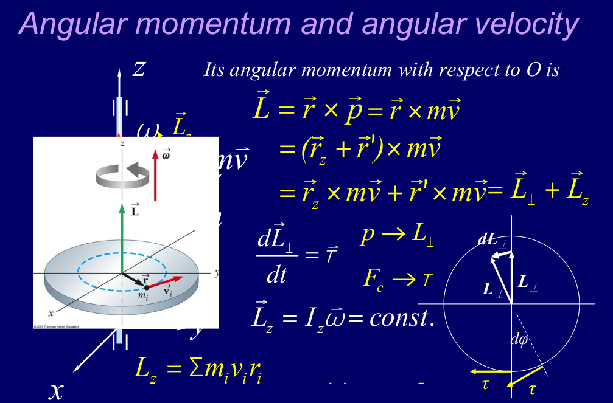
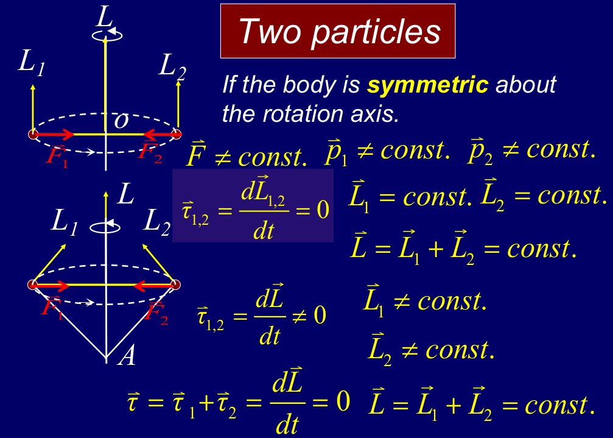
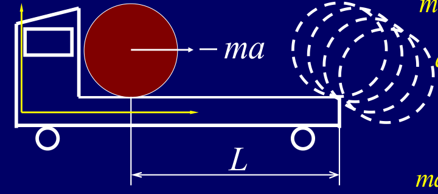
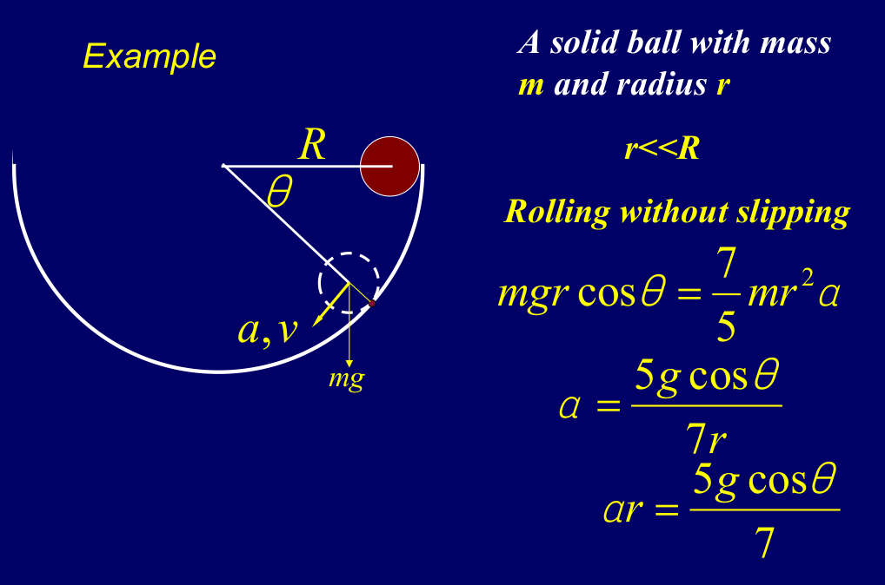
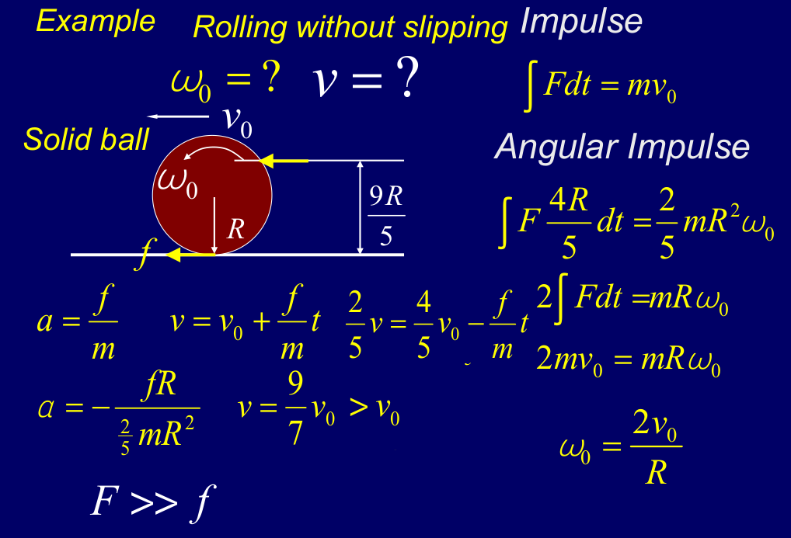

# Chapter 10 Angular Momentum

## 角动量定义与角动量定理

对于一个质点来说，**角动量的定义**是：
- $\vec L = \vec r \times \vec p$
- 其中 $\vec r$ 是质点相对于某个参考点的位置矢量，$\vec p=m\vec v$ 是质点的线动量。
- 所以 $\vec L = r p \sin\theta$

角动量定理的推导

$$\begin{aligned}
\frac{d\vec L}{dt} &= \frac{d}{dt}(\vec r \times \vec p) \\
&= \frac{d\vec r}{dt} \times \vec p + \vec r \times \frac{d\vec p}{dt} \\
&= \vec v \times m\vec v + \vec r \times \vec F \\
&= \vec r \times \vec F \\
&= \vec \tau
\end{aligned}$$

也就是说，质点的角动量的变化率等于作用在质点上的力矩。这与牛顿第二定律的形式非常相似，都是描述了动量（线动量或角动量）的变化与作用在物体上的力（或力矩）之间的关系。

角动量也可以用分量形式来表达
- $\frac{dL_x}{dt}=\tau_x$
- $\frac{dL_y}{dt}=\tau_y$
- $\frac{dL_z}{dt}=\tau_z$

需要注意的是，质点的角动量是相对于某个参考点定义的，不同的参考点会得到不同的角动量值。

---
## 冲量与角动量

先回顾一下线动量和冲量的关系：$J=\int F dt = \Delta p$，也就是说，作用在物体上的力的时间积分等于物体动量的变化。

下面推导出角动量和角动量冲量的关系：
- $\vec J_{angular} = \int \vec \tau dt = \int (\vec r \times \vec F) dt$
- 由于 $\vec r$ 是位置矢量，可以看作是常数，所以 $\vec J_{angular} = \vec r \times \int \vec F dt = \vec r \times \Delta \vec p = \Delta \vec L$

从上面的式子中我们不难看出，角动量守恒的条件是：作用在物体上的总力矩为零，即 $\sum \vec \tau = 0$，这时 $\Delta \vec L = 0$，角动量保持不变。

针对上面这个例子简要的分析,我们先以O点位参考点
- 拉力的力矩$\tau_T=RT\cos \theta$
- 重力的力矩$\tau_{mg}=Rmg$
- 合外力矩$\tau_{net} = \tau_T + \tau_{mg}=0$
- 角动量 $\vec L = \vec R \times m\vec v$,所以 $|\vec L| = Rmv$，方向竖直向上
- 可以见得在这种坐标系下，角动量是恒定的，因为合外力矩为0

现在再以A点为参考点
- 拉力的力矩$\tau_T=0$
- 重力的力矩$\tau_{mg}=rmg\sin\theta=Rmg$
- 合外力矩$\tau_{net} = \tau_T + \tau_{mg}=Rmg$
- 角动量 $\vec L = \vec r \times m\vec v$,所以 $|\vec L| = rmv$，方向在不断改变
- 可以见得在这种坐标系下，角动量不是恒定的，因为合外力矩不为0

---
## 角动量与角速度的基本关系

对于上面这样一个例子，一个质量为m的质点绕着z轴坐圆周运动，角速度为$\omega$，线速度为v，半径为$r'=rsin\theta$，切向速度与角速度的关系为$v=r'\omega=\omega r \sin\theta$

- 角动量的定义式：$\vec L = \vec r \times m\vec v$
- 这里我们把位置矢量拆分为潘星宇z轴的分量和垂直于z轴的分量：$\vec r = \vec r_z + \vec r'$
- 带入角动量的定义式中，我们可以得到：$\vec L = \vec r_z \times m\vec v + \vec r' \times m\vec v$
- $L_z=\vec r'\cdot mv=mr'^2v$
- 对于角动量垂直分量，我们可以得到：$L_\perp = \vec r_z \cdot mv = r\cos\theta \cdot m \cdot \omega r \sin \theta=mr^2\omega \cos\theta \sin \theta$
- 然后最后在分析圆周运动的力矩$\tau = rF\sin\theta=r\cdot(m\omega^2r\sin \theta)\cdot\cos\theta=m\omega^2 r^2 \sin\theta \cos\theta$

接下来我们对角动量的变化率进行分析：
- $\frac{dL_\perp}{dt}=\omega L_\perp$
- 所以显而易见的，$L_z$是一个常数，而$L_\perp$是一个随时间变化的量，且其变化率与与外力矩相等。

---
## 刚体的角动量分解

先进行角动量的分解，分解方式和质点的角动量分解方式完全一致
- $\vec L = \vec L_{z} + \vec L_{perp}$
- $L_z = I\omega$，其中$I$是刚体绕z轴的转动惯量
- $L_{\perp} = \vec \tau$

对于这样一个例子，上方是一个对称的刚体，而下方是一个不对称的刚体

上面这个对称的刚体由两个关于转轴对称的质点构成，很容易得到每个质点的角动量都是沿转轴方向，所以 $\vec L=\vec L_1+\vec L_2$，因此，$\frac{d\vec L}{dt}=0$，合外力矩为0，角动量守恒

而对于下面这个不对称的刚体，两个质点的角动量都不沿转轴方向即方向不断在变化，因此对于两者而言都收到向心力产生的力矩，但是由于两个质点收到的向心力产生的力矩大小相等，方向相反，所以合外力矩为0，角动量守恒 $\frac{d\vec L}{dt}=0$

从上面这个样一个例子我们可以得到结论：如果一个非对称的刚体绕定轴转动时，轴承必须要提供力矩，这就是为什么偏心轴会产生振动导致磨损的原因

| 平动物理量 | 符号与公式 | 转动对应量 | 符号与公式 |
| --- | --- | --- | --- |
| 质量 | $m$ | 转动惯量 | $I=\sum mr^2$ | 
| 力 | $F$ | 力矩 | $\tau=r\times F$ |
| 速度 | $v=\frac{dr}{dt}$ | 角速度 | $\omega=\frac{d\phi}{dt}$ |
| 加速度 | $a=\frac{dv}{dt}$ | 角加速度 | $\alpha=\frac{d\omega}{dt}$ |
| 线动量 | $\vec p=mv$ | 角动量 | $\vec L=\vec r\times \vec p$ |
| 系统总动量 | $\vec P=M\vec v$ | 系统总角动量 | $\vec L_z=I_z\vec \omega$ |
| 动力学定律 | $\sum \vec F_{ext}=M\vec a$ | 动力学定律 | $\sum \vec \tau_{ext}=I\alpha$ |
| 平衡条件 | $\sum \vec F_{ext}=\frac{d\vec p}{dt}=0$ | 平衡条件 | $\sum \vec \tau_{ext}=\frac{d\vec L}{dt}=0$ |
| 守恒结论 | $\sum \vec p=constant$ | 守恒结论 | $\sum \vec L=constant$ |

## 卡车与圆盘的滚动问题

问题：卡车以加速度a向左运动，车厢内用一个质量为m，半径为R的圆盘，圆盘与车厢底板之间无滑动，求圆盘滚到车厢右端时，卡车移动的距离

推导：
- 非惯性系中：圆盘受到向右的惯性力 ma
- 平动方程：$ma-f=ma_{cm}$，其中f是圆盘与车厢底板之间的摩擦力，$a_{cm}$是圆盘质心的加速度
- 转动方程：$fR=I\alpha=\frac{1}{2}mR^2\alpha$，其中$I$是圆盘的转动惯量
- 无滑动条件：$a_{cm}=\alpha R$
- 由转动方程可以得到：$f=\frac{1}{2}mRa$
- 将f代入平动方程中可以得到：$a_{cm}=\frac{2}{3}a$
- 角加速度 $\alpha=\frac{2}{3}\frac{a}{R}$
- 最后进行运动学计算，根据圆盘移动的距离求解t$L=\frac{1}{2}a_{cm}t^2$
- $t = \sqrt{\frac{2L}{a_{cm}}}=\sqrt{\frac{2L}{\frac{2}{3}a}}=\sqrt{\frac{3L}{a}}$
- 卡车移动的距离 $s=\frac{1}{2}at^2$
- 将t代入s中可以得到：$s=\frac{3}{2}L$

## 小球在圆弧轨道的纯滚动问题

问题：一个质量为m，半径为r的实心球，在圆弧轨道上做无滑动滚动，r远小于圆弧半径R，可以近似认为小球的质心做半径为R的圆周运动，求小球在轨道上某一角度 $\theta$ 处的质心线加速度a，线速度v和向心加速度$a_R$

推导：
- 受力分析：小球一共受到三个力：重力 $mg$，支持力 $F_N$ 以及摩擦力 $f$
- 以小球和圆弧轨道的接触点为分析点，我们可以发现
  - $\tau_{mg}=mg\times \vec r=mgrcos\theta$
  - $\tau_{F}=0$
  - $\tau_{f}=0$
  - 转动惯量 $I=\frac{2}{5}mr^2+mr^2=\frac{7}{5}mr^2$
  - 所以可以根据 $I\alpha=\tau$，求解得到 $\alpha=\frac{5g\cos\theta}{7r}$
  - 根据角加速度我们可以得到质心的切向加速度 $a=r\alpha=\frac{5g\cos\theta}{7}$
- 接下来求质心线速度
  - 根据机械能守恒，我们可以得到 $mgr\sin\theta=\frac{1}{2}mv^2+\frac{1}{2}I_{cm}\omega^2$
  - 由于是纯滚动，所以我们不难得到 $v=\omega r$
  - 带入后直接求解可以得到 $v=\sqrt{\frac{10gR\sin\theta}{7}}$
  - $\omega=\sqrt{\frac{10gR\sin\theta}{7r^2}}$
- 最后一步求解向心加速度
  - $a_R=\frac{v^2}{R}=\frac{10g\sin\theta}{7}$

## 最后一个例题

问题： 一个实心球，在不同高度h上面受到水平的冲量，求冲量作用后，球获得的初始角速度，初始线速度，以及最终稳定纯滚动时的线速度v

推导：
- 