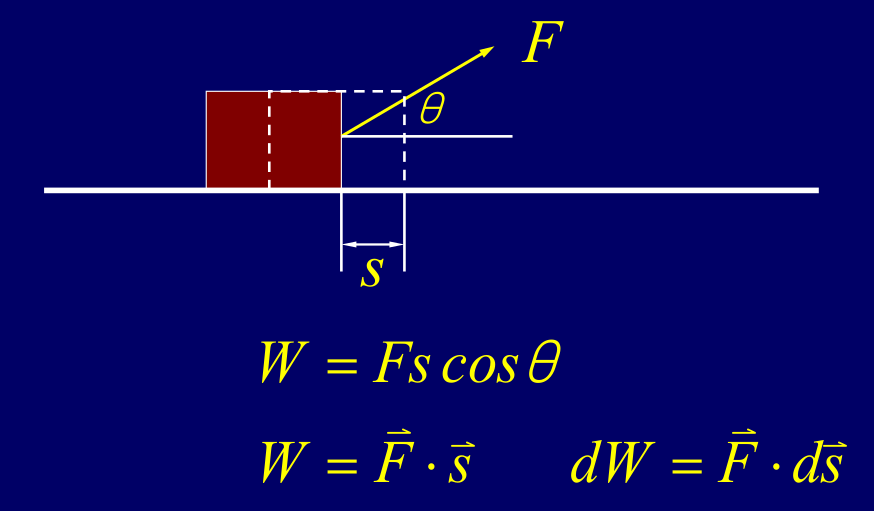
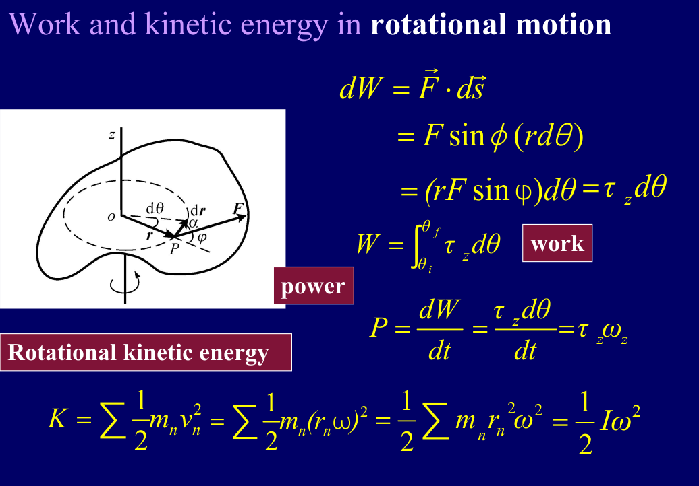
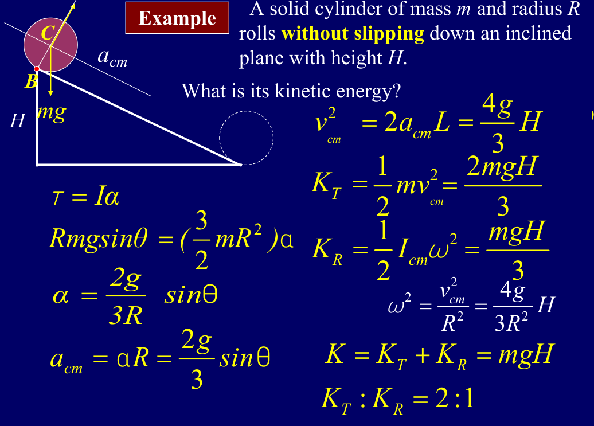

# Chapter 11 Work and Kinetic Energy

## 恒力做功

一个物体在水平面上，受到一个水平向右的恒力F，向右移动了位移s
- 这个恒力做的功是：$W=Fs\cos\theta$，其中$\theta$是力F与位移s之间的夹角
- 写成矢量形式：$W=\vec F \cdot \vec s$
- $dW=\vec F \cdot d\vec s$，所以 $W=\int \vec F \cdot d\vec s$

## 功率

- 平均功率：$P_{avg}=\frac{W}{\Delta t}$
- 瞬时功率：$P=\lim_{\Delta t \to 0} \frac{W}{\Delta t} = \frac{dW}{dt}$
- 单位：瓦特（W），1 W = 1 J/s

## 变力做功

核心思路：把整个运动过程，切成无数个极小的位移段，在每个小段上近似认为力是恒定的，然后把每个小段的功加起来。
- $W=\delta w_1 + \delta w_2 + \cdots + \delta w_n$
- 当$n \to \infty$时，$\delta w_i \to 0$，于是 $W=\int_{x_i}^{x_f} \vec F \cdot d\vec x$

## 变力做功推广到二维

- 通用公式：$W=\int_{C} \vec F \cdot d\vec r$
- 二维展开：
  - 位移元：$d\vec r = dx \hat i + dy \hat j$，
  - 力的分量：$\vec F = F_x \hat i + F_y \hat j$，所以 $W=\int_{C} (F_x dx + F_y dy)$

## 动能与动能定理

- $W=\int_{v_1}^{v_2} m v dv = \frac{1}{2}mv^2 \Big|_{v_1}^{v_2} = \frac{1}{2}mv_2^2 - \frac{1}{2}mv_1^2$
- 合外力对物体做的总功等于物体动能的变化：$W_{net} = \Delta K$
- 其中动能的定义式：$K=\frac{1}{2}mv^2$

## 三种类型的碰撞总结

| 碰撞类型 | 动能是否守恒 | 动能变化K | 能量转化 |
| --- | --- | --- | --- |
| 弹性碰撞 | 碰撞前后动能守恒 | 是 | 仅动能和弹性势能的相互转化 |
| 非弹性碰撞 | 碰撞前后动能不守恒 | 否 | 动能转化为内能、声能等其他形式的能量 |
| 爆炸类碰撞 | 碰撞前后动能不守恒 | 否 | 内能、声能等其他形式的能量转化为动能 |

## 转动中的功和动能

1. 转动中的功：从功的定义出发，当刚体绕定轴转动时，力的作用点的位移元 $d\vec s$ 可以写成 $rd\theta$
  - 只有里的切向分量 $F\sin\theta$ 会做功，径向分量不做功
  - $dW=\vec F d\vec s = F\sin \theta (rd\theta)=\tau_z d\theta$
  - $W=\int \tau_z d\theta$
  - 力矩中对角度的积分，就是转动中力做的功，和平动中力对唯一的积分完全对应

2. 转动中的功率：
  - $P=\frac{dW}{dt}=\tau_z \frac{d\theta}{dt} = \tau_z \omega$
  - 转动中的功率等于力矩乘以角速度
3. 转动动能：
  - 这里我们把刚体看成无数个质点组成，而每个质点的动能是 $\frac{1}{2}mv^2$，而线速度是 $v_n=r_n\omega$
  - 所以总动能是 $K=\sum \frac{1}{2}mv_n^2 = \sum \frac{1}{2}mr_n^2\omega^2 = \frac{1}{2}I\omega^2$
  - 这里的I是转动惯量，平动中的质量在转动中对应的就是转动惯量

## 平动和转动物理量的对比

| 物理量 | 平动 | 转动 |对应关系|
| --- | --- | --- | --- |
| 功 | $W=\int \vec F \cdot d\vec s$ | $W=\int \tau_z d\theta$ | $F$ 对应 $\tau$，$d\vec s$ 对应 $r d\theta$ |
| 功率 | $P=\frac{dW}{dt}=\vec F \cdot \vec v$ | $P=\frac{dW}{dt}=\tau_z \omega$ | $F$ 对应 $\tau$，$\vec v$ 对应 $\omega$ |
| 动能 | $K=\frac{1}{2}mv^2$ | $K=\frac{1}{2}I\omega^2$ | $m$ 对应 $I$，$v$ 对应 $\omega$ |

## 平动和转动的总动能

把刚体上任意一点的速度，分解为质心的平动速度和绕质心 $\vec v_{cm}$ 的转动速度和绕质心的转动速度 $\vec v_{rot}$，即 $\vec v_{n}=\vec v_{cm}+\vec v_{rot}$

- 动能展开：$K=\sum \frac{1}{2}mv_n^2 = \sum \frac{1}{2}m(\vec v_{cm}+\vec v_{rot})^2 = \sum \frac{1}{2}mv_{cm}^2 + \sum \frac{1}{2}mv_{rot}^2 + \sum m\vec v_{cm}\cdot\vec v_{rot}$
  - 第一项：$\sum m_n=M$,所以第一项是质心的平动动能 $\frac{1}{2}Mv_{cm}^2$
  - 第二项：$\sum \frac{1}{2}mv_{rot}^2$ 是绕质心的转动动能 $\frac{1}{2}I_{cm}\omega^2$
  - 第三项：$\sum m\vec v_{cm}\cdot\vec v_{rot}$ 是零，因为绕质心的转动速度 $\vec v_{rot}$ 是垂直于质心的平动速度 $\vec v_{cm}$ 的，所以 $\vec v_{cm}\cdot\vec v_{rot}=0$
  - 最终得到的结果就是，刚体的总动能等于质心的平动动能加上绕质心的转动动能：$K=\frac{1}{2}Mv_{cm}^2 + \frac{1}{2}I_{cm}\omega^2$

## 例题

问题：实心圆柱，质量为M，半径为R，从高度H的斜面无滑动滚下，求解到达底部时候的动能以及平动和转动动能的比例

推导：
- 转动惯量：$I_{cm}=\frac{1}{2}MR^2$
- 纯滚动条件：$a_{cm}=\alpha R$
- 力矩方程：摩擦力提供力矩，质心为转轴：$\tau=fR=I_{cm}\alpha$
- 同时根据平动方程，我们知道 $mg\sin\theta-f=ma_{cm}$
- 解得：$a_{cm}=\frac{2}{3}g\sin\theta$
- 计算质心速度：$v^2_{cm}=2a_{cm}L=\frac{4}{3}gH$
- 平动动能：$K_{cm}=\frac{1}{2}Mv^2_{cm}=\frac{2}{3}MgH$
- 转动动能：$K_{rot}=\frac{1}{2}I_{cm}\omega^2=\frac{1}{4}MR^2\cdot\frac{v^2_{cm}}{R^2}=\frac{1}{3}MgH$
- 动能总和：$K=K_{cm}+K_{rot}=\frac{2}{3}MgH+\frac{1}{3}MgH=MgH$
- 平动动能占总动能的比例：$\frac{K_{cm}}{K}=\frac{2}{3}$，转动动能占总动能的比例：$\frac{K_{rot}}{K}=\frac{1}{3}$

纯滚动是静摩擦力，所以它不做功，机械能守恒，所以动能等于重力势能的变化！！！