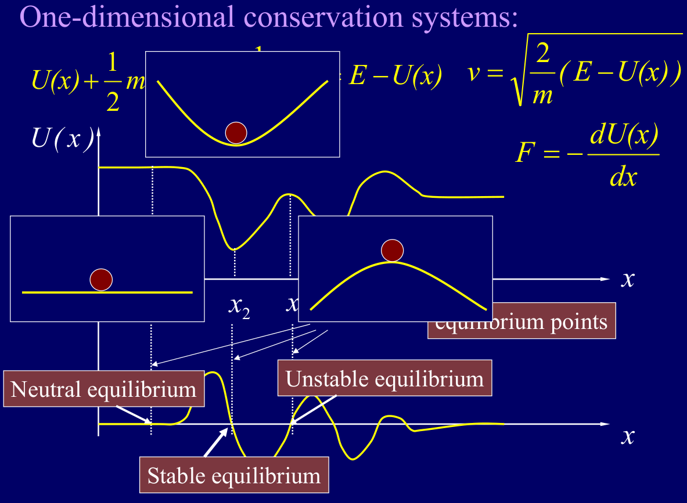
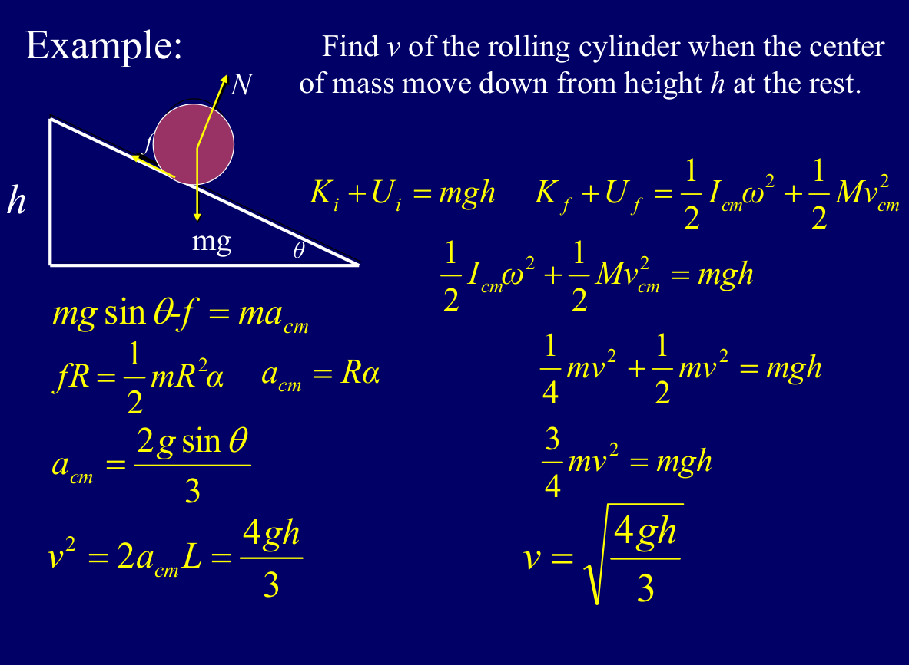
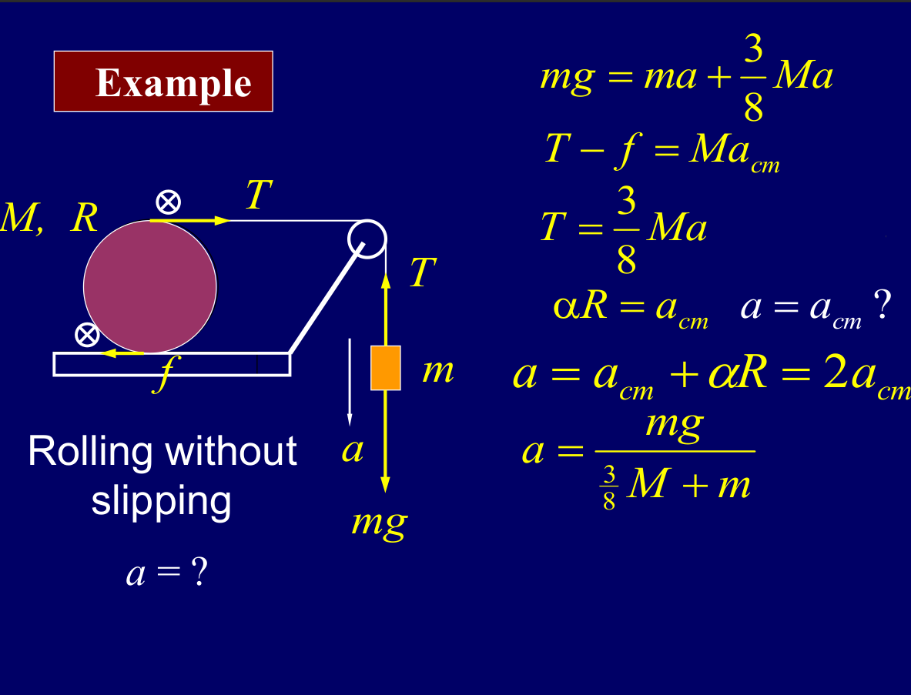

# Chapter 12 Potential Energy

## 保守力 Conservative Force

保守力的定义：如果一个力满足以下条件，那么它就是一个保守力：
- 作用在物体上的力的大小和方向只取决于物体的位置，而与物体的运动路径无关。
- 作用在物体上的力的环路积分为零，即 $\oint \vec F \cdot d\vec r = 0$。

常见的保守力包括重力、弹力和万有引力等。

保守力做的功，等于势能变化的负值，即 $W = -\Delta U$，其中$U$是势能。也可以写成 $U(x)=\int_{x_0}^{x} F(x') dx'+U(x_0)$，其中$x_0$是势能的参考点。

---
## 常见保守力的势能表达式

| 力的类型 | 力的表达式 | 势能表达式 |
| --- | --- | --- |
| 重力 | $\vec F = m\vec g$ | $U=mgh$ |
| 弹力 | $\vec F = -kx$ | $U=\frac{1}{2}kx^2$ |
| 万有引力 | $\vec F = -\frac{GMm}{r^2}\hat r$ | $U=-\frac{GMm}{r}$ |

通过公式的推导，我们不难得到 $F(x)=-\frac{dU}{dx}$，也就是说，保守力等于势能对位置的负导数。也就是说，保守力总是指向势能降低的方向。

---
## 三维情况下的保守力与势能

- 三维下势能能变化的定义：$\Delta U = U(x_f,y_f,z_f)-U(x_i,y_i,z_i)=-\int_i^f \vec F \cdot d\vec r$，其中$d\vec r=dx \hat i + dy \hat j + dz \hat k$是从初始位置到最终位置的路径。
- 三维下的微分关系
  - $dU=-(F_x dx + F_y dy + F_z dz)$
  - $F_x=-\frac{\partial U}{\partial x}$，$F_y=-\frac{\partial U}{\partial y}$，$F_z=-\frac{\partial U}{\partial z}$
  - 写成矢量形式：$\vec F = -\nabla U=( -\frac{\partial U}{\partial x}, -\frac{\partial U}{\partial y}, -\frac{\partial U}{\partial z} )$，其中 $\nabla U$ 是势能的梯度，表示势能在空间中的变化率和方向。

比如说， $U=2x-y^3+2z^2$
- $F_x=-\frac{\partial U}{\partial x}=-2$
- $F_y=-\frac{\partial U}{\partial y}=3y^2$
- $F_z=-\frac{\partial U}{\partial z}=-4z$

---
## 机械能守恒

前提条件：系统是孤立的，只有保守力做功，且没有能量以其他形式（如热能、声能等）转化或损失。

1. 动能定理：合外力做功等于动能变化 $W = \Delta K$
2. 保守力做功：等于势能变化的负值 $W=-\Delta U$
3. 联立之后可以得到：$\Delta K + \Delta U = 0$，也就是说，动能和势能的总和保持不变，即 $K+U=E$，其中$E$是系统的机械能。

---
## 势能曲线

1. 稳定平衡 (Stable equilibrium)：当物体处于势能曲线的极小点时 $\frac{dU}{dx}=0$， 且曲线下凹。物体偏离平衡位置时，保守力会将其拉回平衡位置。
2. 不稳定平衡 (Unstable equilibrium)：当物体处于势能曲线的极大点时 $\frac{dU}{dx}=0$， 且曲线向上凸。物体偏离平衡位置时，保守力会将其推离平衡位置。（比如山顶上的小球）
3. 中性平衡 (Neutral equilibrium)：当物体处于势能曲线的平坦区域时 $\frac{dU}{dx}=0$， 且曲线平坦。物体偏离平衡位置时，保守力不会对其产生恢复作用。（比如水平面上的小球）

我们用机械能守恒的方式再来看一下这道题目

- 根据机械能守恒，我们可以知道 $K_f+U_f=E=\frac{1}{2}mv^2+\frac{1}{2}I_{c}\omega^2$
- 又因为 $v=r\omega$，所以 $E=\frac{1}{2}mv^2+\frac{1}{2}I_{c}\frac{v^2}{r^2}$
- 解得 $v=\sqrt{\frac{4gh}{3}}$

问题：质量为M、半径为R的圆柱在水平面上无滑动滚动，通过绳子和滑轮连接一个质量为m的物体，物体下落的加速度为a，求a

推导：
- 对于物体来说，主要的水平方向受力是向右的绳子的拉力T，以及平面的向左的摩擦力。
- 对于悬挂的物体来说，主要在垂直方向的受力是重力 $mg$ 和 向上的拉力 T

等式关系：
- 对于悬挂的物体：$mg-T=ma$
- 要注意，悬挂的物体的加速度和绳子是一致的，但是 $a=a_{cm}+\alpha R$
- 对于水平面上面的物体来说，由于是无滑动滚动，所以 角速度 $a_{cm}={\alpha}{R}$
- 所以我们可以得到 $a_{cm}=\frac{a}{2}$
- 同时，绳子的拉力和平面上的摩擦力提供了转动力矩, $\tau=R\times T+R\times f=R(f+T)=\frac{1}{2}MR^2\cdot \frac{a}{2R}$
- 可以解得 $T+f=\frac{Ma}{4}$
- $T=\frac{3Ma}{8}$