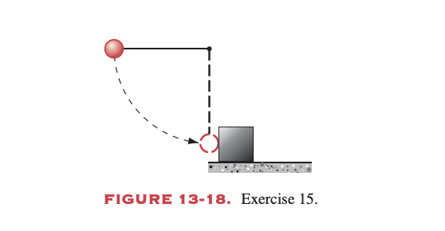
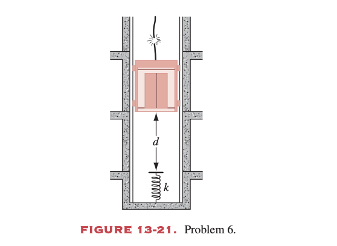
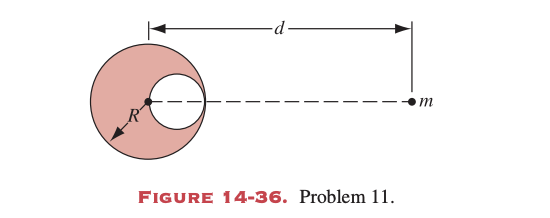
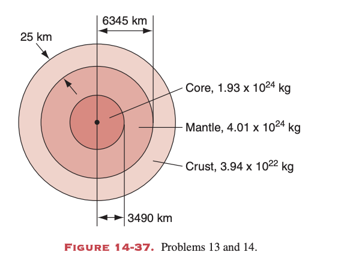
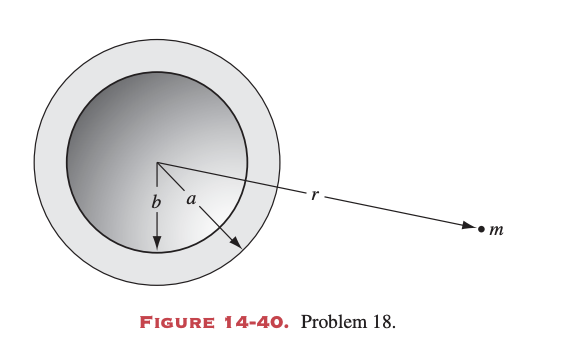
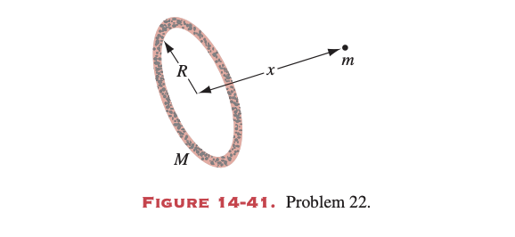

# Homework of Chap 13, 14

## T1 (P296, T14)
A rubber ball dropped from a height of exactly $6 \text{ ft}$ bounces (hits the floor) several times, losing 10% of its kinetic energy each bounce. After how many bounces will the ball subsequently not rise above $3 \text{ ft}$?

**Answer**: 
- $E_0 = mgh_0$
- $E_n = E_0 (1-0.1)^n = 0.9^n mgh_0$
- $h_n = 0.9^n h_0$
- $0.9^n \cdot 6 \leq 3 \implies 0.9^n \leq 0.5$
- $n = 7$ 

---
## T2 (P296, T15)
A steel ball of mass 0.514 kg is fastened to a cord 68.7 cm long and is released when the cord is horizontal. At the bottom of its path, the ball strikes a 2.63-kg steel block initially at rest on a frictionless surface (Fig. 13-18). On collision, one-half the mechanical kinetic energy is converted to internal energy and sound energy. Find the final speeds.

**Answer**: 
- $v_{10} = \sqrt{2gh_0}$
- $p_i = p_f \implies m_1 v_{10} = m_1 v_{1f} + m_2 v_{2f}$
- $K_f = \frac{1}{2} K_i \implies \frac{1}{2}m_1 v_{1f}^2 + \frac{1}{2}m_2 v_{2f}^2 = \frac{1}{4}m_1 v_{10}^2$
- 联立求解得到 $v_{1f}$ 和 $v_{2f}$ 

---
## T3 (P296, T19)
The National Transportation Safety Board is testing the crashworthiness of a new car. The 2340-kg vehicle is driven at 12.6 km/h into an abutment. During impact, the center of mass of the car moves forward 64.0 cm; the abutment is compressed by 8.30 cm. Ignore friction between the car and the road.
(a) Find the force, assumed constant, exerted by the abutment on the car.
(b) By how much does the internal energy of the car increase?

**Answer**: 
(a)
- $\Delta K = -\frac{1}{2} m v_0^2$
- $W = -F \Delta x_{cm} \implies -F \Delta x_{cm} = -\frac{1}{2} m v_0^2$
- $F = \frac{m v_0^2}{2 \Delta x_{cm}}$

(b)
- $W_{ext} = F \Delta x_{abutment}$
- $\Delta E_{int} = -W_{ext} = -F \Delta x_{abutment}$ 

---
## T4 (P297, T1)
A stone of weight $w$ is thrown vertically upward into the air with an initial speed $v_0$ . Suppose that the air drag force $f$ dissipates an amount $f_y$ of mechanical energy as the stone travels a distance $y$.
(a) Show that the maximum height reached by the stone is
$$
h=\frac{v_0^2}{2g(1+f/w)}
$$
(b) Show that the speed of the stone upon impact with the ground is
$$
v=v_0\left(\frac{w-f}{w+f}\right)^{1/2}
$$

**Answer**: 
(a)
- 向上运动至最高点时机械能变化: $\Delta E = -f h$
- $mgh - \frac{1}{2} m v_0^2 = -f h \implies (mg + f)h = \frac{1}{2} m v_0^2$
- 考虑到 $mg = w$，从而得 $h = \frac{v_0^2}{2g(1+f/w)}$

(b)
- 下落至地面机械能变化: $\Delta E' = -f h$
- $\frac{1}{2} m v^2 - mgh = -f h \implies \frac{1}{2} m v^2 = (w - f)h$
- 代入上式高度得到 $v = v_0 \left(\frac{w-f}{w+f}\right)^{1/2}$ 

---
## T5 (P297, T2)
The magnitude of the force of attraction between the positively charged proton and the negatively charged electron in the hydrogen atom is given by
$$
F=k\frac{e^2}{r^2}
$$
where $e$ is the electric charge of the electron, $k$ is a constant, and $r$ is the separation between electron and proton. Assume that the proton is fixed. Imagine that the electron is initially moving in a circle of radius $r_1$ about the proton and jumps suddenly into a circular orbit of smaller radius $r_2$ ; see Fig. 13-20.
(a) Calculate the change in kinetic energy of the electron, using Newton’s second law.
(b) Using the relation between force and potential energy, calculate the change in potential energy of the atom.
(c) By how much has the total energy of the atom changed in this process? (This energy is often given off in the form of radiation.)

**Answer**: 
(a)
- 向心力由库仑力提供: $m \frac{v^2}{r} = k \frac{e^2}{r^2} \implies mv^2 = k \frac{e^2}{r}$
- 动能 $K = \frac{1}{2} m v^2 = k \frac{e^2}{2r}$
- $\Delta K = \frac{ke^2}{2} \left(\frac{1}{r_2} - \frac{1}{r_1}\right)$

(b)
- $F = -\frac{dU}{dr} \implies U = -k \frac{e^2}{r}$
- $\Delta U = -ke^2 \left(\frac{1}{r_2} - \frac{1}{r_1}\right)$

(c)
- $\Delta E = \Delta K + \Delta U = -\frac{ke^2}{2} \left(\frac{1}{r_2} - \frac{1}{r_1}\right)$ 

---
## T6 (P297, T5)
The cable of a 4000-lb elevator in Fig. 13-21 snaps when the elevator is at rest at the first floor so that the bottom is a distance $d = 12.0 \text{ ft}$ above a cushioning spring whose force constant is $k = 10,000 \text{ lb/ft}$. A safety device clamps the guide rails, removing 1000 ft-lb of mechanical energy for each 1.00 ft that the elevator moves.
(a) Find the speed of the elevator just before it hits the spring.
(b) Find the distance that the spring is compressed.
(c) Find the distance that the elevator will bounce back up the shaft.
(d) Calculate approximately the total distance that the elevator will move before coming to rest. Why is the answer not exact?

**Answer**: 
(a)
- $W_{nc} = -f_k d$
- $\frac{1}{2} m v_1^2 = mg d - f_k d$
- $v_1 = \sqrt{2g d(1 - \frac{f_k}{mg})}$
(b)
- $\Delta K = 0 \implies m g (d+x) - f_k (d+x) - \frac{1}{2} k x^2 = 0$
- 解二次方程得到 $x$
(c)
- 设反弹高度 $y$：$m g (x-y) - f_k (x+y) = 0$
- $y = x \frac{mg-f_k}{mg+f_k}$
(d)
- 总损失能量即为初始势能 $E_{total} = m g (d+x_{max})$
- 摩擦力总路程 $D = \frac{E_{total}}{f_k}$ 粗略估计 

---
## T7 (P326, T11)
The following problem is from the 1946 “Olympic” examination of Moscow State University (see Fig. 14-36): A spherical hollow is made in a lead sphere of radius $R$, such that its surface touches the outside surface of the lead sphere and passes through its center. The mass of the sphere before hollowing was M. With what force, according to the law of universal gravitation, will the hollowed lead sphere attract a small sphere of mass $m$, which lies at a distance $d$ from the center of the lead sphere on the straight line connecting the centers of the spheres and of the hollow?

**Answer**: 
- 原实心球对该质点引力 $F_{full} = G \frac{M m}{d^2}$
- 挖去部分的质量 $M_{hollow} = \frac{4}{3}\pi (R/2)^3 \rho = \frac{M}{8}$
- 挖去部分如果存在，其引力 $F_{hollow} = G \frac{M_{hollow} m}{(d - R/2)^2} = G \frac{M m}{8(d - R/2)^2}$
- 剩余部分引力 $F = F_{full} - F_{hollow} = G M m \left( \frac{1}{d^2} - \frac{1}{8(d-R/2)^2} \right)$ 

---
## T8 (P326, T13)
Figure 14-37 shows, not to scale, a cross section through the interior of the Earth. Rather than being uniform throughout, the Earth is divided into three zones: an outer crust, a mantle, and an inner core. The dimensions of these zones and the mass contained within them are shown in the figure. The Earth has total mass $5.98 \times 10^{24} \text{ kg}$ and radius 6370 km. Ignore rotation and assume that the Earth is spherical.
(a) Calculate g at the surface.
(b) Supose that a bore hole is driven to the crust–mantle interface (the Moho); what would be the value of g at the bottom of the hole?
(c) Suppose that the Earth were a uniform sphere with the same total mass and size. What would be the value of g at a depth of 25 km? Use the result of Exercise 11. Precise measurements of g are sensitive probes of the interior structure of the Earth, although results can be clouded by local density variations and lack of a precise knowledge of the value of G.

**Answer**: 
(a)
- $g_{surface} = G \frac{M_{Earth}}{R_{Earth}^2}$

(b)
- $\Delta M = M_{crust}$
- $g_{moho} = G \frac{M_{Earth} - M_{crust}}{(R_{Earth} - h_{crust})^2}$

(c)
- 均匀球体内部重力加速度 $g(r) = g_s \frac{r}{R_{Earth}}$
- 距离地心 $r = R_{Earth} - 25 \text{ km}$ 时的 $g$ 即可求出 

---
## T9 (P326, T14)
Use the model of the Earth shown in Fig. 14-37 to examine the variation of g with depth in the interior of the Earth.
(a) Find g at the core–mantle interface. How does g vary from this interface to the center of the Earth?
(b) Show that g has a local minimum within the mantle; find the distance from the Earth’s center where this occurs and the associated value of g.
(c) Make a sketch showing the variation of g within the Earth.

**Answer**: 
(a)
- 在地核-地幔交界处 $g_c = G \frac{M_{core}}{R_{core}^2}$
- 从中心向外在地核中 $g \propto r$ （线性增加）

(b)
- $g(r) = G \frac{M_{core} + \int_{R_{core}}^r \rho_{mantle}(x) 4\pi x^2 dx}{r^2}$
- 对 $r$ 求导 $\frac{dg}{dr} = 0 \implies$ 解出极小值点 $r$ 与对应的 $g$

(c)
- 图像特点：地核内线性上升，地核边界有转折，地幔中有小波动（极小值后上升），最后到表面并随之在外太空随 $1/r^2$ 衰减 

---
## T10 (P326, T18)
A sphere of matter, of mass $M$ and radius a, has a concentric cavity of radius $b$, as shown in cross section in Fig. 14-40.
(a) Sketch the gravitational force $F$ exerted by the sphere on a particle of mass $m$, located a distance $r$ from the center of the sphere, as a function of $r$ in the range $0\leq r \leq \infty$ Consider points $r=0,b,a$ and $\infty$ in particular.
(b) Sketch the corresponding curve for the potential energy $U(r)$ of the system.
(c) From these graphs, how would you obtain graphs of the gravitational field strength due to the sphere?

**Answer**: 
(a)
- $r < b$: $\Sigma M = 0 \implies F = 0$
- $b \leq r \leq a$: $\Sigma M(r) = M \frac{r^3-b^3}{a^3-b^3} \implies F = G \frac{M m}{r^2}\frac{r^3-b^3}{a^3-b^3}$
- $r > a$: $F = G \frac{M m}{r^2}$

(b)
- 势能 $U(r) = -\int_{\infty}^{r} F(x) dx$
- 外侧 $1/r$ 函数，壳层内类似于二次抛物线，空腔内为常数

(c)
- 引力场强 $g(r) = \frac{F(r)}{m} = -\frac{1}{m} \frac{dU}{dr}$ 即势能关于 $r$ 导数的负值 

---
## T11 (P326, T22)
Several planets (the gas giants Jupiter, Saturn, Uranus, and Neptune) possess nearly circular surrounding rings, perhaps composed of material that failed to form a satellite. In addition, many galaxies contain ring-like structures. Consider a homogeneous ring of mass $M$ and radius $R$.
(a) Find an expression for the gravitational force exerted by the ring on a particle of mass $m$ located a distance $x$ from the center of the ring along its axis. See Fig. 14-41.
(b) Suppose that the particle falls from rest as a result of the attraction of the ring of matter. Find an expression for the speed with which it passes through the center of the ring.

**Answer**: 
(a)
- 微元受力 $dF = G \frac{m dM}{R^2 + x^2}$，取沿轴向分量
- $dF_x = dF \cos\theta = G \frac{m dM}{R^2 + x^2} \frac{x}{\sqrt{R^2 + x^2}}$
- 积分得到 $F_x = G \frac{M m x}{(R^2 + x^2)^{3/2}}$

(b)
- 能量守恒 $\Delta K + \Delta U = 0$
- $U_{initial} = -\int_{\infty}^x F_x dx = -G \frac{M m}{\sqrt{R^2 + x^2}}$
- 初始静止 $\frac{1}{2} m v^2 = U_{initial} - U_{center} = G M m \left( \frac{1}{R} - \frac{1}{\sqrt{R^2 + x^2}} \right)$
- 从而得到 $v = \sqrt{2GM \left( \frac{1}{R} - \frac{1}{\sqrt{R^2 + x^2}} \right)}$ 
