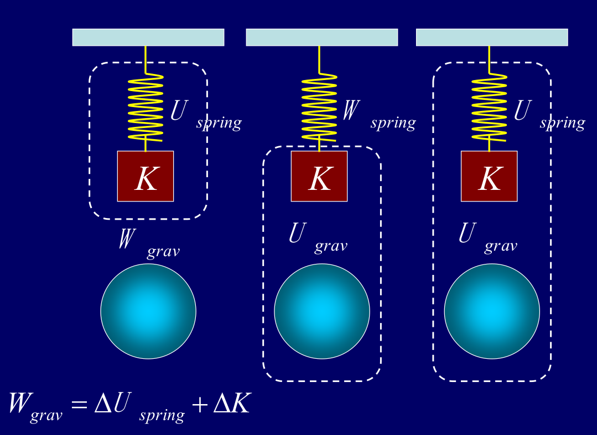
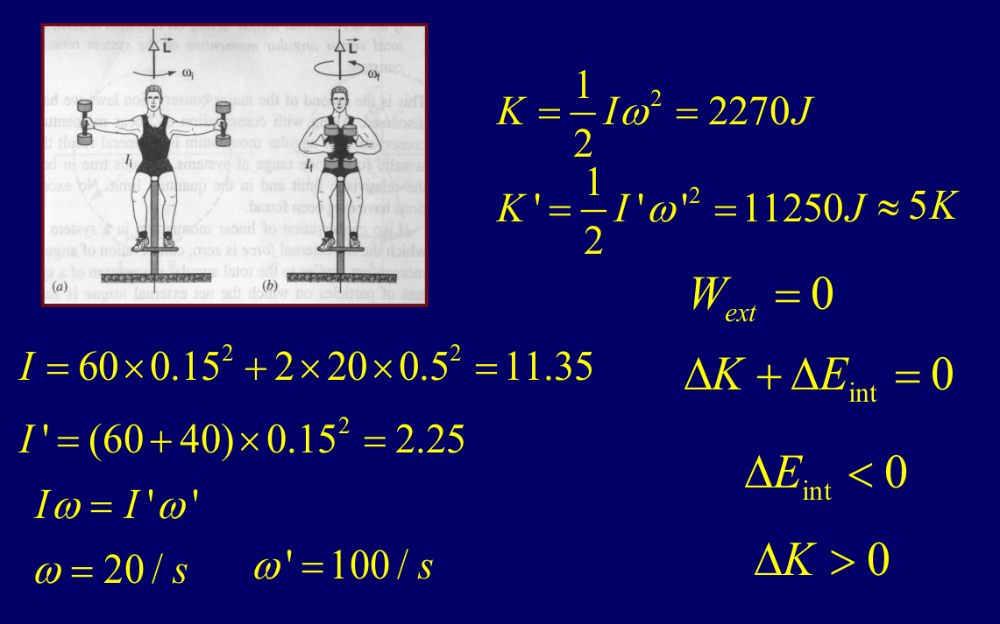
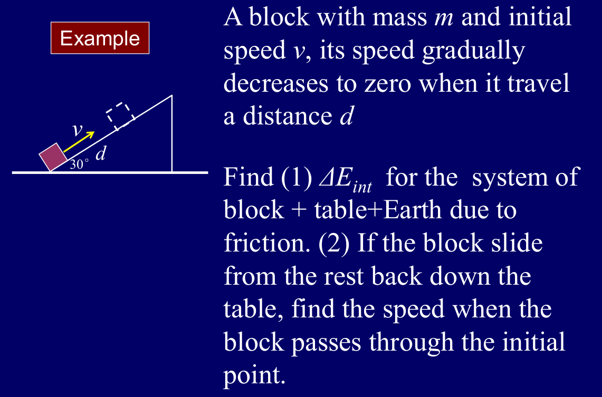
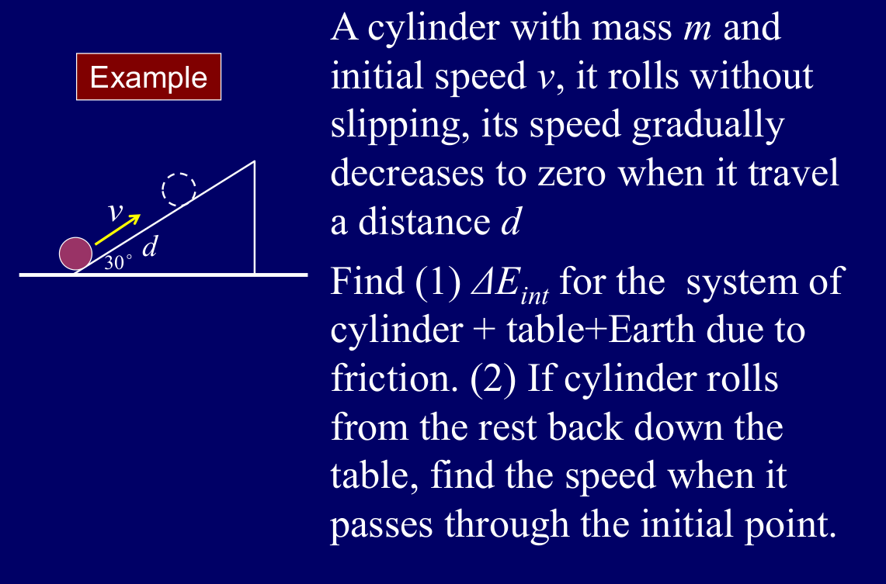
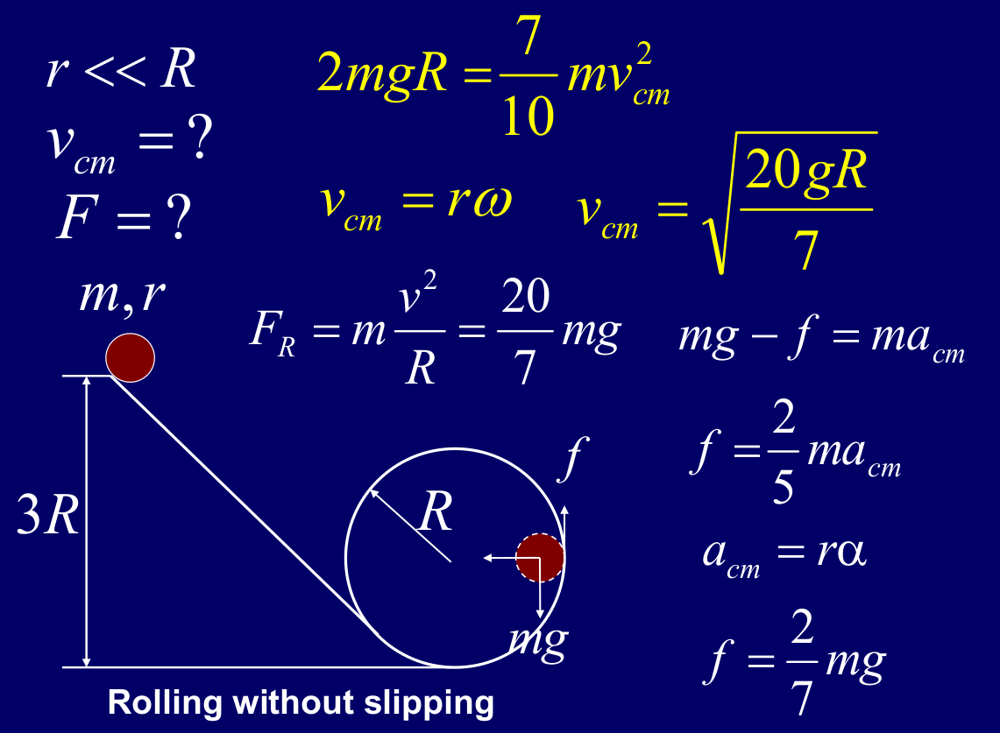

# Chapter 13 Conservation of energy

## 外力做功对保守系统的影响

$$ \Delta K + \Delta U = W_{ext} $$
- K 是系统动能（平动+转动），U是系统内所有保守力对应的势能总和
- $W_{ext}$ 是外力做的功，正值表示外力对系统做正功，负值表示外力对系统做负功。
- 当 $W_{ext}=0$ 时，系统的机械能守恒，即 $\Delta K + \Delta U = 0$，也就是说，动能和势能的总和保持不变。

---
## 无外力做功的弹簧系统

这个系统中包含物体（动能K）、弹簧（弹性势能 $U_{spring}$）、以及重力势能 $U_{gravity}$。、
- 外力：天花板对弹簧的拉力，但是作用点不移动，所以 $W_{ext}=0$。
- 所以我们可以得到，在这个系统中，机械能守恒，即 $\Delta K + \Delta U_{spring} + \Delta U_{gravity} = 0$。

改变系统的边界，我们把系统的边界缩小为（物体+地球），弹簧变成外力
- 弹力对物体做功，弹力的作用点在物体上，物体发生位移，所以弹力对系统做功。
- $W_{spring} = \Delta U_{spring}+\Delta K$，负号表示弹力对系统做负功。

改变系统的边界，我们把系统的边界缩小为（弹簧+物体），地球都变成外力
- 重力对物体做功，重力的作用点在物体上，物体发生位移，所以重力对系统做功。
- $W_{gravity} = \Delta U_{gravity}+\Delta K$，负号表示重力对系统做负功。

最后，我们把系统缩小为只有一个物体，只包含物体本身
- 此时弹簧弹力和重力都是外力，他们做的功分别是 $W_{spring}$ 和 $W_{gravity}$。
- 机械能定理：$\Delta K = W_{spring} + W_{gravity}$。
- 如上就是动能定理的原始形式，完全不涉及动能，只看外力做工和动能变化

---
## 热力学第一定律

系统内部存在非保守力（如摩擦力）时，机械能不再守恒。热力学第一定律描述了能量的转化和守恒：
$$ \Delta E_{int} =W_{ext} +Q$$
- $E_{int}$ 是系统的内能，包含了系统内部的动能和势能。
- $W_{ext}$ 是外力做的功，正值表示外力对系统做正功，负值表示外力对系统做负功。
- $Q$ 是热量，正值表示系统吸收热量，负值表示系统放出热量。

如果没有热量交换，非保守力系统的能量方程
$$ \Delta E_{int} +\Delta K +\Delta U=W_{ext} $$
- 左侧是系统总的能量变化（内能+动能+势能）
- 右侧是外力对系统做的功

---
## 在将下一个部分的内容之前，我们先回顾一下之前的内容：

- 系统质心位置：$\vec r_{cm} =-\frac{1}{M}\sum m_i \vec r_i$
- 系统质心速度：$\vec v_{cm} =\frac{1}{M}\sum m_i \vec v_i$
- 系统质心加速度：$\vec a_{cm} =\frac{1}{M}\sum m_i \vec a_i$
- 系统动量：$\vec p =\sum m_i \vec v_i$
- 系统受力：$\vec F_{ext} =\sum \vec F_i$

---
## 质心能量方程

1. 外力对质心做的功
$\int_{x_i}^{x_f} \vec F_{ext} \cdot d\vec x_{cm} = \Delta K_{cm}=\frac{1}{2}M v_{cm,f}^2 - \frac{1}{2}M v_{cm,i}^2$, 这部分功只改变系统质心的动能。
2. 系统总动能
$K = K_{cm} + K_{R}$，其中 $K_{cm}$ 是质心动能，$K_{R}$ 是系统内各个质点相对于质心的动能（转动动能）
3. 完整地能量方程
$W_{ext}=\Delta K_{cm} + \Delta K_{R}$

也就是说实际上外力对质心做的功只改变了整个系统的平动动能，而外力实际的做功还可能改变系统内部的动能（转动动能）和势能。

---
## 角动量守恒过程中的能量变化

角动量守恒，所以 $I\omega=I'\omega'$
- 初始：$I=11.35 kg\cdot m^2$，$\omega=20 rad/s$，所以 $L=227 kg\cdot m^2/s$。
- 最终：$I'=14.2 kg\cdot m^2$，$\omega'=\frac{L}{I'}=16 rad/s$, 所以 $L'=227 kg\cdot m^2/s$。

而对于动能
- 初始：$K=\frac{1}{2}I\omega^2=2270 J$。
- 最终：$K'=\frac{1}{2}I'\omega'^2=11250 J$。

动能大幅度增加，是因为人收手臂的时候，肌肉做了内力功，化学能转换为了机械能。

---
## 例题

滑块以初速度 v 沿粗糙鞋面上滑，滑行距离d后停下，再滑回初始点

1. 上滑过程
-  $\Delta U+\Delta K+\Delta E_{int}=0$
-  $\Delta U = mgdsin30^\circ$
-  $\Delta K = -\frac{1}{2}mv^2$
-  $\Delta E_{int} = -(\Delta U+\Delta K)=\frac{1}{2}mv^2 - mgdsin30^\circ$

2. 下滑过程
- 上滑和下滑过程，摩擦力都会做工产生热，所以总内能变化是 $2\Delta E_{int}$
- 所以带入 $\Delta K = \frac{1}{2}mv^2_t-\frac{1}{2}mv^2$，我们可以得到 $v_t=\sqrt{2gd-v^2}$。

圆柱一初速度 v 沿斜面纯滚动上滑，滑行距离d后停下，再滑回初始点

1. 上滑过程
- 系统：圆柱+斜面+地球，无滑动摩擦，所以机械能守恒
- $\Delta E_{int}=-(\Delta U+\Delta K)=0$
- 圆柱的总动能 $K=K_{cm}+K_{R}=\frac{1}{2}mv^2+\frac{1}{2}I\omega^2$，其中 $I=\frac{1}{2}mr^2$，$\omega=\frac{v}{r}$，所以 $K=\frac{3}{4}mv^2$。
- 势能增加 $\Delta U=mgdsin30^\circ$。
- 机械能守恒，$\frac{3}{4}mv^2=mgdsin30^\circ$，所以 $v=\sqrt{\frac{2}{3}gd}$。

2. 下滑过程
- 同样纯滚动，机械能守恒，所以滑回初始点的速度和上滑初速度大小相等，方向相反

实心球从高度3R处落下，进入半径为R的竖直圆轨道，做纯滚动

1. 速度计算：
- 初始势能，$3mgR$，最终势能，$mgR$
- 转化为平动+转动动能，$2mgR=\frac{7}{10}mv^2$，所以 $v=\sqrt{\frac{20}{7}gR}$。

2. 受力分析
- 向心加速度：$a_R=\frac{v^2}{R}=\frac{20}{7}g$。
- 向心力：$F_R=ma_R=\frac{20}{7}mg$。
- 摩擦力分析：摩擦力提供向心力的一部分，重力提供剩余的部分，所以 $F_{friction}=F_R - mg=\frac{2}{7}mg$。