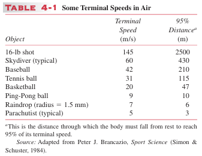

## T4 (P86,T18)

(a) Assuming that the drag force $D$ is given by $D = bv$, show that the distance $y_{95}$ through which an object must fall from rest to reach 95% of its terminal speed is given by
$$y_{95} = \frac{v_T^2}{g} (ln(20)-\frac{19}{20})$$
where $v_T$ is the terminal speed. (Hint: Use the result for $y(t)$ ob-tained in Problem 17.) 
(b) Using the terminal speed of $42 m/s$ for the baseball given in Table 4-1, calculate the 95% distance.Why does the result not agree with the value listed in Table 4-1?

## T5 (P155, Ex.18)

A railway flat car is rushing along a level frictionless track at a speed of 45m/s. Mounted on the car and aimed forward is a cannon that fires 65-kg cannon balls with a muzzle speed of 625 m/s. The total mass of the car, the cannon, and the large supply of cannon balls on the car is 3500kg. How many cannon balls must be fired to bring the car as close to rest as possible?

## T7 (P157, Ex.10)

A 1400-kg cannon, which fires a 70.0-kg shell with a muzzle speed of 556 m/s, is set at an elevation angle of 39.0° above the horizontal. The cannon is mounted on frictionless rails, so that it recoils freely
(a) What is the speed of the shell with respect the earth
(b) At what angle with the ground is the shell projected? (Hint: The horizontal component of the momentum of the system remains unchanged as the gun is fired.)