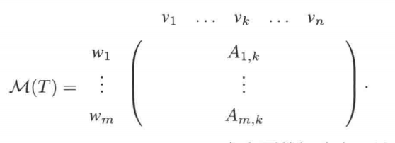

# 第3章 线性映射

## 3.A 线性映射
线性映射（linear map）是把一个向量空间中的结构“保持地”送到另一个向量空间中的函数。

- 设 $T:V\to W$
- 若对所有 $u,v\in V$ 和标量 $c\in F$ 都有
  - $T(u+v)=T(u)+T(v)$
  - $T(cv)=cT(v)$
  则称 $T$ 是线性映射
- 记所有从 $V$ 到 $W$ 的线性映射组成的集合为 $\mathcal{L}(V,W)$

### 常见例子

- 零映射（zero map）：把所有向量都送到 0
- 恒等映射（identity map）：$I(v)=v$
- 取值映射、微分算子、积分算子、矩阵乘法都可以看成线性映射

### 线性映射与定义域的基

设 $v_1,...,v_n$ 是 $V$ 的一个基，任意 $w_1,...,w_n\in W$，则存在唯一的线性映射 $T:V\to W$ 使得 $T(v_j)=w_j$ 对所有 $j=1,...,n$ 都成立。

### 线性映射的乘积

若 $T\in \mathcal{L}(U,V)$，$S\in \mathcal{L}(V,W)$，则 $S T\in \mathcal{L}(U,W)$ 定义如下：对于任意 $u\in U$，有 $(S T)(u) = S(T(u))$。

### 线性映射乘积的代数性质

- 结合性(associativity)：$(T_1T_2)T_3=T_1(T_2T_3)$
- 单位元(identity element)：$I T=T I=T$
- 分配律(distributivity)：$(S_1+S_2)T=S_1T+S_2T$ 和 $S(T_1+T_2)=ST_1+ST_2$，这里 $S, S_1, S_2\in \mathcal{L}(V,W)$，$T, T_1, T_2\in \mathcal{L}(U,V)$

## 3.B 零空间与值域

### 零空间 (Null Space)
线性映射 $T$ 的零空间定义为

$$
\operatorname{null}T=\{v\in V:T(v)=0\}
$$

- $\operatorname{null}T$ 是 $V$ 的子空间
- 若 $T(v_1)=T(v_2)$，则 $v_1-v_2\in \operatorname{null}T$
- 若 $\operatorname{null}T=\{0\}$，则 $T$ 是 one-to-one

### 单的 (injective)

如果当 $Tu=Tv$ 时必有 $u=v$，则称 $T$ 是单的（one-to-one 或 injective）。
同时，单射性等价于零空间为 ${0}$

### 值域 (Range)

线性映射 $T$ 的值域定义为

$$
\operatorname{range}T=\{T(v):v\in V\}
$$

- $\operatorname{range}T$ 是 $W$ 的子空间
- 若 $\operatorname{range}T=W$，则 $T$ 是 满的 (onto)
- 核和像分别描述“丢失了什么”和“到达了哪里”

### 线性映射基本定理
- 设 $V$ 是有限维的， $T\in\mathcal{L}(V,W)$，则 $\operatorname{range}T$ 是有限维的并且 $dim V = dim \operatorname{null}T + dim \operatorname{range}T$。
- 如果 $V$ 和 $W$ 是有限维的，并且 $\dim V > \dim W$，则 $T$ 不是单的。
- 如果 $V$ 和 $W$ 是有限维的，并且 $\dim V < \dim W$，则 $T$ 不是满的。
- 齐次线性方程组：当变量多于方程时，齐次线性方程组必有非零解
- 非齐次线性方程组：当方程多余变量时，必有一组常数项使得对应的非齐次线性方程组无解

## 3.C 矩阵

### 矩阵的定义 $A_{j,k}$

设 m 和 n 是正整数， $m\times n $ 矩阵 A 是由F的元素构成的 m 行 n 列的矩形阵列。 
$$ A=\begin{bmatrix}
A_{1,1} & A_{1,2} & \cdots & A_{1,n} \\
A_{2,1} & A_{2,2} & \cdots & A_{2,n} \\
\vdots & \vdots & \cdots & \vdots \\
A_{m,1} & A_{m,2} & \cdots & A_{m,n}
\end{bmatrix} $$
记号 $A_{j,k}$ 表示 A 的第 j 行第 k 列的元素。

### 线性映射的矩阵 ($M(T)$)

设 $T\in \mathcal{L}(V,W)$，并设 $v_1,...,v_n$ 是 $V$ 的一个基， $w_1,...,w_m$ 是 $W$ 的一个基。规定 T 关于这些基的矩阵为 $m\times n$ 的矩阵 $M(T)$，其中 $A_{j,k}$ 满足 $T(v_k)=\sum_{j=1}^m A_{j,k} w_j=A_{1,k}w_1+\cdots+A_{m,k}w_m$。

如何从T构造出 $M(T)$：
- 将定义域的基向量 $v_1,...,v_n$ 横写在顶端
- 将T映到的那个向量空间的基向量 $w_1,...,w_m$ 竖写在左侧

$$M(T)=\begin{bmatrix}
A_{1,1} & A_{1,2} & \cdots & A_{1,n} \\
A_{2,1} & A_{2,2} & \cdots & A_{2,n} \\
\vdots & \vdots & \cdots & \vdots \\
A_{m,1} & A_{m,2} & \cdots & A_{m,n}
\end{bmatrix} $$

一般我们再考虑 T 是 $F^n$ 到 $F^m$ 的线性映射时，默认使用标准基，这时 $M(T)$ 就是我们通常意义上的矩阵。比如：

设 $T\in \mathcal{L}(F^2,F^3)$ 定义为 $T(x,y)=(x+3y,2x+5y,7x+9y)$，则 

标准基下：
$$T(1,0)=(1,2,7),\quad T(0,1)=(3,5,9)$$
$$M(T)=\begin{bmatrix}1 & 3 \\
2 & 5 \\
7 & 9\end{bmatrix}$$

在考虑 $P_m(F)$ 到 $P_{m+n}(F)$ 的线性映射时，默认使用 $1,x,x^2,...$ 作为基。比如：

设 $D\in \mathcal{L}(P_3(F),P_2(F))$ 定义为 $D(p)=p'$，则
$$D(1)=0,\quad D(x)=1,\quad D(x^2)=2x,\quad D(x^3)=3x^2$$
$$M(D)=\begin{bmatrix}0 & 1 & 0 & 0 \\
0 & 0 & 2 & 0 \\
0 & 0 & 0 & 3\end{bmatrix}$$

### 矩阵加法

规定两个同样大小的矩阵的和是把矩阵中相对应的元素想家得到的元素，对于 $(A+C)_{j,k}$，我们有 $(A+C)_{j,k}=A_{j,k}+C_{j,k}$。

$$\begin{bmatrix}A_{1,1} & A_{1,2} & \cdots & A_{1,n} \\
A_{2,1} & A_{2,2} & \cdots & A_{2,n} \\
\vdots & \vdots & \ddots & \vdots \\
A_{m,1} & A_{m,2} & \cdots & A_{m,n}
\end{bmatrix}+\begin{bmatrix}C_{1,1} & C_{1,2} & \cdots & C_{1,n} \\
C_{2,1} & C_{2,2} & \cdots & C_{2,n} \\
\vdots & \vdots & \ddots & \vdots \\
C_{m,1} & C_{m,2} & \cdots & C_{m,n}
\end{bmatrix}=\begin{bmatrix}A_{1,1}+C_{1,1} & A_{1,2}+C_{1,2} & \cdots & A_{1,n}+C_{1,n} \\
A_{2,1}+C_{2,1} & A_{2,2}+C_{2,2} & \cdots & A_{2,n}+C_{2,n} \\
\vdots & \vdots & \ddots & \vdots \\
A_{m,1}+C_{m,1} & A_{m,2}+C_{m,2} & \cdots & A_{m,n}+C_{m,n}
\end{bmatrix}$$

### 线性映射的和的矩阵

设 $T,S\in \mathcal{L}(V,W)$，则 $M(T+S)=M(T)+M(S)$。

### 矩阵的标量乘法

标量与矩阵的乘机就是用该标量乘以矩阵的每个元素，对于 $\lambda A$，我们有 $(\lambda A)_{j,k}=\lambda A_{j,k}$。

$$\lambda\begin{bmatrix}A_{1,1} & A_{1,2} & \cdots & A_{1,n} \\
A_{2,1} & A_{2,2} & \cdots & A_{2,n} \\
\vdots & \vdots & \ddots & \vdots \\
A_{m,1} & A_{m,2} & \cdots & A_{m,n}
\end{bmatrix}=\begin{bmatrix}\lambda A_{1,1} & \lambda A_{1,2} & \cdots & \lambda A_{1,n} \\
\lambda A_{2,1} & \lambda A_{2,2} & \cdots & \lambda A_{2,n} \\
\vdots & \vdots & \ddots & \vdots \\
\lambda A_{m,1} & \lambda A_{m,2} & \cdots & \lambda A_{m,n}
\end{bmatrix}$$

### 标量乘以线性映射的矩阵
设 $T\in \mathcal{L}(V,W)$， $\lambda\in F$，则 $M(\lambda T)=\lambda M(T)$。

### 记号 $F^{m,n}$

对于正整数 $m$ 和 $n$，元素取自 $F$ 的 $m\times n$ 矩阵的集合记为 $F^{m,n}$。

### $\dim F^{m,n}=mn$

设 $m$ 和 $n$ 是正整数， 按照上面定义的矩阵加法和标量乘法，则 $F^{m,n}$ 是一个向量空间，并且 $\dim F^{m,n}=mn$。

例子：
取 \(F=\mathbb R\)，看 \(F^{2,3}\)（所有 \(2\times3\) 实矩阵）。

1. 先看结论
- 维度应该是 \(2\times3=6\)。

2. 标准基怎么写
这 6 个矩阵就是基（每个只有一个位置是 1）：

- \(E_{11}=\begin{bmatrix}1&0&0\\0&0&0\end{bmatrix}\)
- \(E_{12}=\begin{bmatrix}0&1&0\\0&0&0\end{bmatrix}\)
- \(E_{13}=\begin{bmatrix}0&0&1\\0&0&0\end{bmatrix}\)
- \(E_{21}=\begin{bmatrix}0&0&0\\1&0&0\end{bmatrix}\)
- \(E_{22}=\begin{bmatrix}0&0&0\\0&1&0\end{bmatrix}\)
- \(E_{23}=\begin{bmatrix}0&0&0\\0&0&1\end{bmatrix}\)

3. 任意矩阵都能由它们线性组合得到
例如
\[
A=\begin{bmatrix}2&-1&5\\4&0&3\end{bmatrix}
\]
可以写成
\[
A=2E_{11}-1E_{12}+5E_{13}+4E_{21}+0E_{22}+3E_{23}.
\]

这说明：
- “张成”成立（任何矩阵都能写出来）
- 且这 6 个方向互不重复（线性无关）

所以 \(\dim(F^{2,3})=6\)。

你可以把它类比成：
- \(2\times3\) 矩阵有 6 个格子
- 每个格子对应一个独立基方向
- 维度就是格子数。

### 矩阵乘法

设 $A$ 是一个 $m\times n$ 的矩阵， $C$ 是一个 $n\times p$ 的矩阵，则 $AC$ 是一个 $m\times p$ 的矩阵，其中 $(AC)_{j,k}=\sum_{r=1}^n A_{j,r}C_{r,k}$。就是把A的第j行和C的第k列对应元素相乘再求和。

例子：
现在我们把一个 $3\times 2$ 的矩阵 $A$ 和一个 $2\times 4$ 的矩阵 $C$ 相乘：
$$\begin{bmatrix}1 & 2 \\ 3 & 4 \\ 5 & 6\end{bmatrix}\times \begin{bmatrix}6 & 5 & 4 & 3 \\ 2 & 1 & 0 & -1\end{bmatrix}=\begin{bmatrix}10 & 7 & 4 & 1 \\ 26 & 19 & 12 & 5 \\ 42 & 31 & 20 & 9\end{bmatrix}$$

### 线性映射的乘积的矩阵

若 $T\in \mathcal{L}(U,V)$，$S\in \mathcal{L}(V,W)$，则 $M(ST)=M(S)M(T)$。

### 记号 $A_{j,\cdot}$ 和 $A_{\cdot,k}$

若 $A$ 是一个 $m\times n$ 的矩阵，则 
- $A_{j,\cdot}$ 表示 $A$ 的第 j 行
- $A_{\cdot,k}$ 表示 $A$ 的第 k 列。

### 矩阵乘积的元素等于行乘以列

设 $A$ 是一个 $m\times n$ 的矩阵， $C$ 是一个 $n\times p$ 的矩阵，则 $(AC)_{j,k}=A_{j,\cdot}\cdot C_{\cdot,k}$。

### 矩阵乘机的列等于矩阵乘以列

设 $A$ 是一个 $m\times n$ 的矩阵， $C$ 是一个 $n\times p$ 的矩阵，则 $(AC)_{\cdot,k}=A C_{\cdot,k}$。

## 列的线性组合

设 $A$ 是一个 $m\times n$ 的矩阵， $c=\begin{bmatrix}c_{1}  \\ c_{2} \\ \vdots \\ c_{n}\end{bmatrix}$ 是一个 $n\times 1$ 的矩阵，$$Ac=c_1A_{\cdot,1}+c_2A_{\cdot,2}+\cdots+c_nA_{\cdot,n}$$则 $Ac$ 的第 k 列是 $A$ 的列的线性组合，其中的标量来自 $c$ 的元素。

## 3.D 可逆性与同构的向量空间

### 可逆 (invertible)，逆 (inverse)

- 线性映射 $T\in \mathcal{L}(V,W)$ 称为可逆的，如果存在 $S\in \mathcal{L}(W,V)$ 使得 $ST$ 等于 $V$ 上的恒等映射且 $TS$ 等于 $W$ 上的恒等映射。
- 满足 $ST=I_V$ 和 $TS=I_W$ 的线性映射 $S\in \mathcal{L}(W,V)$ 叫做 $T$ 的逆，记为 $T^{-1}$。
- 可逆的线性映射有唯一的逆，也就是说，如果 $T\in \mathcal{L}(V,W)$ 可逆，则 $T^{-1}$ 是 $\mathcal{L}(W,V)$ 中唯一满足 $T^{-1}T=I_V$ 和 $TT^{-1}=I_W$ 的线性映射。
- 可逆性等价于单性和满性：一个线性映射是可逆的当且仅当它既是单的又是满的。

### 证明可逆性等价于单性和满性

1. 假设 $T$ 可逆，设 $u,v\in V$，如果 $T(u)=T(v)$，则 $T^{-1}T(u)=T^{-1}T(v)$，所以 $u=v$，因此 $T$ 是单的。
2. 假设 $T$ 可逆，设 $w\in W$，则 $T T^{-1}(w)=I_W(w)=w$，因此 $T$ 是满的。
3. 现在假设 $T$ 是单的且满的，我们需要证明 $T$ 是可逆的。对于每个 $w\in W$，定义 $Sw$ 是 $V$ 中唯一的向量使得 $T(Sw)=w$。由于 $T$ 是满的，这样的 $Sw$ 存在；由于 $T$ 是单的，这样的 $Sw$ 是唯一的。现在我们需要证明 $S$ 是线性映射，并且满足 $ST=I_V$ 和 $TS=I_W$。
   - 假设 $v\in V$，则 $T((S\circ T)(v))=T(v)$，由于 $T$ 是单的，所以 $(S\circ T)(v)=v$，因此 $ST=I_V$。
   - 假设 $w\in W$，则 $T((T\circ S)(w))=T(Sw)=w$，因此 $TS=I_W$。
   - 现在我们需要证明 $S$ 是线性映射。设 $w_1,w_2\in W$ 和标量 $c\in F$，则
   $$T(S(w_1+w_2))=w_1+w_2=T(Sw_1)+T(Sw_2)=T(Sw_1+Sw_2)$$
   由于 $T$ 是单的，所以 $S(w_1+w_2)=Sw_1+Sw_2$。类似地，可以证明 $S(cw)=cSw$。因此 $S$ 是线性映射。

### 不可逆的线性映射
- 从 $P(R)$ 到 $P(R)$ 的乘以 $x^2$ 的线性映射 $T(p)=x^2p$ 是不可逆的，因为他不是满的

映射是：
- \(T: P(\mathbb R)\to P(\mathbb R)\)
- \(T(p)=x^2p\)

要满射就得满足：任意 \(q(x)\in P(\mathbb R)\)，都存在 \(p(x)\) 使 \(x^2p(x)=q(x)\)。

现在取一个很简单的 \(q(x)=1\)（常数多项式）。

如果 \(T\) 是满的，就应该有某个多项式 \(p(x)\) 使
- \(x^2p(x)=1\)。

但这是不可能的，因为左边一定含有因子 \(x^2\)，所以在 \(x=0\) 处必为 0；
- 左边代 \(x=0\)：\(x^2p(x)=0\)
- 右边代 \(x=0\)：\(1\)

矛盾。所以不存在这样的 \(p\)。

因此 \(1\notin \operatorname{range}(T)\)，于是 \(\operatorname{range}(T)\neq P(\mathbb R)\)，
所以 \(T\) 不是满射（不是 onto），从而不可逆。

### 同构 (isomorphism)、同构的 (isomorphic)

- 同构就是可逆的线性映射
- 若两个向量空间之间存在一个同构，则称这两个向量空间是同构的

### 维数反映了向量空间是否同构

$F$ 上两个有限维向量空间同构当且仅当其维数相等。

### $\mathcal{L}(V,W)$ 与 $F^{m,n}$ 的同构

设 $v_1,\dots, v_n$ 是 $V$ 的一组基，$w_1,\dots, w_m$ 是 $W$ 的一组基，则 M是$\mathcal{L}(V,W)$ 与 $F^{m,n}$ 之间的一个同构。

证明：已知 $M$是线性的，固执需要证明M既是单的又是满的，则
1. 如果 $T\in \mathcal{L}(V,W)$ 且 $M(T)=0$，则 $T(v_k)=0$ 对所有 $k=1,...,n$ 都成立，因此 $T=0$，所以 $M$ 是单的。
2. 对于任意 $A\in F^{m,n}$，定义 $T\in \mathcal{L}(V,W)$ 使得 $T(v_k)=\sum_{j=1}^m A_{j,k} w_j$ 对所有 $k=1,...,n$ 都成立，则 $M(T)=A$，所以 $M$ 是满的。

### $\dim \mathcal{L}(V,W)=(\dim V)(\dim W)$

设 $V$ 和 $W$ 是有限维的， $\dim V=n$， $\dim W=m$，则 $\dim \mathcal{L}(V,W)=(\dim V)(\dim W)$。

### 向量的矩阵

设 $v\in V$， 并设 $v_1,\dots,v_n$ 是 $V$ 的一个基，则 $v$ 关于这个基的矩阵是一个 $n\times 1$ 的矩阵 
$$M(v)=\begin{bmatrix}c_{1} \\
c_{2} \\
\vdots \\
c_{n}\end{bmatrix}$$
其中 $c_{j}$ 满足 $v=\sum_{j=1}^n c_{j} v_j$。

### $M(T)_{\cdot,k}=M(T(v_k))$

设 $T\in \mathcal{L}(V,W)$，并设 $v_1,...,v_n$ 是 $V$ 的一个基， $w_1,...,w_m$ 是 $W$ 的一个基，则 $M(T)_{\cdot,k}=M(T(v_k))$。

### 线性映射的作用类似于矩阵乘

设 $T\in \mathcal{L}(V,W)$，设 $v_1,...,v_n$ 是 $V$ 的一个基， $w_1,...,w_m$ 是 $W$ 的一个基，则对于任意 $v\in V$，有 $$M(Tv)=M(T)M(v)$$

## 算子 (operator) 

- 向量空间到其自身的线性映射成为算子
- 记号 $\mathcal{L}(V)=\mathcal{L}(V,V)$

## 在有限维的情景，单射、满射、可逆是等价的

设 $V$ 是有限维的， $T\in \mathcal{L}(V)$，则以下条件等价：
- $T$ 是单的
- $T$ 是满的
- $T$ 是可逆的
