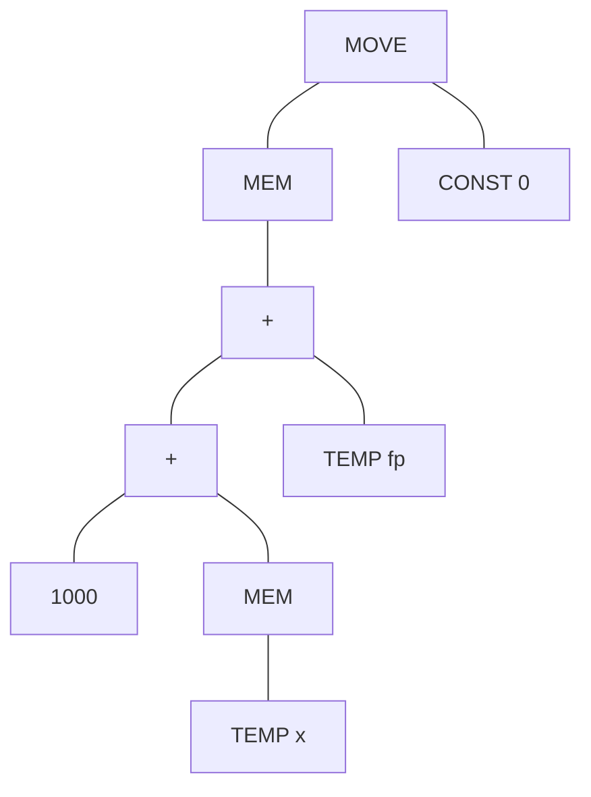
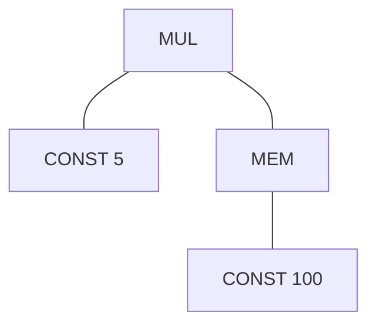
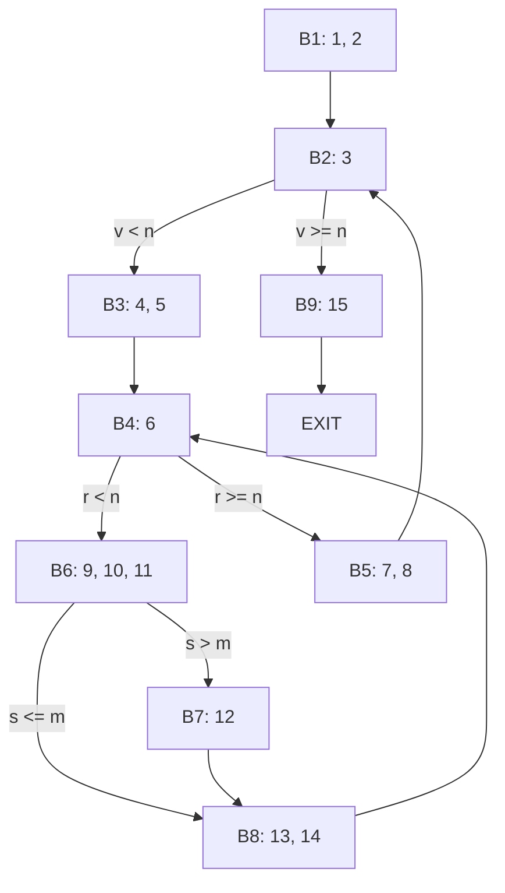

# 编译原理作业：指令选择与流分析 (Chapter 9 & 10)

## 题目 9.1
For each of the following expressions, draw the tree and generate *Jouette*-machine instructions using Maximal Munch. Circle the tiles (as in Figure 9.2), but number them *in the order that they are munched*, and show the sequence of *Jouette* instructions that results.

a. `MOVE(MEM(+(+(CONST_1000, MEM(TEMP_x)), TEMP_fp)), CONST_0)`
b. `BINOP(MUL, CONST_5, MEM(CONST_100))`

---

## 解答 9.1

### a. `MOVE(MEM(+(+(CONST_1000, MEM(TEMP_x)), TEMP_fp)), CONST_0)`

- **IR树结构**：


- **瓷砖覆盖与 Munch 顺序**：
  使用 Maximal Munch 算法（从根节点开始匹配最大瓷砖）：
  1. **Tile 1 (Munch #1)**: 根部 `MOVE(MEM(addr), val)`，匹配 `STORE` 指令。
  2. **Tile 2 (Munch #2)**: 右子树 `CONST 0`。
  3. **Tile 3 (Munch #3)**: 地址部 `+(e1, TEMP fp)`，匹配 `ADD` 指令。
  4. **Tile 4 (Munch #4)**: 地址部左子树 `+(1000, e2)`，匹配 `ADDI` 指令。
  5. **Tile 5 (Munch #5)**: `MEM(TEMP x)`，匹配 `LOAD` 指令。

- **生成的 Jouette 指令序列**（按发射顺序，即后序遍历结果）：
1. `ADDI r2 <- r0 + 0` (Tile 2)
2. `LOAD r4 <- M[rx + 0]` (Tile 5)
3. `ADDI r3 <- r4 + 1000` (Tile 4)
4. `ADD r1 <- r3 + fp` (Tile 3)
5. `STORE M[r1 + 0] <- r2` (Tile 1)

---

### b. `BINOP(MUL, CONST_5, MEM(CONST_100))`

- **IR树结构**：


- **瓷砖覆盖与 Munch 顺序**：
  1. **Tile 1 (Munch #1)**: `MUL(e1, e2)`。
  2. **Tile 2 (Munch #2)**: `CONST 5`。
  3. **Tile 3 (Munch #3)**: `MEM(CONST 100)`，匹配 `LOAD` 指令。

- **生成的 Jouette 指令序列**：
1. `ADDI r2 <- r0 + 5` (Tile 2)
2. `LOAD r3 <- M[r0 + 100]` (Tile 3)
3. `MUL r1 <- r2 * r3` (Tile 1)

---

## 题目 10.1 & 8.6
Perform flow analysis on the program of Exercise 8.6:
a. Draw the control-flow graph.
b. Calculate live-in and live-out at each statement.
c. Construct the register interference graph.

**Program 8.6:**
```
1: m <- 0
2: v <- 0
3: L1: if v >= n goto L_exit
4: r <- v
5: s <- 0
6: L2: if r < n goto L_body
7: v <- v + 1
8: goto L1
9: L_body: x <- M[r]
10: s <- s + x
11: if s <= m goto L_next
12: m <- s
13: L_next: r <- r + 1
14: goto L2
15: L_exit: return m
```

---

## 解答 10.1

### a. 控制流图 (CFG)


### b. 活跃变量分析 (Liveness Analysis)
假设 $n$ 在整个程序中保持活跃（作为入口参数），$m$ 是返回值。

| 语句 | Def | Use | Live-In | Live-Out |
| :--- | :--- | :--- | :--- | :--- |
| 1 | m | - | {n} | {m, n} |
| 2 | v | - | {m, n} | {m, n, v} |
| 3 | - | v, n | {m, n, v} | {m, n, v} |
| 4 | r | v | {m, n, v} | {m, n, r, v} |
| 5 | s | - | {m, n, r, v} | {m, n, r, s, v} |
| 6 | - | r, n | {m, n, r, s, v} | {m, n, r, s, v} |
| 7 | v | v | {m, n, v} | {m, n, v} |
| 8 | - | - | {m, n, v} | {m, n, v} |
| 9 | x | r | {m, n, r, s} | {m, n, r, s, x} |
| 10 | s | s, x | {m, n, r, s, x} | {m, n, r, s} |
| 11 | - | s, m | {m, n, r, s} | {m, n, r, s} |
| 12 | m | s | {n, r, s} | {m, n, r, s} |
| 13 | r | r | {m, n, r, s} | {m, n, r, s} |
| 14 | - | - | {m, n, r, s} | {m, n, r, s} |
| 15 | - | m, n | {m, n} | {} |

### c. 寄存器冲突图 (RIG)
在任意程序点同时活跃的变量之间存在冲突。根据上述分析：
- **m**: 与 {n, v, r, s} 冲突
- **v**: 与 {m, n, r, s} 冲突
- **n**: 与 {m, v, r, s, x} 冲突
- **r**: 与 {m, v, n, s, x} 冲突
- **s**: 与 {m, v, n, r, x} 冲突
- **x**: 与 {m, n, r, s} 冲突

**冲突图边集合**：
1. (m, n), (m, v), (m, r), (m, s)
2. (v, n), (v, r), (v, s)
3. (n, r), (n, s), (n, x)
4. (r, s), (r, x)
5. (s, x)
