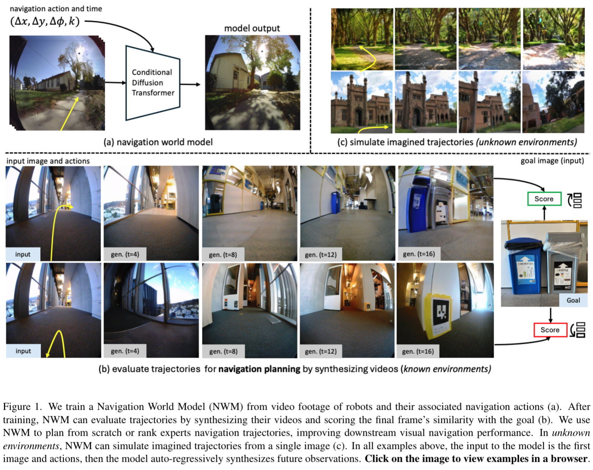
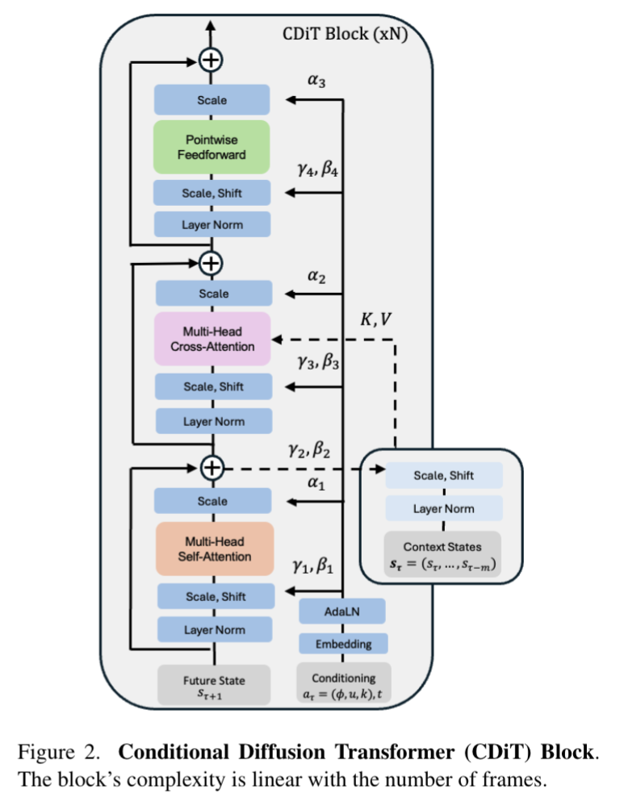
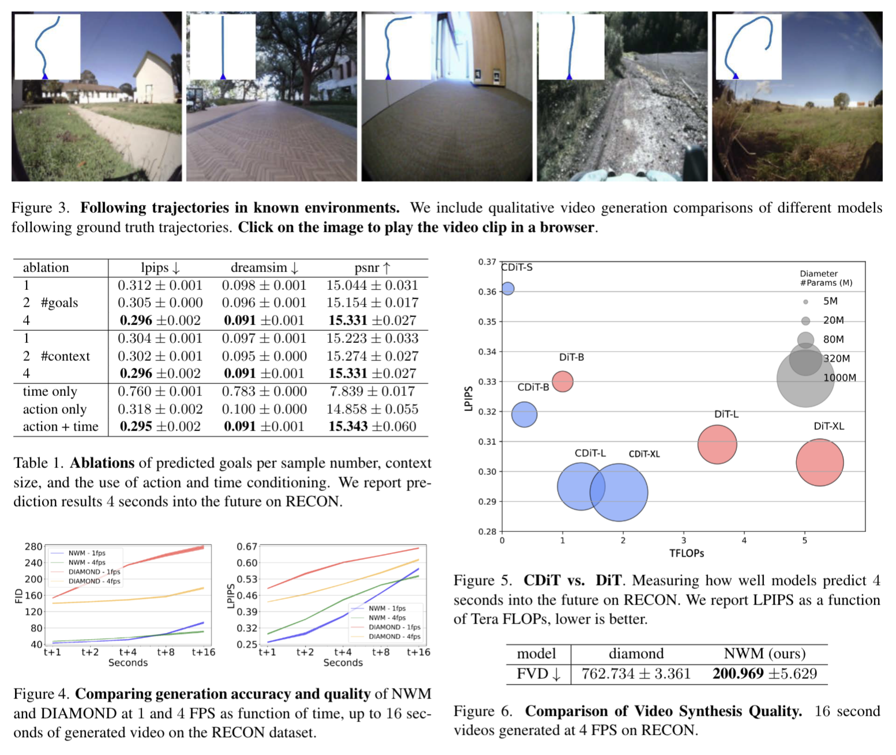
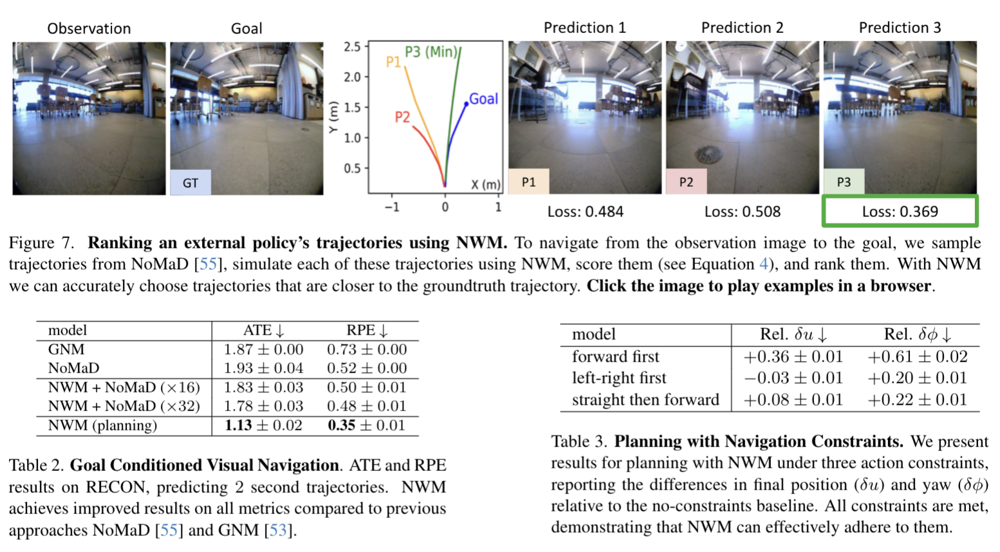
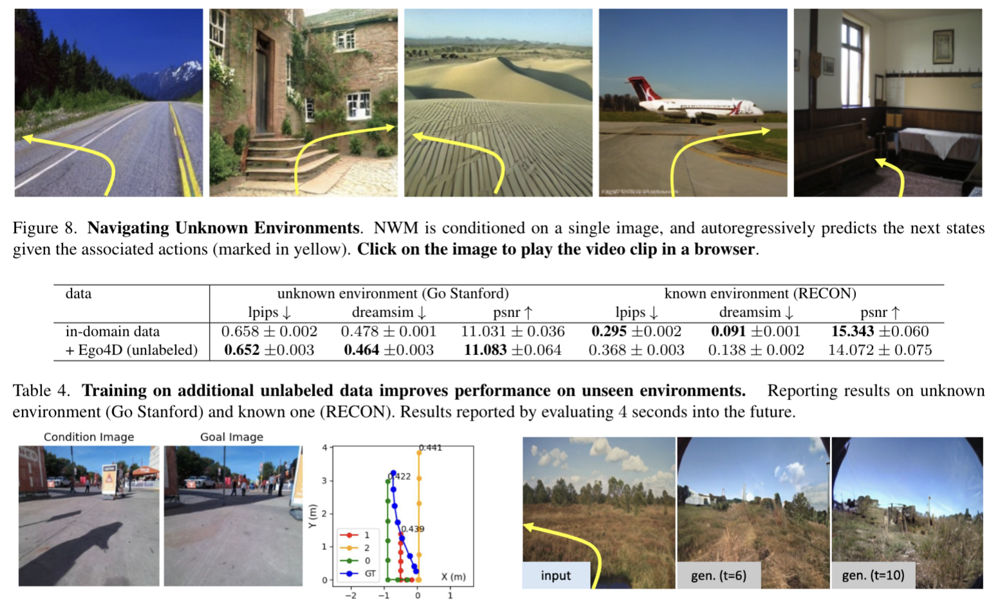

# Descriptor-In-Pixel : Point-Feature Tracking for Pixel Processor Arrays

**Author:** Laurie Bose et al.  
**Date:** 2025

## 1. Abstract

This paper presents a novel approach for joint pointfeature detection and tracking, designed specifically for Pixel Processor Array (PPA) vision sensors. Instead of standard pixels, PPA sensors consist of thousands of “pixelprocessors”, enabling massive parallel computation of visual data at the point of light capture. Our approach performs all computation entirely in-pixel, meaning no raw image data need ever leave the sensor for external processing. We introduce a Descriptor-In-Pixel paradigm, in which a feature descriptor is held within the memory of each pixelprocessor. The PPA’s architecture enables the response of every processor’s descriptor, upon the current image, to be computed in parallel. This produces a“descriptor response map” which, by generating the correct layout of descriptors across the pixel-processors, can be used for both pointfeature detection and tracking. This reduces sensor output to just sparse feature locations and descriptors, read-out via an address-event interface, giving a greater than 1000× reduction in data transfer compared to raw image output. The sparse readout and complete utilization of all pixelprocessors makes our approach very efficient. Our implementation upon the SCAMP-7 PPA prototype runs at over 3000 FPS (Frames Per Second), tracking point-features reliably under violent motion. This is the first work perform.

---

## 2. Introduction

When human agents plan, they often imagine their fu-ture trajectories considering constraints and counterfactu-als. On the other hand, current state-of-the-art robotics navigation policies [53, 55] are “hard-coded”, and after training, **new constraints cannot be easily introduced** (e.g. “no left turns”). Another limitation of current supervised visual navigation models is that they **cannot dynamically allocate more computational resources to address hard problems**. We aim to design a new model that can mitigate these issues.

人类在规划的时候，常常会结合符合约束条件，以及反设事实(Conterfactuals)来想象未来的轨迹。但是目前最先进的机器导航策略是“硬编码”的，训练完成后，新的约束条件无法被轻易引入（例如“禁止左转”）。另外一个问题是：现有有监督视觉导航模型的另一局限在于，无法为解决复杂问题动态分配更多计算资源。本文所提出的NVM旨在解决这个问题。

---

In this work, we propose a Navigation World Model (NWM), **trained to predict the future representation of a video frame based on past frame representation(s) and action(s)**(see Figure 1(a)). NWM is trained on video footage and navigation actions collected from various robotic agents. After training, NWM is used to plan novel navigation trajectories by simulating potential navigation plans and verifying if they reach a target goal (see Figure 1(b)). 

本文提出的 NWM 的训练目标是基于过往帧表征和动作预测视频帧的未来表征（见图 1 (a)）。NWM 采用来自多种机器人智能体的视频片段和导航动作进行训练。训练完成后，NWM 可通过模拟潜在导航方案并验证其是否抵达目标，从而规划全新导航轨迹（见图 1 (b)）。

---

NWM is conceptually similar to recent diffusion-based world models for **offline model-based reinforcement learning**, such as DIAMOND and GameNGen. However, unlike these models, NWM is trained across a wide range of environments and embodiments, leveraging the diversity of navigation data from robotic and human agents. This allows us to train a large diffusion transformer model capable of scaling effectively with model size and data to adapt to multiple environments. Our approach also shares similarities with **Novel View Synthesis (NVS)** methods like NeRF, Zero-1-2-3, and GDC, from which we draw inspiration. However, unlike NVS approaches, our goal is to train a single model for navigation across diverse environments and model temporal dynamics from natural.

NWM 在概念上类似于基于扩散的离线模型强化学习世界模型（如 DIAMOND 和 GameNGen ）。

NWM 相比于这些模型的优势：利用了大量来自于机器人和人类智能体的多样化导航数据，在各种环境和体现形式中进行训练。使得 NWM 能够适应多种环境。

NWM 还与新颖视图合成（NVS， Novel View Sythensis）方法有相似之处，但不同的是，NWM 的目标是训练一个单一模型，在多样化环境中进行导航，并从自然场景中建模时间动态。

---

To learn a NWM, we propose a novel Conditional Diffusion Transformer (CDiT), trained to predict the next image state given past image states and actions as context. Unlike a DiT, CDiT’s computational complexity is **linear with respect to the number of context frames**, and it scales favorably for models trained up to 1B parameters across diverse environments and embodiments, **requiring 4x fewer FLOPs compared to a standard DiT** while achieving better future prediction results. 

构建 NWM 我们使用的是 CDiT，其训练目标是基于过往图像状态和动作作为上下文，预测下一图像状态。与 DiT 不同，CDiT 的计算复杂度与上下文帧数量呈线性关系，在多种环境和智能体形态下，模型参数可顺利扩展至 10 亿，与标准 DiT 相比，计算量减少 4 倍，同时未来预测效果更优。

---

In unknown environments, our results show that NWM benefits from training on unlabeled, action- and reward-freevideo data from Ego4D. Qualitatively, we observe improved video prediction and generation performance on single images (see Figure 1(c)). Quantitatively, with additional unlabeled data, NWM produces more accurate predictions when evaluated on the held-out Stanford Go dataset

在未知环境中，实验结果表明，NWM 能从 Ego4D 的无标签、无动作、无奖励视频数据中获益。定性分析显示，NWM 在单图像上的视频预测和生成性能得到提升（见图 1 (c)）；定量分析表明，加入额外无标签数据后，NWM 在预留的斯坦福 Go 数据集上的预测精度更高。

---

## 3. Navigation World Models

### 3.1. Formulation

We are given an egocentric video dataset together with agent navigation actions **$D = {(x_0, a_1, ..., x_T, a_T)}_{i=1}^n$** such that $x_i\in R^{H\times W\times 3}$ is an image and $a_i = (u, \phi)$ is a
navigation command given by translation parameter $u\in R^2$ that controls the change in forward/backward and right/left motion, as well as $\phi \in R$ that controls the change in yaw
rotation angle

$D = {(x_0, a_1, ..., x_T, a_T)}_{i=1}^n$
- **$x_i\in R^{H\times W\times 3}$**：表示图像信息，H、W 分别为图像的高度和宽度
- **$a_i = (u, \phi)$**：表示导航指令
  - **$u\in R^2$**：平移参数，控制前后和左右运动的变化
  - **$\phi \in R$**：控制偏航旋转角度的变化

上述的这个模型可以轻易的扩展到三维，$u\in R^3$ 和 $\phi \in R^3$ 分别表示 偏航角(yaw), 俯仰角(pitch) 和 翻滚角(roll)。

---

The navigation actions $a_i$ can be fully observed (as in Habitat), e.g. moving forward towards a wall will trigger a response from the environment based on physics, which will lead to the agent staying in place, whereas in other environments the navigation actions can be approximated based on the change in the agent’s location.

导航动作 $a_i$ 可完全观测：例如，向墙壁前进时，环境会基于物理规律产生反馈，导致智能体保持静止；而在其他环境中，导航动作可通过智能体位置变化近似获取。

---

Our goal is to learn a world model $F$ , $a$ stochastic mapping from previous latent observation(s) $s_\tau$ and action $a_\tau$ to future latent state representation $s_{t+1}$ :
$$
s_i = enc_\theta(x_i)
$$
$$
s_{\tau+1} \sim F_\theta(s_{\tau + 1} | s_\tau, a_\tau)
$$

Where $s_\tau = (s_\tau, ..., s_{\tau-m})$ are the past m visual observations encoded via a pretrained VAE. Using a VAE has the benefit of working with compressed latents, allowing to decode predictions back to pixel space for visualization.
Due to the simplicity of this formulation, it can be naturally shared across environments and easily extended to more complex action spaces, like controlling a robotic arm.Different than, we aim to train a single world model across environments and embodiments, without using task or action embeddings like in.

我们的目标是要构建世界模型 $F$ ，其核心作用是 “模拟环境规律”—— 让模型根据历史的环境观测和智能体的动作，预测未来的环境状态。在本文中，世界模型 F 被定义为 “随机映射”，这意味着它预测的未来状态不是唯一确定的（符合真实环境中存在噪声、动态障碍物等不确定性的特点），而非像确定性模型那样输出固定结果。例如：机器人在室内导航时，根据当前看到的 “门口” 图像（观测 s）和 “向前走 1 米” 的动作（a），世界模型 F 不会只预测 “下一步看到客厅” 这一种结果，而是会给出 “看到客厅”“看到客厅且有行人经过” 等多种可能状态的概率分布，以此应对环境中的不确定性。

$$
s_i = enc_\theta(x_i)
$$

编码器 $enc_\theta$ 的作用是将高维图像 $x_i$ 压缩为低维潜在表征 $s_i$，以降低后续世界模型的计算复杂度。本文采用预训练的 VAE 作为编码器。这么做的目的是：原始图像数据冗余度高（如相邻像素信息重复），直接用于后续预测会导致计算量过大；而潜在变量 si​ 能提取图像的 “核心语义特征”（如 “桌子的形状”“墙壁的颜色”），既减少计算成本，又能聚焦关键信息。

$$
s_\tau = (s_\tau, ..., s_{\tau-m})
$$

**历史状态整合**：为了让模型具备 “记忆” 能力，NWM 会将过去 m 帧的潜在表征整合为历史状态 $s_\tau$，以便更全面地反映环境动态。

$$
s_{\tau+1} \sim F_\theta(s_{\tau + 1} | s_\tau, a_\tau)
$$

在给定 “过去 m 个观测的潜在变量 $s_\tau$​” 和 “当前动作 $a_\tau$​” 的条件下，未来状态 $s_{\tau+1}$​ 的概率分布由世界模型 $F_\theta$ 生成。

---

The formulation in Equation 1 models action but does not allow control over the temporal dynamics. We extend this formulation with a time shift input $k \in [T_{min} , T_{max} ]$, setting $a_\tau = (u, \phi, k)$, thus now $a_\tau$ specifies the time change k, used to determine how many steps should the model move into the future (or past). Hence, given a current state $s_\tau$ , we can randomly choose a timeshift k and use the corresponding time shifted video frame as our next state $s_{\tau + 1}$ .The navigation actions can then be approximated to be asummation from time $m=\tau+k+1$:
$$
u_{\tau\rightarrow m}=\sum_{t=\tau}^{m} u_t\ \ \ \ \   ,\ \ \ \ \   \phi_{\tau\rightarrow m}=\sum_{t=\tau}^{m} \phi_t\ \  mod\  2\ \pi
$$
This formulation allows learning both navigation actions,but also the environment temporal dynamics. In practice, we allow time shifts of up to ±16 seconds. 

公式（1）虽能关联 “观测 - 动作 - 未来状态”，但无法控制 “预测的时间跨度”—— 例如模型只能预测 “下一帧（约 0.25 秒后）” 的状态，若需要预测 “1 秒后”“2 秒后” 的状态，传统方法需多次迭代预测（先预测 0.25 秒后，再以该结果为输入预测 0.5 秒后，以此类推），不仅计算效率低，还会累积误差（每一步预测的微小偏差，多步后会导致结果严重偏离实际）

**时间偏移 k:**
- $k \in [T_{min} , T_{max} ]$: 是人为设定的 “时间跨度参数”，例如 k=4 代表预测 “4 帧后（1 秒后）” 的状态，k=−2 代表回溯 “2 帧前（0.5 秒前）” 的状态（可用于修正历史预测误差），本文中 k 的范围最高为 ±16 秒；
- $a_\tau = (u, \phi, k)$: 将时间偏移 k 纳入动作向量 a 中，使得模型在预测未来状态时，能同时考虑 “动作” 和 “时间跨度” 两个因素；
- 引入了时间偏移 k 后，模型可以直接根据当前状态 $s_\tau$​、动作 $a_\tau$​ 和时间偏移 k，预测任意时间点的未来状态 $s_{\tau+k+1}$​，无需多次迭代，大大提升了计算效率，且减少了误差累积。

**导航动作的近似运算：**
当时间跨度为k的时候，模型需要计算k步内的累计动作而不是单步动作
$$
u_{\tau\rightarrow m}=\sum_{t=\tau}^{m} u_t\ \ \ \ \   ,\ \ \ \ \   \phi_{\tau\rightarrow m}=\sum_{t=\tau}^{m} \phi_t\ \  mod\  2\ \pi
$$
第一个表示平移累计，第二个表示旋转累计。
通过这两个累积计算，模型能准确判断 “连续动作组合后，智能体的最终位置和朝向”，进而更精准地预测对应的未来视觉状态。

---

One challenge that may arise is the entanglement of actions and time. For example, if reaching a specific location always occurs at a particular time, the model may learn to rely solely on time and ignore the subsequent actions, or vice versa. In practice, the data may contain natural counterfactuals—such as reaching the same area at different times. To encourage these natural counterfactuals, we sample multiple goals for each state during training. We further explore this approach in Section 4.

在训练数据中，可能存在 “特定动作与特定时间强关联” 的情况。例如，若训练数据中 “到达餐厅” 这一状态总是出现在 “导航开始后 10 秒”，模型可能会学到错误规律 —— 仅根据 “时间达到 10 秒” 就预测 “到达餐厅”，而忽略 “是否实际执行了‘走向餐厅’的动作”；反之，也可能仅根据 “执行了走向餐厅的动作”，就预测 “立即到达餐厅”，而忽略 “实际需要 10 秒才能走到” 的时间规律。这种 “过度依赖单一因素（时间或动作）而忽略另一因素” 的现象，就是 “动作与时间的纠缠”，会导致模型在真实场景中失效（如 “10 秒时若因障碍物绕路，实际未到达餐厅，模型仍会错误预测到达”）。

解决方案：
- 利用数据中的自然反设事实（counterfactuals）：例如，训练数据中可能包含 “10 秒到达餐厅” 和 “15 秒到达餐厅” 两种情况，模型可通过学习这些多样化的时间 - 动作组合，避免过度依赖单一因素；
- 训练时为每个状态采样多个目标：通过为同一状态提供不同的时间 - 动作目标，强制模型学习综合考虑两者，从而减轻纠缠问题。   

---

### 3.2 Diffusion Transformer as World Model

Conditional Diffusion Transformer Architecture. The architecture we use is a temporally autoregressive transformer model utilizing the efficient CDiT block (see Figure 2), which is applied →N times over the input sequence of latents with input action conditioning

CDiT enables time-efficient autoregressive modeling by constraining the attention in the first attention block only to tokens from the target frame which is being denoised. To condition on tokens from past frames, we incorporate a cross-attention layer, such that every query token from the current target attends to tokens from past frames, which are used as keys and values. The cross-attention then contextualizes the representations using a skip connection layer.

本文采用的架构是时间自回归 Transformer 模型，该模型利用高效的 CDiT 块。并在输入潜在序列上应用 N 次，同时融入输入动作条件。CDiT 通过约束第一个注意力块仅关注待去噪目标帧的 token，实现高效自回归建模。为结合过往帧的 token 信息，模型引入交叉注意力层，使当前目标的每个查询 token 都能关注过往帧的 token（作为键和值）。随后，交叉注意力通过跳跃连接层对表征进行上下文建模。

---

**关于 CDiT 的知识补充：**

1. **扩散模型(Diffusion Models)** 是一类生成模型
- 前向过程（加噪）：从干净数据（如导航中的 “当前帧图像”）开始，按固定噪声 schedule 逐步加入高斯噪声，最终让数据变成纯噪声（模拟环境的不确定性）；
- 反向过程（去噪）：训练模型从噪声数据出发，根据 “上下文信息”（如过去的图像、导航动作）逐步去除噪声，恢复出干净的 “未来数据”（如导航中的 “下一帧图像”）。

为什么适合导航场景：
导航环境存在动态障碍物、传感器噪声等不确定性，而扩散模型的 “随机性” 能模拟这种不确定性（如预测 “行人可能从左 / 右经过” 两种结果），比确定性模型（如传统 CNN）更贴合真实导航需求。

2. **Transformer 架构**：捕捉全局依赖的 “注意力机制”
- 文档中提到 CDiT 替代了传统扩散模型的 U-Net 架构，原因在于：U-Net 依赖卷积操作，只能捕捉局部图像特征，难以处理 “过去多帧图像” 与 “未来帧” 的时序关联；Transformer 的自注意力机制可直接建模 “所有输入 token（如图像块、动作特征）” 之间的全局关系，更适合导航任务中 “多帧观测 + 动作” 的联合建模。
- **时序自回归（Temporal Autoregressive）**: 文档中 CDiT 被定义为 “时间自回归 Transformer”，即模型按时间顺序逐步生成未来状态（如先预测 t+1 帧，再以 t+1 帧为输入预测 t+2 帧）

3. **条件扩散（Conditional Diffusion）**：导航任务的 “可控性”
- 普通扩散模型生成的样本是无目标的（如随机生成一张室内图像），而导航需要 “根据动作和目标生成可控轨迹”，因此 CDiT 引入条件扩散机制—— 将 “导航动作”“时间偏移” 等任务相关信息注入模型，让生成过程服从任务约束。论文中提到的条件就有：过去帧的潜在表征、导航动作、时间偏移 k 等。

---

To condition on the navigation action $a \in \mathbb{R}^{3}$ , we first map each scalar to $\mathbb{R}^{d\over 3}$ by extracting sine-cosine features, then applying a 2-layer MLP, and concatenating them into a single vector $\psi_{a} \in \mathbb{R}^{d}$ . We follow a similar process to map the timeshift $k \in \mathbb{R}$ to $\psi_{k} \in \mathbb{R}^{d}$ and the diffusion timestep $t \in \mathbb{R}$ to $\psi_{t} \in \mathbb{R}^{d}$ . Finally we sum all embeddings into a single vector used for conditioning: 
$\xi=\psi_{a}+\psi_{k}+\psi_{t}$

导航任务的条件信息分为三类（导航动作a、时间偏移k、扩散时间步t），它们的原始格式差异极大（如a是 3 维连续值，t是 1 维整数），无法直接拼接输入。因此第一步需通过 **“特征映射 + MLP 处理”**。将每种信息单独编码为相同维度（$\mathbb{R}^d$，$d$为模型隐藏层维度）

通过正弦、余弦函数将数值转化为高维向量，既保留数值大小关系（如k=4与k=5的特征更相似），又避免模型对数值范围敏感（如k的单位从 “步数” 改为 “秒” 时，特征仍能通用）。

完成单条件嵌入后，得到$\psi_{a}$（动作）、$\psi_{k}$​（时间）、$\psi_{t}$​（扩散步）三个同维度向量。论文中采用直接求和的方式融合：$\xi=\psi_{a}+\psi_{k}+\psi_{t}$

---

$\xi$ is then fed to an AdaLN block to generate scale and shift coefficients that modulate the Layer Normalization outputs, as well as the outputs of the attention layers. To train on unlabeled data, we simply omit explicit navigation actions when computing $\xi$ (see Eq. 3).

融合后的向量ξ并非直接输入 Transformer 层，而是先送入AdaLN（自适应层归一化）块，生成 “缩放系数” 和 “偏移系数”，再用这两个系数调制 CDiT 中 “层归一化输出” 和 “注意力层输出”。

例：
- 当 $\xi$ 中 “向前平移” 的特征较强时，AdaLN 会生成对应的缩放系数，放大注意力层中 “前方区域图像 token” 的权重（让模型更关注前方环境，预测向前走后的场景）；
- 当 $\xi$ 中 “t=800”（高噪声阶段）的特征较强时，AdaLN 会生成更大的偏移系数，调整层归一化输出，让模型在去噪时更激进（去除更多噪声以还原干净的未来帧）。

---

An alternative approach is to simply use DiT, however, applying a DiT on the full input is computationally expensive. Denote n the number of input tokens per frame, and m the number of frames, and d the token dimension. Scaled Multi-head Attention Layer complexity is dominated by the attention term $O(m^{2} n^{2} d)$ , which is quadratic with context length. In contrast, our CDiT block is dominated by the cross-attention layer complexity $O(m n^{2} d)$ , which is linear with respect to the context, allowing us to use longer context size. We analyze these two design choices in Section 4. CDiT resembles the original Transformer Block, without applying expensive selfattention over the context tokens.

另一种方案是直接使用 DiT，但将 DiT 应用于完整输入的计算成本较高。设每帧输入 token 数为 n、帧数为 m、token 维度为 d，则缩放多头注意力层 的复杂度主要由注意力项 $O(m^2n^2d)$ 决定，该复杂度与上下文长度呈二次关系。相比之下，CDiT 块的复杂度主要由交叉注意力层 $O(mn^2d)$ 决定，与上下文长度呈线性关系，因此可支持更长的上下文长度。第 4 节将分析这两种设计方案的性能差异。CDiT 与原始 Transformer 块 相似，但无需对上下文 token 进行昂贵的自注意力计算。

---

**Diffusion Training.** In the forward process, noise is added to the target state $s_{\tau+1}$ according to a randomly chosen timestep $t \in{1, ..., T}$ . The noisy state $s_{\tau+1}^{(t)}$ can be defined as: $s_{\tau+1}^{(t)}=\sqrt{\alpha_{t}} s_{\tau+1}+\sqrt{1-\alpha_{t}} \epsilon$ , where $\epsilon \sim N(0, I)$ is Gaussian noise, and ${\alpha_{t}}$ is a noise schedule controlling the variance. As t increases, $s_{\tau+1}^{(t)}$ converges to pure noise. The reverse process attempts to recover the original state representation $s_{T+1}$ from the noisy version $s_{\tau+1}^{(t)}$ ,conditioned on the context $S_{\tau}$ , the current action $a_{\tau}$ , and the diffusion timestep t. We define $F_{\theta}(s_{\tau+1} | s_{\tau}, a_{\tau}, t)$ as the denoising neural network model parameterized by θ . We follow the same noise schedule and hyperparams of DiT [44].

前向过程中，根据随机选择的时间步 $t \in{1, ..., T}$ 向目标状态 $s_{\tau+1}$​ 添加噪声。带噪状态 $s_{\tau+1}^{(t)}$​ 定义为：$s_{\tau+1}^{(t)}=\sqrt{\alpha_{t}} s_{\tau+1}+\sqrt{1-\alpha_{t}} \epsilon$ 
其中 $\epsilon \sim N(0, I)$ 为高斯噪声，${\alpha_{t}}$ 为控制方差的噪声调度表。随着 t 增大，$s_{\tau+1}^{(t)}$​ 逐渐趋近于纯噪声。反向过程试图基于上下文 $s_{\tau+1}$​、当前动作 $a_{\tau}$​ 和扩散时间步 t，从带噪版本 $s_{\tau+1}^{(t)}$​ 中恢复原始状态表征 $s_{\tau+1}$​。

$F_{\theta}(s_{\tau+1} | s_{\tau}, a_{\tau}, t)$ 为参数为 $\theta$ 的去噪神经网络模型。本文采用与 DiT [44] 相同的噪声调度表和超参数。

---

**Training Objective.** The model is trained to minimize the mean-squared between the clean and predicted target, aiming to learn the denoising process: 

$$
\mathcal{L}_{simple}=\mathbb{E}_{s_{\tau +1},a_{\tau },s_{\tau },\epsilon ,t}\left[ \| s_{\tau +1}-F_{\theta }(s_{\tau +1}^{(t)}|s_{\tau },a_{\tau },t)\| _{2}^{2}\right]
$$

In this objective, the timestep t is sampled randomly to ensure that the model learns to denoise frames across varying levels of corruption. By minimizing this loss, the model learns to reconstruct $s_{\tau+1}$ from its noisy version $s_{\tau+1}^{(t)}$ , conditioned on the context $S_{\tau}$ and action $a_{\tau}$ , thereby enabling the generation of realistic future frames. Following [44], we also predict the covariance matrix of the noise and supervise it with the variational lower bound loss $L_{vlb }$ [42].

模型训练目标是最小化干净目标与预测目标之间的均方误差，以学习去噪过程：
$$
\mathcal{L}_{simple}=\mathbb{E}_{s_{\tau +1},a_{\tau },s_{\tau },\epsilon ,t}\left[ \| s_{\tau +1}-F_{\theta }(s_{\tau +1}^{(t)}|s_{\tau },a_{\tau },t)\| _{2}^{2}\right]
$$
关于这个公式：
- **期望符号$\mathbb{E}_{s_{\tau +1},a_{\tau },s_{\tau },\epsilon ,t}$** ：对所有可能的训练样本（未来状态、动作、历史上下文、噪声、时间步）计算损失的平均值。核心目的是让模型学习通用的去噪规律，而非过拟合某一个样本。
- **$s_{\tau+1}$** ​：真实未来帧的潜在特征（干净目标），由 VAE 编码器从原始图像 $x_{\tau+1}$ ​压缩得到 $s_{\tau+1}​=encθ​(x_{\tau+1}​)$，是模型需要还原的 “标准答案”。
- **$L_2$ 范数平方（均方误差）** 是损失的计算方式，直接量化 “模型预测的干净帧” 与 “真实干净帧” 的差异。

​$L_{vlb }$（Variational Lower Bound，变分下界损失）源于扩散模型的概率框架，其核心是最大化 “模型生成分布与真实数据分布的对数似然”，本质是从 “概率拟合” 角度优化模型，而非仅关注 “点预测误差”（$L_{simple}$​）。​$L_{vlb }$ ​能让模型更好地拟合导航数据的 “时序分布”（如 “动作与未来帧的概率关联”），减少 “模式崩溃”（避免模型仅生成少数几种场景），提升轨迹生成的多样性与真实性 —— 这对未知环境的 “想象轨迹”至关重要。

---

### 3.3. Navigation Planning with World Models

Here we move to describe how to use a trained NWM to plan navigation trajectories. Intuitively, if our world model is familiar with an environment, we can use it to simulate navigation trajectories, and choose the ones which reach the goal. In an unknown, out of distribution environments, long term planning might rely on imagination.

Formally, given the latent encoding $s_{0}$ and navigation target $s^{*}$ , we look for a sequence of actions $(a_{0}, ..., a_{T-1})$ that maximizes the likelihood of reaching $s^{*}$ . Let $S(s_{T}, s^{*})$ represent the unnormalized score for reaching state $s^{*}$ with $s_{T}$ given the initial condition $s_{0}$ ,actions $a = (a_{0}, ..., a_{T-1})$ , and states $s=(s_{1}, ... s_{T})$ obtained by autoregressively rolling out the NWM: $s \sim F_{\theta}(\cdot | s_{0}, a)$ .

形式上，给定潜在编码 $s_{0}$​ 和导航目标 $s^{*}$，需寻找动作序列$(a_{0}, ..., a_{T-1})$，以最大化抵达 $s^{*}$ 的可能性。设 $S(s_{T}, s^{*})$ 表示在初始条件 $s_{0}$​、动作 $a = (a_{0}, ..., a_{T-1})$ 以及通过 NWM 自回归生成的状态 $s=(s_{1}, ... s_{T})$ 下，状态 $s_{T}$​ 抵达目标 $s^{*}$ 的未归一化分数（即 $s \sim F_{\theta}(\cdot | s_{0}, a)$）。

---

We define the energy function $E(s_{0}, a_{0}, ..., a_{T-1}, s_{T})$ , such that minimizing the energy corresponds to maximizing the unnormalized perceptual similarity score and following potential constraints on the states and actions: 
$$
\begin{aligned} & \mathcal{E}\left(s_{0}, a_{0}, ..., a_{T-1}, s_{T}\right)=-\mathcal{S}\left(s_{T}, s^{*}\right)+ \sum_{\tau=0}^{T-1} \mathbb{I}\left(a_{\tau} \notin \mathcal{A}_{valid }\right)+\sum_{\tau=0}^{T-1} \mathbb{I}\left(s_{\tau} \notin \mathcal{S}_{safe }\right), \end{aligned}
$$
The similarity is computed by decoding $s^{*}$ and $s_{T}$ to pixels using a pretrained VAE decoder [4] and then measuring the perceptual similarity [14, 75]. Constraints like “never go left then right” can be encoded by constraining $a_{\tau}$ to be in a valid action set $A_{valid }$ , and “never explore the edge of the cliff” by ensuring such states $s_{\tau}$ are in $S_{safe }$ . $I(\cdot)$ denotes the indicator function that applies a large penalty if any action or state constraint is violated.

定义**能量函数** : $\mathcal{E}\left(s_{0}, a_{0}, ..., a_{T-1}, s_{T}\right)$ 最小化该能量函数等价于最大化未归一化感知相似度分数，并遵循状态和动作的潜在约束：
$$
\begin{aligned} & \mathcal{E}\left(s_{0}, a_{0}, ..., a_{T-1}, s_{T}\right)=-\mathcal{S}\left(s_{T}, s^{*}\right)+ \sum_{\tau=0}^{T-1} \mathbb{I}\left(a_{\tau} \notin \mathcal{A}_{valid }\right)+\sum_{\tau=0}^{T-1} \mathbb{I}\left(s_{\tau} \notin \mathcal{S}_{safe }\right), \end{aligned}
$$

- 相似度通过预训练 VAE 解码器 [4] 将 $s^{*}$ 和 $s_{T}$ 解码为像素，再通过感知相似度度量 [14, 75] 计算
- **约束条件** （如 “禁止先左转后右转”）可通过将 $a_{\tau}$ 限制在有效动作集 $\mathcal{A}_{valid}$ 中实现
- “禁止探索悬崖边缘” 等条件可通过确保状态 $s_{\tau}$​ 属于**安全状态集**  $\mathcal{S}_{safe}$ 实现
- $\mathbb{I}(\cdot)$ 表示指示函数，若违反任何动作或状态约束，将施加较大惩罚。

---

The problem then reduces to finding the actions that minimize this energy function: 
$$
arg \operatorname* {min}_{a_{0},... ,a_{T-1}}\mathbb {E}_{s}\left[ \mathcal {E}(s_{0},a_{0},... ,a_{T-1},s_{T})\right] (5)
$$
This objective can be reformulated as a Model Predictive Control (MPC) problem, and we optimize it using the Cross-Entropy Method, a simple derivative-free and population-based optimization method which was recently used with with world models for planning. We include an overview of the Cross-Entropy Method and the full optimization technical details in Appendix 7.

该问题可转化为寻找最小化能量函数的动作序列：
$$
arg \operatorname* {min}_{a_{0},... ,a_{T-1}}\mathbb {E}_{s}\left[ \mathcal {E}(s_{0},a_{0},... ,a_{T-1},s_{T})\right] (5)
$$
该目标可重构为模型预测控制（MPC）问题，并采用交叉熵方法 优化。交叉熵方法是一种简单的无导数种群优化方法，近期已被用于结合世界模型进行规划。

---

**Ranking Navigation Trajectories.** Assuming we have an existing navigation policy $\Pi(a | s_{0}, s^{*})$ , we can use NWMs to rank sampled trajectories. Here we use NoMaD, a state-of-the-art navigation policy for robotic navigation. To rank trajectories, we draw multiple samples from ! and choose the one with the lowest energy, like in Eq. 5.

假设存在现有导航策略 $\Pi(a | s_{0}, s^{*})$，可利用 NWM 对采样轨迹进行排序。本文采用 NoMaD（一种最先进的机器人导航策略），通过该策略采样多个轨迹，选择能量函数最小的轨迹。

---

## 4. Experiments and Results
### 4.1. Experimental Setting

**Datasets.** For all robotics datasets (SCAND , TartanDrive, RECON, and HuRoN), we have access to the location and rotation of robots, allowing us to infer relative actions compare to current location (see Eq. 2). To standardize the step size across agents, we divide the distance agents travel between frames by their average step size in meters, ensuring the action space is similar for different agents. We further filter out backward movements, following NoMaD. Additionally, we use unlabeled Ego4D videos, where the only action we consider is time shift. SCAND provides video footage of socially compliant navigation in diverse environments, TartanDrive focuses on off-road driving, RECON covers open-world navigation, HuRoN captures social interactions. We train on unlabeled Ego4D videos and GO Stanford serves as an unknown evaluation environment. For the full details, see Appendix 8.1.

对于所有机器人数据集，我们可获取机器人的位置和旋转信息，从而根据当前位置推断相对动作。为标准化不同智能体的步长，将智能体在帧间移动的距离除以其平均步长（以米为单位），确保不同智能体的动作空间具有一致性。参考 NoMaD，我们进一步过滤掉后退动作。本文使用无标签 Ego4D 视频，其中仅考虑时间偏移动作。
- SCAND 提供多种环境中社交合规导航的视频片段
- TartanDrive 专注于越野驾驶
- RECON 涵盖开放世界导航
- HuRoN 捕捉社交互动场景
- 模型在无标签 Ego4D 视频上训练，斯坦福 Go 作为未知评估环境

---

**Evaluation Metrics.** We evaluate predicted navigation trajectories using Absolute Trajectory Error (ATE) for accuracy and Relative Pose Error (RPE) for pose consistency. To check how semantically similar are world model predictions to ground truth images, we apply LPIPS and DreamSim, measuring perceptual similarity by comparing deep features, and PSNR for pixellevel quality. For image and video synthesis quality, we use FID and FVD which evaluate the generated data distribution. See Appendix 8.1 for more details.

- 采用**绝对轨迹误差（ATE）** 评估导航轨迹预测的准确性
- 采用**相对位姿误差（RPE）** 评估位姿一致性
- 通过 **LPIPS** 和 **DreamSim** 衡量世界模型预测结果与真实图像的语义相似度（基于深层特征比较）
- 采用 **PSNR** 评估像素级质量
- 使用 **FID** 和 **FVD** 评估生成图像和视频的质量（基于生成数据分布）

---

**Baselines.** We consider all the following baselines.
- DIAMOND is a diffusion world model based on the UNet architecture. We use DIAMOND in the offline-reinforcement learning setting following their public code. The diffusion model is trained to autoregressively predict at 56x56 resolution alongside an upsampler to obtrain 224x224 resolution predictions. To condition on continuous actions, we use a linear embedding layer. 
- GNM is a general goal-conditioned navigation policy trained on a dataset soup of robotic navigation datasets with a fully connected trajectory prediction network. GNM is trained on multiple datasets including SCAND, TartanDrive, GO Stanford, and RECON.
- NoMaD extends GNM using a diffusion policy for predicting trajectories for robot exploration and visual navigation. NoMaD is trained on the same datasets used by GNM and on HuRoN.

**基线模型**
- **DIAMOND** ：基于 UNet 架构的扩散世界模型。参考其公开代码，在离线强化学习设置中使用 DIAMOND。扩散模型以 56×56 分辨率自回归预测，再通过上采样器获得 224×224 分辨率预测结果。采用线性嵌入层处理连续动作。
- **GNM** ：通用目标条件导航策略，在多种机器人导航数据集的混合数据集上训练，采用全连接轨迹预测网络。训练数据包括 SCAND、TartanDrive、斯坦福 Go 和 RECON。
- **NoMaD** ：扩展 GNM，采用扩散策略预测机器人探索和视觉导航轨迹。训练数据包括 GNM 使用的所有数据集及 HuRoN。

---

Implementation Details. In the default experimental setting we use a CDiT-XL of $1 B$ parameters with context of 4 frames, a total batch size of 1024, and 4 different navigation goals, leading to a final total batch size of 4096. We use the Stable Diffusion VAE tokenizer, similar as in DiT. We use the AdamW optimizer with a learning rate of $8 e-5$ . After training, we sample 5 times from each model to report mean and std results. XL sized model are trained on 8 H100 machines, each with 8 GPUs. Unless otherwise mentioned, we use the same setting as in $DiT- */2$ models.

默认实验设置中，采用 10 亿参数的 CDiT-XL 模型，
- 上下文帧数 (context) 为 4，
- 总批次大小 (batch size) 为 1024，
- 导航目标数 (number of navigation goals) 为 4，
- 最终总批次 (total batch size) 为 4096。
- 采用 Stable Diffusion  VAE 分词器（与 DiT 相同）
- 优化器使用 AdamW，学习率为 $8 e-5$。

训练完成后，每个模型采样 5 次，报告均值和标准差结果。XL 规模模型在 8 台 H100 机器上训练（每台机器配备 8 块 GPU）。除非另有说明，其他设置与 $DiT- */2$ 模型一致。

---

### 4.2. Ablations

Models are evaluated on single-step 4 seconds future prediction on validation set trajectories on the known environment RECON. We evaluate the performance against the ground truth frame by measuring LPIPS, DreamSim, and PSNR. We provide qualitative examples in Figure 3.

在已知环境 RECON 的验证集轨迹上，评估模型的单步 4 秒未来预测性能。通过 LPIPS、DreamSim 和 PSNR 衡量预测结果与真实帧的差异。定性示例见图 3。

---
**Model Size and CDiT.** We compare CDiT (see Section 3.2) with a standard DiT in which all context tokens are fed as inputs. We hypothesize that for navigating known environments, the capacity of the model is the most important, and the results in Figure 5, indicate that CDiT indeed performs better with models of up to 1B parameters, while consuming less than 2￫FLOPs. Surprisingly, even with equal amount of parameters (e.g, CDiT-L compared to DiT-XL), CDiT is $4\times$ faster and performs better.

**Number of Goals.** We train models with variable number of goal states given a fixed context, changing the number of goals from 1 to 4. Each goal is randomly chosen between ±16 seconds window around the current state. The results reported in Table 1 indicate that using 4 goals leads to significantly improved prediction performance in all metrics.

**Context Size.** We train models while varying the number of conditioning frames from 1 to 4 (see Table 1). Unsurprisingly, more context helps, and with short context the model often “lose track”, leading to poor predictions.

**Time and Action Conditioning.** We train our model with both time and action conditioning and test how much each input contributes to the prediction performance (we include the results in Table 1). We find that running the model with time only leads to poor performance, while not conditioning on time leads to small drop in performance as well. This confirms that both inputs are beneficial to the model.

**模型规模与 CDiT**
将 CDiT与标准 DiT进行比较。我们假设在已知环境导航中，模型容量最为关键。图 5 结果表明，CDiT 在模型参数高达 10 亿时仍表现优异，且计算量减少不到 2 倍。令人意外的是，即使参数数量相同（如 CDiT-L 与 DiT-XL），CDiT 的速度也快 4 倍，性能更优。

**目标数量**
在固定上下文下，训练模型时使用不同数量的目标状态（1 至 4 个）。每个目标从当前状态的 ±16 秒窗口内随机选择。表 1 结果表明，使用 4 个目标时，所有指标的预测性能均显著提升。

**上下文长度**
训练模型时，调整条件帧数（1 至 4 帧，见表 1）。不出所料，更多上下文有助于提升性能；上下文较短时，模型易 “丢失轨迹”，导致预测效果不佳。

**时间与动作条件**
训练模型时同时融入时间和动作条件，测试各输入对预测性能的贡献（结果见表 1）。仅使用时间条件时，模型性能较差；不使用时间条件时，性能也略有下降。这表明两种输入对模型均有帮助。

---

### 4.3. Video Prediction and Synthesis

We evaluate how well our model follows ground truth actions and predicts future states. The model is conditioned on the first image and context frames, then autoregressively predicts the next state using ground truth actions, feeding back each prediction. We compare predictions to ground truth images at 1, 2, 4, 8, and 16 seconds, reporting FID and LPIPS on the RECON dataset. Figure 4 shows performance over time compared to DIAMOND at 4 FPS and 1 FPS, showing that NWM predictions are significantly more accurate than DIAMOND. Initially, the NWM 1 FPS variant performs better, but after 8 seconds, predictions degrade due to accumulated errors and loss of context and the 4 FPS becomes superior. See qualitative examples in Figure 3.

**Generation Quality.** To evaluate video quality, we autoregressively predict videos at 4 FPS for 16 seconds to create videos, while conditioning on ground truth actions. We then evaluate the quality of videos generated using FVD, compared to DIAMOND [1]. The results in Figure 6 indicate that NWM outputs higher quality videos.

评估模型遵循真实动作并预测未来状态的能力。模型以第一张图像和上下文帧为条件，通过真实动作自回归预测下一状态，并将预测结果反馈至模型。在 RECON 数据集上，比较模型在 1、2、4、8 和 16 秒时的预测结果与真实图像，报告 FID 和 LPIPS。图 4 显示 NWM 与 DIAMOND 在 4 FPS 和 1 FPS 下的性能随时间变化，结果表明 NWM 的预测准确性显著高于 DIAMOND。初始阶段，NWM 的 1 FPS 变体表现更优，但 8 秒后，由于累积误差和上下文丢失，预测性能下降，4 FPS 变体表现更优。定性示例见图 3。

**生成质量**
在真实动作条件下，以 4 FPS 自回归预测 16 秒视频，通过 FVD 评估视频质量，并与 DIAMOND 比较。图 6 结果表明，NWM 生成的视频质量更高。

表 2. 目标条件视觉导航结果。报告 RECON 数据集上 2 秒轨迹预测的 ATE 和 RPE。与现有方法 NoMaD 和 GNM 相比，NWM 在所有指标上均有提升。

表 3. 带导航约束的规划结果。报告 NWM 在三种动作约束下的规划结果，以及最终位置（$\delta u$）和偏航角（$\delta \phi$）相对于无约束基线的差异。所有约束均满足，表明 NWM 可有效遵循约束。

---

### 4.4. Planning Using a Navigation World Model

Next, we turn to describe experiments that measure how well can we navigate using a NWM. We include the full technical details of the experiments in Appendix 8.2.

**Standalone Planning.** We demonstrate that NWM can be effectively used independently for goal-conditioned navigation. We condition it on past observations and a goal image, and use the Cross-Entropy Method to find a trajectory that minimizes the LPIPS similarity of the last predicted image to the goal image (see Equation 5). To rank an action sequence, we execute the NWM and measure LPIPS between the last state and the goal 3 times to get an average score. We generate trajectories of length 8, with temporal shift of \(k=0.25\) . We evaluate the model performance in Table 2. We find that using a NWM for planning leads to competitive results with state-of-the-art policies.

**独立规划**
实验表明，NWM 可有效独立用于目标条件导航。以过往观测和目标图像为条件，采用交叉熵方法寻找使最后一帧预测结果与目标图像的 LPIPS 相似度最小的轨迹。为对动作序列排序，运行 NWM 3 次，计算最后一帧与目标的 LPIPS 平均值。生成轨迹长度为 8，时间偏移 k=0.25。表 2 报告模型性能，结果表明 NWM 规划性能与当前最先进策略相当。

---

**Planning with Constraints.** World models allow planning under constraints—for example, requiring straight motion or a single turn. We show that NWM supports constraintaware planning. In forward-first, the agent moves forward for 5 steps, then turns for 3. In left-right first, it turns for 3 steps before moving forward. In straight then forward, it moves straight for 3 steps, then forward. Constraints are enforced by zeroing out specific actions; e.g., in left-right first, forward motion is zeroed for the first 3 steps, and Standalone Planning optimizes the rest. We report the norm of the difference in final position and yaw relative to unconstrained planning. Results (Table 3) show NWM plans effectively under constraints, with only minor performance drops (see examples in Figure 9).

**带约束规划**
世界模型支持带约束规划（例如要求直线运动或单次转弯）。实验表明 NWM 支持约束感知规划：
- 先前进：智能体前进 5 步，再转弯 3 步；
- 先左右转：智能体转弯 3 步，再前进；
- 先直线后前进：智能体直线运动 3 步，再前进。
通过将特定动作置零实现约束：例如，“先左右转” 约束下，前 3 步前进动作为零，独立规划优化其余动作。报告最终位置和偏航角相对于无约束规划的差异范数。表 3 结果表明，NWM 可有效在约束下规划，性能仅轻微下降（示例见图 9）。

---

**Using a Navigation World Model for Ranking.** NWM can enhance existing navigation policies in a goalconditioned navigation. Conditioning NoMaD on past observations and a goal image, we sample \(n \in{16,32}\) trajectories, each of length 8, and evaluate them by autoregressively following the actions using NWM. Finally, we rank each trajectory’s final prediction by measuring LPIPS similarity with the goal image (see Figure 7). We report ATE and RPE on all in-domain datasets (Table 2) and find that NWM-based trajectory ranking improves navigation performance, with more samples yielding better results.

**基于导航世界模型的排序**
NWM 可增强现有导航策略的目标条件导航性能。以过往观测和目标图像为条件，通过 NoMaD 采样 $n\in {16,32}$ 条轨迹（每条长度为 8），利用 NWM 自回归遵循动作评估轨迹，通过最后一帧预测结果与目标图像的 LPIPS 相似度对轨迹排序（见图 7）。表 2 报告所有域内数据集的 ATE 和 RPE，结果表明基于 NWM 的轨迹排序可提升导航性能，且样本数量越多，性能越优。

---

### 4.5. Generalization to Unknown Environments

Here we experiment with adding unlabeled data, and ask whether NWM can make predictions in new environments using imagination. In this experiment, we train a model on all in-domain datasets, as well as a susbet of unlabeled videos from Ego4D, where we only have access to the timeshift action. We train a CDiT-XL model and test it on the Go Stanford dataset as well as other random images. We report the results in Table 4, finding that training on unlabeled data leads to significantly better video predictions according to all metrics, including improved generation quality. We include qualitative examples in Figure 8. Compared to indomain (Figure 3), the model breaks faster and expectedly hallucinates paths as it generates traversals of imagined environments.

本节实验通过添加无标签数据，验证 NWM 是否能在新环境中通过想象进行预测。模型在所有域内数据集及部分无标签 Ego4D 视频（仅考虑时间偏移动作）上训练。采用 CDiT-XL 模型，在斯坦福 Go 数据集及其他随机图像上测试。表 4 结果表明，在无标签数据上训练后，所有指标的视频预测性能均显著提升，生成质量更优。定性示例见图 8。与域内环境（图 3）相比，模型在未知环境中更快出现性能下降，且在生成想象环境轨迹时会出现合理的幻觉路径。

表 4. 额外无标签数据对未知环境性能的提升。报告未知环境（斯坦福 Go）和已知环境（RECON）的结果。评估 4 秒未来预测性能。

图 9. 基于 NWM 的带约束规划我们可视化了在 “先向左或向右移动、再向前移动” 的约束下，由 NWM 规划的轨迹。规划目标是使最终位置与朝向，与真实轨迹（GT）完全一致。图中展示了候选轨迹 0、1、2 的成本值，其中轨迹 0（绿色）的成本最低。

图 10. 局限性与失效场景在未知环境中，一个常见的失效情况是模式崩溃，即模型输出会逐渐变得与训练数据中见过的内容越来越相似。点击图片可在浏览器中播放视频片段。

---

## 5. Limitations 

We identify multiple limitations. First, when applied to out of distribution data, the model tends to slowly lose context and generates next states that resemble the training data, a phenomena that was observed in image generation and is known as mode collapse [56, 58]. We include such an example in Figure 10. Second, while the model can plan, it struggles with simulating temporal dynamics like pedestrian motion (although in some cases it does). Both limitations are likely to be solved with longer context and more training data. Additionally, the model currently utilizes 3 DoF navigation actions, but extending to 6 DoF navigation and potentially more (like controlling the joints of a robotic arm) are possible as well, which we leave for future work.

- 应用于分布外数据时，模型易逐渐丢失上下文，生成与训练数据相似的下一状态，这种现象在图像生成中被称为模式崩溃（示例见图 10）；
- 模型虽能规划，但难以模拟行人运动等时间动态（部分场景除外）。

这两个局限性有望通过增加上下文长度和训练数据解决。此外，模型目前采用 3 自由度导航动作，未来可扩展至 6 自由度导航，甚至控制机械臂关节等更复杂的动作空间，这也是未来的研究方向。

