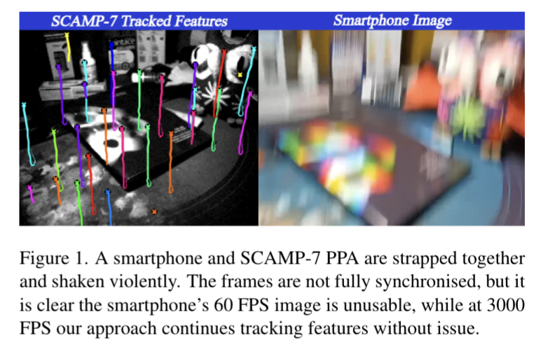
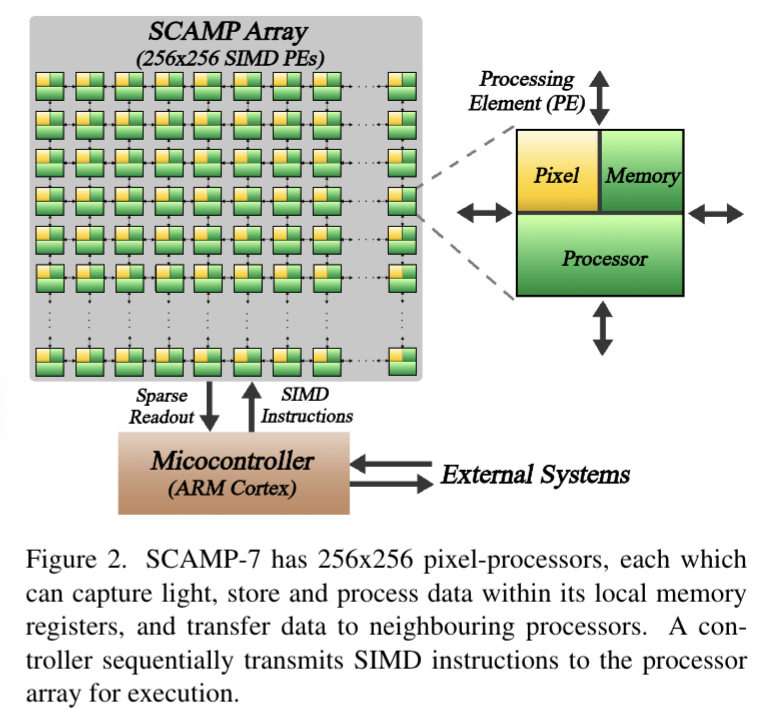
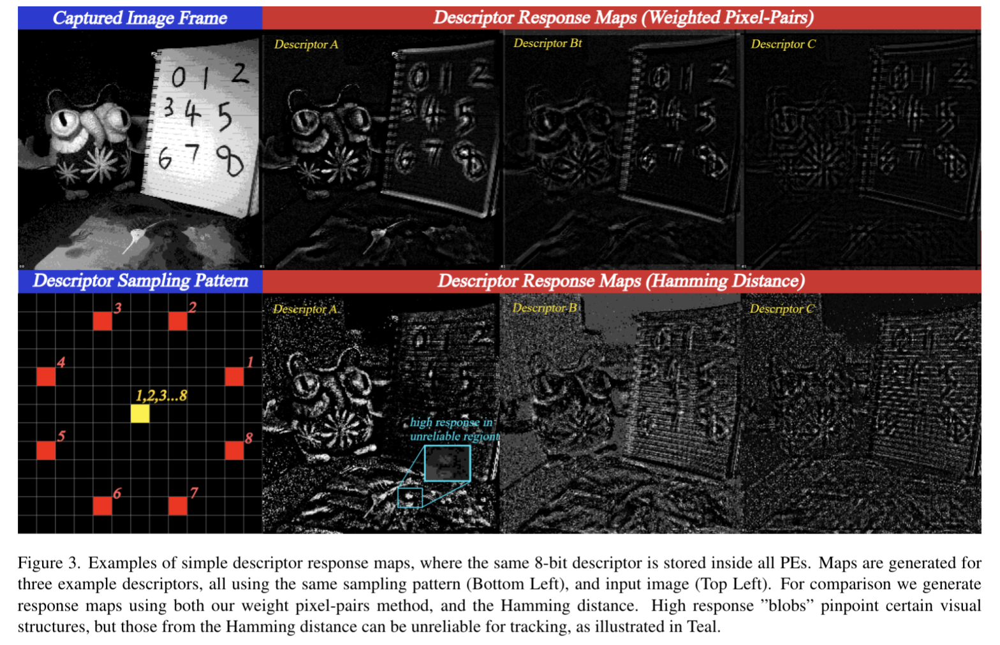

# Descriptor-In-Pixel : Point-Feature Tracking for Pixel Processor Arrays

**Author:** Laurie Bose et al.  
**Date:** 2025

## 1. Abstract

This paper presents a novel approach for joint pointfeature detection and tracking, designed specifically for Pixel Processor Array (PPA) vision sensors. Instead of standard pixels, PPA sensors consist of thousands of “pixelprocessors”, enabling massive parallel computation of visual data at the point of light capture. Our approach performs all computation entirely in-pixel, meaning no raw image data need ever leave the sensor for external processing. We introduce a Descriptor-In-Pixel paradigm, in which a feature descriptor is held within the memory of each pixelprocessor. The PPA’s architecture enables the response of every processor’s descriptor, upon the current image, to be computed in parallel. This produces a“descriptor response map” which, by generating the correct layout of descriptors across the pixel-processors, can be used for both pointfeature detection and tracking. This reduces sensor output to just sparse feature locations and descriptors, read-out via an address-event interface, giving a greater than 1000× reduction in data transfer compared to raw image output. The sparse readout and complete utilization of all pixelprocessors makes our approach very efficient. Our implementation upon the SCAMP-7 PPA prototype runs at over 3000 FPS (Frames Per Second), tracking point-features reliably under violent motion. This is the first work perform.

本文提出了一种联合点特征检测与跟踪的新颖方法，专为 **像素处理器阵列（Pixel Processor Array, PPA）视觉传感器** 设计。

**像素处理器阵列（Pixel Processor Array, PPA）视觉传感器** ：
- 每个**像素单元**（称为 “Pixel Processor” 或 “Processing Element, PE”）**不仅能捕获光线强度，还内置本地内存** （数字 / 模拟寄存器）和**计算单元** ，可独立执行加减、布尔逻辑、阈值化等基础运算，并通过邻接通信（如 4 邻域连接）实现像素间数据传输，无需依赖外部总线。
- 所有 PE 由一个中央控制器同步调度，执行相同指令但处理各自数据（ **单指令多数据，SIMD** ），类似 GPU 但粒度更细（像素级并行）
- 传统相机需逐帧输出完整图像（数据量大、延迟高），而 PPA 可在像素内直接提取高 - level 信息（如特征位置、描述符），仅输出稀疏结果。
- 部分 PPA 采用 3D 堆叠架构（如曼彻斯特大学的 3D SOI 方案），将感光层、模拟处理层、数字处理层垂直分离，通过硅通孔（TSV）实现像素级通信，既保证高填充因子（提升感光灵敏度），又避免平面架构中处理器对像素的面积占用。

我们引入了 “像素内描述符”（Descriptor-In-Pixel）范式，其中每个像素处理器的内存中存储一个特征描述符。PPA 的架构支持 **并行计算** 每个处理器的描述符对当前图像的响应，生成 **“描述符响应图”** ；通过在像素处理器间合理布局描述符，该响应图可同时用于点特征检测和跟踪。这使得传感器输出仅需包含稀疏的特征位置和描述符，通过地址事件接口读出，与原始图像输出相比，**数据传输量减少超过 1000 倍**。稀疏读出设计与像素处理器的充分利用使我们的方法具有极高效率。在 SCAMP-7 PPA 原型上的实现达到了 3000 帧 / 秒（FPS）以上的速度，能够在剧烈运动下可靠跟踪点特征。这是首个完全在像素内执行点特征检测与跟踪的研究成果。

---

## 2. Introduction

Point-features are distinct points within an image, chosen to be clearly identifiable within multiple images of the same scene, even under changes such as scale, lighting, and perspective. The various methods of point-feature detection and tracking are some of the most widespread tools in computer vision, playing a vital role in Visual Odometry and Simultaneous Localisation and Mapping (SLAM). Many mobile systems such as virtual-reality headsets and unmanned aerial vehicles rely extensively on point-features, often from multiple cameras, to continuously estimate the system’s pose. Such systems have limited on-board computational power, limited battery life, and often require low-latency response due to rapid motion. This has pushed the need for computational efficiency, but despite many advancements, the basic task of image transfer from sensor to processor remains a significant time and power bottleneck.

**点特征是图像中具有显著辨识度的点**，即使在场景的多幅图像中经历尺度、光照和视角变化，仍能被清晰识别。各类点特征检测与跟踪方法是计算机视觉中应用最广泛的工具之一，在 **视觉里程计（Visual Odometry）** 和 **同时定位与地图构建（Simultaneous Localisation and Mapping, SLAM）** 中发挥关键作用。
关于 **视觉里程计（Visual Odometry）** ：
- 通过视觉传感器（相机、PPA 等）的图像序列，计算设备（如机器人、无人机）相对运动轨迹的技术，本质是 “用视觉测距离和姿态变化”。
- **只关注相对运动** ：不依赖外部定位（如 GPS）， **仅通过帧间图像特征匹配（如 PPA 跟踪的点特征）计算轨迹** ，输出设备的位置和姿态变化（如 x/y/z 平移、俯仰 / 偏航 / 滚转角度）。
- 无全局地图：不构建完整环境地图， **仅输出 “增量式轨迹”** ，可能存在累计误差（比如走得越远，误差越大）。
- **适配 PPA 的优势** ：PPA 的高帧率（数千 FPS）和低延迟，能捕捉快速运动下的清晰特征，**减少运动模糊导致的轨迹计算误差** ；稀疏数据输出也能**降低 VO 的实时计算压力** 。

关于 **同时定位与地图构建（Simultaneous Localisation and Mapping, SLAM）** ：
- 在未知环境中，设备一边通过传感器（视觉、激光等）定位自己的位置，一边构建环境的全局一致地图，两者同步进行、相互约束 —— 解决 “不知道自己在哪，也不知道环境长什么样” 的问题。
- **定位与建图同步** ：定位需要地图提供参考（比如 “我在地图上某特征点的东边 5 米”），建图需要定位结果确定特征点的准确位置，形成闭环。
- **有回环检测与优化** ：通过识别重复场景（回环检测），修正之前的轨迹和地图误差，避免累计误差过大，保证地图全局一致。
- **与 VO 的关系** ：VO 是 SLAM 的 “核心子模块”——SLAM 的 “定位” 部分本质就是 VO，但 SLAM 额外增加了 “建图” 和 “回环优化” 功能，比 VO 更完整、误差更小。
- **适配 PPA 的优势** ：PPA 在像素内提取的特征位置和描述符，可直接用于 SLAM 的地图构建（存储环境特征）和回环检测（匹配重复场景的特征）；稀疏数据输出减少地图存储和传输成本。

许多移动系统（如虚拟现实头显、无人机）广泛依赖多相机采集的点特征，持续估计系统姿态。这类系统的机载计算能力、电池续航有限，且因运动迅速往往需要低延迟响应。这推动了对计算效率的需求，但尽管已有诸多进展，图像从传感器到处理器的传输仍是时间和功耗的主要瓶颈。

---

This issue ultimately reflects the dominant paradigm in electronic imaging, where sensors are primarily built to capture images for a human observer, rather than efficient visual computing. In the context of point-feature detection and tracking, whole images are distilled down to a sparse handful of key-points and descriptors. This is a tiny amount of data compared to the original image, yet standard cameras must still transfer whole images to external processing, repeatedly every frame. This paper presents an alternative, a novel implementation of point-feature detection and tracking for an emerging sensor paradigm, the PixelProcessor Array (PPA) [9]. Traditional cameras consist of an array of light capture elements, while PPAs are an array of programmable pixel-processors or “Processing Elements” (PEs). Each of these processors has its own local memory on which it can perform various computations, and communication with neighbouring processors enabling data transfer across the array. Images are captured directly into the array, with each PE capturing a single pixel of the whole image into its local memory. This sensor architecture enables massively parallel “in-pixel” computation upon the focal plane, with the PE array operating as a Single Instruction Multiple Data (SIMD) computer. Such a sensor can capture visual data, extract high level information, and then output only this sparse data, thereby removing the image output bottleneck.

这一问题本质上反映了电子成像的主流范式 —— 传感器设计初衷是为人类观察者捕获图像，而非支持高效视觉计算。**在点特征检测与跟踪任务中，整幅图像最终会被提炼为少量稀疏的关键点和描述符，相较于原始图像数据量极小**；但标准相机仍需逐帧将整幅图像传输至外部进行处理。本文提出一种替代方案，为新兴的像素处理器阵列（PPA）传感器范式设计了新颖的点特征检测与跟踪实现。传统相机由光捕获元件阵列组成，而 PPA 是可编程像素处理器（或称 “处理单元”，Processing Elements, PEs）的阵列。每个处理器拥有独立的本地内存，可执行各类计算，并能与相邻处理器通信以实现阵列内数据传输。图像直接捕获至阵列中，每个处理单元将整幅图像的一个像素存储到其本地内存。这种传感器架构支持在焦平面进行大规模并行 “像素内” 计算，**处理单元阵列以单指令多数据（Single Instruction Multiple Data, SIMD）模式运行**。此类传感器能够捕获视觉数据、提取高层信息，**仅输出稀疏数据**，从而消除图像输出瓶颈。

---

图 1 智能手机与 SCAMP-7 PPA 绑定并剧烈摇晃。两设备帧率未完全同步，但可清晰看出：智能手机 60 FPS 的图像已无法使用，而我们的方法在 3000 FPS 下仍能无偏差跟踪特征。

---

Our in-pixel approach for point-feature detection and tracking is designed specifically for the PPA’s architecture, providing high pixel-processor compute resource utilisation, and minimizing data transfer between sensor and external processing. The core of our approach is based around the concept of “Descriptor-In-Pixel”, whereby each PE holds a complete point-feature descriptor within its own local memory. The PPA computes in parallel the response of every PE’s descriptor upon a captured image. By generating the correct layout of descriptors every frame across the PE array, the computed “response map” can be used for both point-feature detection and tracking. All computation is performed within the PPA’s pixel-processors (the PE array), without any additional external processing on PC or microcontroller. Therefore, dense sensor output, such as images, is no longer necessary. Instead, only the coordinates of tracked point-features and the descriptors of newly initialized point-features are output, providing a greater than 1000× data reduction compared to whole images. Any additional image data in this paper is output purely for visualization purposes, and is not required for our approach to operate. Our implementation upon the SCAMP-7 PPA prototype [6] achieves speeds just above 3000 frames per second (FPS), with an average sensor output of just 2 bytes per feature, per frame, demonstrating the PPAs potential in high-speed applications (Figure 1).

我们提出的像素内点特征检测与跟踪方法专为 PPA 架构设计，实现了像素处理器计算资源的高效利用，并最大限度减少了传感器与外部处理之间的数据传输。方法核心围绕 “像素内描述符” 概念展开：**每个处理单元在其本地内存中存储完整的点特征描述符**。PPA 并行计算每个处理单元的描述符对捕获图像的响应，通过逐帧在处理单元阵列中合理布局描述符，生成的 “响应图” 可同时用于点特征检测和跟踪。**所有计算均在 PPA 的像素处理器（处理单元阵列）内完成**，无需在个人计算机或微控制器上进行额外外部处理。因此，不再需要图像等密集型传感器输出，仅需输出跟踪点特征的坐标和新初始化点特征的描述符，与整幅图像相比数据量减少超过 1000 倍。本文中所有额外的图像数据仅为可视化目的输出，并非方法运行的必需条件。在 SCAMP-7 PPA 原型上的实现速度略高于 3000 帧 / 秒，每个特征每帧的平均传感器输出仅为 2 字节，充分展示了 PPA 在高速应用中的潜力（图 1）。

---

## 3. Related Works

**Prior PPA Based Works** : At the time of writing there are few other works regarding point-feature detection and tracking for PPAs. The early work of demonstrated an implementation of the FAST corner detector at 2300 FPS on SCAMP-5. This work does not perform any form of tracking, and simply outputs the coordinates of detected corner points from the sensor. Performing feature tracking/correspondence using nothing but point coordinates is very challenging, especially as FAST uses no information from previous frames to inform detection, leading to poor temporal stability of detected points between frames. BITVO took steps to address this by outputting a binary edge image alongside the corner points detected by FAST. From these edge images corner descriptors are computed, which are then used in tracking corner points between frames. While this improves tracking quality, the need to output a full resolution binary image to external processing introduces a significant bottleneck, limiting performance to 300 FPS. The solution to this is performing both detection and tracking entirely on-sensor, avoiding the need to output dense visual information to external processing. This is the motivation behind our approach, which uses purely onsensor compute to detect and track point-features at thousands of frames per second.

**基于 PPA 的现有研究**

截至本文撰写时，关于 PPA 点特征检测与跟踪的研究较少。早期研究在 SCAMP-5 上实现了 FAST 角点检测器，帧率达 2300 FPS，但该研究未涉及任何跟踪功能，仅从传感器输出检测到的角点坐标。仅通过点坐标进行特征跟踪 / 匹配极具挑战性，尤其是 FAST 未利用前一帧信息辅助检测，导致检测点在帧间的时间稳定性较差。BITVO对此进行了改进，在 FAST 检测的角点之外，额外输出二进制边缘图像，基于这些边缘图像计算角点描述符，进而用于帧间角点跟踪。尽管跟踪质量有所提升，但需向外部处理输出全分辨率二进制图像，引入了显著瓶颈，将性能限制在 300 FPS。**解决这一问题的关键是在传感器端完全执行检测与跟踪**，避免向外部处理输出密集型视觉信息 —— 这正是本文方法的设计动机，通过纯传感器端计算实现每秒数千帧的点特征检测与跟踪。

---

**Event Cameras** : Event cameras are another alternative visual sensor, outputting a stream of “events” which encode time, location and polarity of brightness changes at the per-pixel level. Many works have demonstrated pointfeatures upon event cameras, some using just the raw event stream, others incorporating image data into their approach. With the event camera’s very high dynamic range and temporal resolution, many of these works produce impressive results, tracking features in rapid motion and challenging lighting conditions. One drawback of event cameras is the complexity involved in dealing with their sparse asynchronous event data (a price paid in exchange for the sensor’s very high temporal resolution). This can lead to significant computational costs, and while earlier works may use only a standard desktop CPU, recent works require a high-end 300 watt GPU for close to real-time performance. In contrast, a strength of the PPA is that it still allows visual computation to be performed upon captured image frames, instead of complex asynchronous event data. By performing all computation in-pixel, temporal resolutions and latencies comparable to event camera based methods can be achieved, but at a reduced total energy cost.

**事件相机**

事件相机是另一类新型视觉传感器，**输出 “事件流”，编码每个像素亮度变化的时间、位置和极性**。已有多项研究在事件相机上实现点特征提取，部分仅使用原始事件流，另一些则结合图像数据。**事件相机具有极高的动态范围和时间分辨率**，因此许多相关研究取得了令人瞩目的成果，能够在快速运动和复杂光照条件下跟踪特征。但事件相机的一大缺点是处理稀疏异步事件数据的复杂性（这是换取高时间分辨率的代价），可能导致极高的计算成本：早期研究可能仅需标准桌面 CPU，而近期研究为实现近实时性能，需使用 300 瓦级高端 GPU。**相比之下，PPA 的优势在于仍支持对捕获的图像帧进行视觉计算，而非处理复杂的异步事件数据**。通过在像素内执行所有计算，**PPA 可实现与事件相机方法相当的时间分辨率和延迟，且总能耗更低**。

---

**Traditional Point-Feature Tracking** : Many traditional point-feature approaches such as ORB work by locating salient points (using methods such as FAST), and building descriptors for each of these points. Point-features are then tracked by matching their descriptors against those of salient points detected in the current frame. However, separating detection and tracking into two disjoint processes allows a tracked feature’s associated salient point to be missed in detection, potentially replaced by a different salient point in close proximity. This can result in tracked features “flickering” as their salient points are temporarily lost. By contrast our approach uses the same mechanism (descriptor response) for both detection and tracking for reliable re-detection of existing features.

**传统点特征跟踪**

许多传统点特征方法（如 ORB）的流程为：**定位显著点（采用 FAST 等方法），为每个显著点构建描述符，通过将当前帧检测到的显著点描述符与已跟踪特征的描述符匹配，实现点特征跟踪**。然而，将检测与跟踪拆分为两个独立过程可能导致跟踪特征对应的显著点在检测阶段被遗漏，进而被邻近的其他显著点替代，造成跟踪特征 “闪烁” 现象。相比之下，**本文方法使用同一机制（描述符响应）同时实现检测与跟踪，确保现有特征的可靠重检测。**

---

## 4. SCAMP Overview

We demonstrate an implementation of our approach upon the SCAMP-7 PPA system [6]. Shown in Figure 2, this vision sensor device has an image resolution of 256×256, giving a total of 65,536 pixel-processors (PEs). Each processor is connected to its four immediate neighbours, forming a network for data transfer across the array. For local memory, each pixel-processor has 23 1-bit digital registers, and 7 analogue registers which store continuous values. Various operations upon local memory are supported, such as addition and subtraction of analogue registers, boolean logic between digital registers, and thresholding of analogue values to digital results. Light is captured separately by each processor, and with each frame trigger, converted to analogue values. Thus each processor captures one pixel of an image that spans the whole array.

我们在 SCAMP-7 PPA 系统上实现了所提方法。如图 2 所示，
该视觉传感器的
- **图像分辨率为 256×256**
- **包含 65536 个像素处理器（处理单元）**
- 每个处理器与四个相邻处理器相连，形成阵列内数据传输网络。
- 本地内存方面，**每个像素处理器配备 23 个 1 位数字寄存器和 7 个存储连续值的模拟寄存器**，支持本地内存的多种操作（如模拟寄存器的加减运算、数字寄存器的布尔逻辑运算、模拟值到数字结果的阈值化处理）。每个处理器独立捕获光线，每帧触发时将光信号转换为模拟值，因此每个处理器对应整幅图像的一个像素。

---

Each pixel-processor does not store and execute its own program instructions, instead a centralised controller broadcasts identical instructions to all 65,536 processors in parallel, which then execute each instruction concurrently. Thus the array operates in a Single Instruction Multiple Data (SIMD) mode, similar to GPU compute. Importantly each pixel-processor contains a 1-bit “activity flag” register for enabling and disabling the execution of instructions, allowing for per-pixel conditional execution. By writing programs for the controller, the processor array can be made to execute entire vision applications in-pixels, and output only specific extracted information. Various tasks have been demonstrated on this architecture including neural networks, visual odometry, and eye tracking.

**每个像素处理器不存储和执行独立的程序指令，而是由中央控制器向所有 65536 个处理器并行广播相同指令，处理器同步执行每条指令**。因此，该阵列以单指令多数据（SIMD）模式运行，类似 GPU 计算。重要的是，每个像素处理器包含一个 1 位 “活动标志” 寄存器，用于启用或禁用指令执行，支持逐像素条件执行。通过为控制器编写程序，处理器阵列可在像素内执行完整的视觉应用，仅输出特定提取的信息。该架构已被验证可实现多种任务，包括神经网络、视觉里程计和眼动跟踪。

---

图 2 SCAMP-7 包含 256×256 个像素处理器，每个处理器可捕获光线、在本地内存寄存器中存储和处理数据，并向相邻处理器传输数据。控制器按顺序向处理器阵列发送 SIMD 指令，供其执行。

---

## 5. Approach Overview

Our approach uses a novel Descriptor In-Pixel paradigm designed specifically to exploit the PPA’s massively parallel, on-sensor computation. Three key components enabled by the PPA’s architecture are as follows.

1. In-Pixel Descriptors. Our approach involves storing a complete point-feature descriptor within each PE’s local digital memory, essentially storing a descriptor at each pixel location.

2. Parallel Descriptor Computation. The PPA captures image frames directly into the PE array, with each PE capturing one pixel into its local analogue memory. By examining the pixel data of surrounding PEs, each PE can compute a descriptor for its local image content. This descriptor computation can be performed for every PE (i.e. every pixel location) simultaneously in parallel.

3. Parallel Descriptor Response Computation. Comparison between stored descriptors and those computed from captured image can be performed in parallel across all PEs. This generates a “response map”, indicating how strongly the stored descriptors correlate or “match” with the captured image content.

本文方法采用新颖的 “像素内描述符” 范式，专为发挥 PPA 的大规模并行、传感器端计算优势而设计。PPA 架构支持的三大核心组件如下：

- **像素内描述符**：在每个处理单元的本地数字内存中存储完整的点特征描述符，本质上是在每个像素位置存储一个描述符。
- **并行描述符计算**：PPA 将图像帧直接捕获至处理单元阵列，每个处理单元将一个像素存储到本地模拟内存。通过读取相邻处理单元的像素数据，每个处理单元可计算其对应图像位置的描述符，且所有处理单元（即所有像素位置）的描述符计算可同时并行执行。
- **并行描述符响应计算**：所有处理单元可并行执行存储描述符与捕获图像计算描述符的比较，生成 “响应图”，指示存储描述符与捕获图像内容的相关程度或 “匹配度”。

---

The descriptors distributed across the PE array follow a specific layout, surrounding each tracked point-feature’s location with PEs storing its descriptor. This descriptor layout is generated every frame by spreading the descriptors of tracked features into nearby PEs. After computing the response of these stored descriptors on the current image frame, each tracked feature will be surrounded by a patch of response from its own descriptor. These response patches are analysed in parallel, determining the new location of each tracked feature. This tracking requires that features do not move further than the predetermined patch area between frames. However, our approach can operate at thousands of frames per second, allowing patch areas to be very small (9 × 9) and still facilitate reliable tracking. New pointfeatures are detected and initialized by analysing the responses of those PEs not inside the patch of any tracked feature. These aspects will be described later in detail.

（原文有点难懂）

- 为了跟踪特征，**需要给每个已跟踪的特征分配一片像素处理器（邻域），让这些处理器都存储该特征的描述符**：逐帧扩散描述符。比如第 1 帧时，特征 A 在像素（x,y）处，只让（x,y）这个处理器存 A 的描述符；第 2 帧时，把 A 的描述符 “扩散” 到（x,y）周围的邻居处理器（比如上下左右）；第 3 帧再扩散一层，最终形成一个9×9 的处理器区域（相当于给 A 划了一块 9×9 的 “专属地盘”）。
- 当新的图像帧被 PPA 捕获后，每个处理器会做一件事：**用当前图像中自己对应位置的像素信息，计算 “和自己存储的描述符有多匹配”**（这个匹配度就是 **“响应值”**）。在当前图像中，这个特征实际所在的位置，对应的处理器计算出的 “响应值会特别高”—— 于是在该特征的邻域内，会形成一个 “高响应的区域”（相当于 “特征在这里，所以和它的描述符匹配度最高”）。
- 在 9×9 的邻域里，响应值最高的那个处理器的位置，就是这个特征在当前帧的新位置。

---

In summary, our approach performs all necessary computation within the PE array, each feature is tracked between frames using pixel-processors surrounding its location, while all remaining pixel-processors perform a search to detect new features. This approach is very efficient essentially utilizing 100% of the PPA’s compute, and also allows sensor output to be reduced to simply the locations and descriptors of tracked features. As a result, our approach can operate at thousands of frames per second upon SCAMP-7.

综上，**本文方法在处理单元阵列内完成所有必要计算**：每个特征通过其位置周围的像素处理器进行帧间跟踪，其余所有像素处理器执行新特征搜索检测。该方法效率极高，可实现 PPA 计算资源的 100% 利用，同时将传感器输出简化为跟踪特征的位置和描述符。因此，我们的方法在 SCAMP-7 上可达到每秒数千帧的运行速度。

---

## 6. In-Pixel Descriptors

We make use of simple binary point descriptors, similar to the well known BRIEF descriptor. Such descriptors are stored as binary strings within each PE, occupying multiple digital registers (1 bit per register). Computing a PE’s descriptor for a given image involves comparing pairs of pixel data around its location, each comparison generating 1 bit of the descriptor’s string. Specifically, the $i^{th }$ bit of the descriptor, $d_{i}$ , is computed as 

$$
d_{i}= \begin{cases}
0, & \text{if } p_{i(1)} < p_{i(2)} \\ 
1, & \text{if } p_{i(1)} \geq p_{i(2)}
\end{cases}
$$

where $p_{i(1)}$ , $p_{i(2)}$
are a pair of pixel values at locations relative to the PE’s location, according to some predetermined sampling pattern.

我们采用简单的二进制点描述符，类似著名的 BRIEF 描述符。**此类描述符以二进制字符串形式存储在每个处理单元中**，占用多个数字寄存器（每个寄存器 1 位）。计算特定图像对应的处理单元描述符时，需比较该处理单元对应位置周围的像素对，每次比较生成描述符字符串的 1 位。具体而言，描述符的第 i 位 $d_{i}$ 计算如下：

$$
d_{i}= \begin{cases}
0, & \text{if } p_{i(1)} < p_{i(2)} \\ 
1, & \text{if } p_{i(1)} \geq p_{i(2)}
\end{cases}
$$

其中，pi (1)、pi (2) 是根据预设采样模式，在处理单元对应位置的相对坐标上选取的一对像素值。

---

Descriptor Size: For maximum efficiency, an entire descriptor should be stored within each PE (i.e. one descriptor per pixel location). However, PE local memory on SCAMP7 is very limited, restricting this first demonstration of our approach to tiny 8-bit descriptors, performing just eight local pixel pair comparisons. Due to how our approach operates, these are still sufficient for reliable high-speed feature tracking. Larger descriptors could be utilized on future PPA hardware, with greater memory per PE. Note, using significantly larger descriptors (128+ bit) would likely not improve tracking in our approach, but these would be better suited to long term tasks such as re-localisation.

**描述符尺寸**

为实现最高效率，每个处理单元应存储完整的描述符（即每个像素位置对应一个描述符）。但 SCAMP-7 的处理单元本地内存非常有限，因此本文首次验证采用小型 8 位描述符，仅执行 8 次本地像素对比较。得益于方法的设计机制，这些 8 位描述符仍足以支持可靠的高速特征跟踪。未来 PPA 硬件若增加每个处理单元的内存容量，可采用更大尺寸的描述符。需注意，**使用显著更大的描述符（128 位以上）可能无法提升本文方法的跟踪性能**，但更适用于重定位等长期任务。

---

Descriptor Sampling Pattern: Computing the binary descriptor for a specific pixel location involves comparing pairs of pixels, sampled in a given pattern about that location. This “sampling pattern”, is chosen with the aim to compress the local image into a compact bit string, capturing any discriminative structures within the local image content. BRIEF [7] uses fixed random sampling patterns, which are too large (128+ bit) to use for in-pixel descriptors. Instead we use fixed sampling patterns similar to the BRISK [13] & FREAK [1] descriptors. We only use a single sampling pattern during operation, for all descriptors across all PEs, as this enables us to fully exploit the PPA’s parallel SIMD compute. We opted for a ‘compare-to-center’ sampling pattern (see Figure 3) due to its simplicity and low computational cost, though many other patterns could be used.

**描述符采样模式**

计算特定像素位置的二进制描述符时，**需按照围绕该位置的特定模式采样像素对**。选择 “采样模式” 的目标是将局部图像压缩为紧凑的位字符串，捕获局部图像内容中的判别性结构。BRIEF 采用固定随机采样模式，**但位长过大（128 位以上），不适合作为像素内描述符**。因此，我们采用类似 BRISK 和 FREAK 描述符的固定采样模式，且在运行过程中所有处理单元的所有描述符均使用单一采样模式 —— 这一设计可充分发挥 PPA 的并行 SIMD 计算优势。我们选择 “中心比对” 采样模式（见图 3），因其实现简单、计算成本低，当然也可采用其他多种模式。

---

图 3 简单描述符响应图示例：所有处理单元存储相同的 8 位描述符。针对三个示例描述符生成响应图（均采用相同采样模式（左下）和输入图像（左上））。为进行对比，分别使用加权像素对方法和汉明距离生成响应图。高响应 “块” 可精准定位特定视觉结构，但如青色部分所示，汉明距离生成的响应图用于跟踪时可靠性较低。